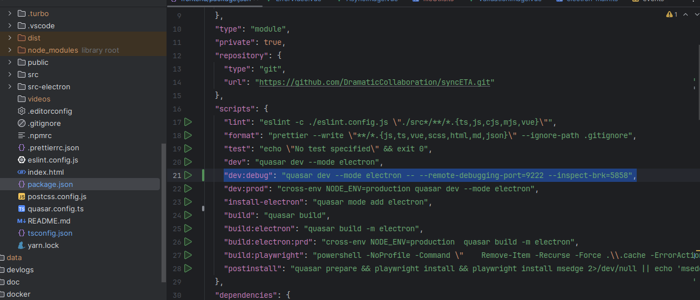

---
title: Electron Debugging
description: Memories fade quickly, but logs are forever! 🎯 Our team's fun and free work record space
head:
  - - meta
    - name: keywords
      content: Let's write down what we studied
  - - meta
    - property: og:title
      content: Work Log Playground - Free Work Record Space 🎪
  - - meta
    - property: og:description
      content: This is a space where team members freely record and share work logs. We introduce a fun work log system that you can conveniently add to whenever you need without any force.
  - - meta
    - property: og:image
      content: https://empasy.io/docs/images/favicon.png
  - - meta
    - property: og:url
      content: https://empasy.io/study/
sort: 300
---

# Electron debugging in Intellij

1. Execute dev:debug
   

2. Run Debugger

   - Click the "Debugger listening on ws://127.0.0.1:5858/cc94b3d2-5a48-461b-9fb8-6ee3ee3e38fd" part
     

3. Breakpoint
   
