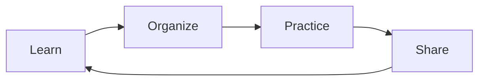

# 📚 My Own Knowledge Playground 🎪

## "You understand more deeply as much as you teach"

**"Double the joy when you share what you've learned!"**  
This is a space to have fun sharing various knowledge and realizations you've studied 🎯

## 🎯 Learning Cycle

**Learn together, grow together!**  
We support your learning journey ✨

---

> **💡 Final Tip:** The habit of organizing and sharing what you've learned will become your  
> **most powerful learning weapon!** Let's do it together 🚀
