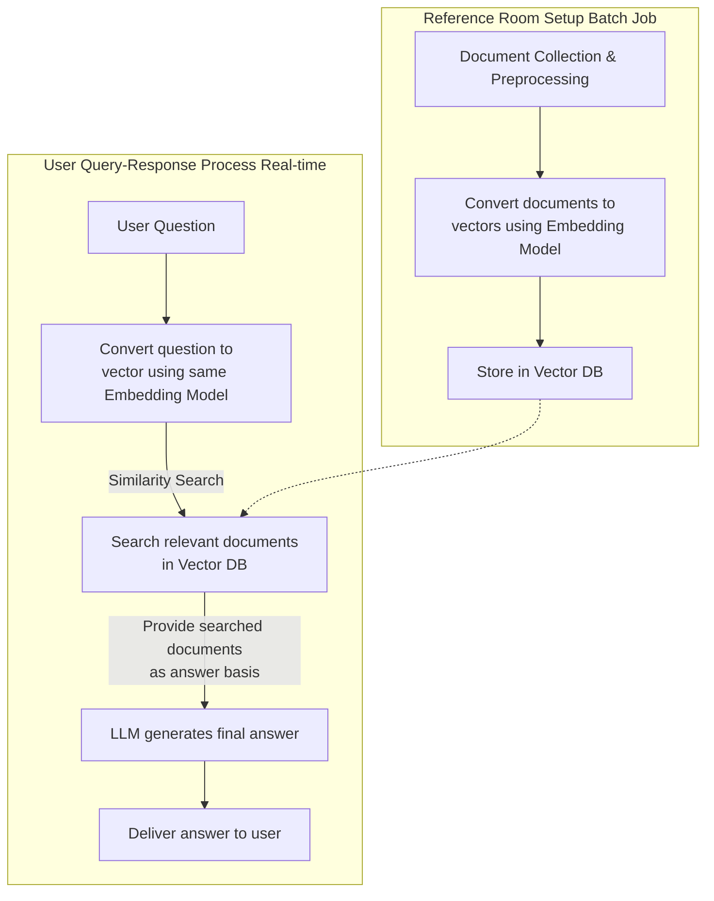

## **RAG (Retrieval-Augmented Generation) Building Perfect Guide: A Friendly Manual for Beginners**

### **Table of Contents**

1.  [What is RAG? Understanding with easy analogies](#1-what-is-rag-understanding-with-easy-analogies)
2.  [Why do we need RAG?](#2-why-do-we-need-rag)
3.  [What do we need to build RAG? (Prerequisites)](#3-what-do-we-need-to-build-rag-prerequisites)
4.  [RAG Building in 5 Steps: Just follow along!](#4-rag-building-in-5-steps-just-follow-along)
5.  [What tools should we use?](#5-what-tools-should-we-use)

---

### **1. What is RAG? Understanding with easy analogies**

**RAG (Retrieval-Augmented Generation)** is a technology that combines **"Information Retrieval + Answer Generation"**.

- **`R` (Retrieval)**: The step of **finding information related to the question** from a massive pile of documents.
- **`AG` (Augmented Generation)**: The step where the **LLM generates an accurate answer** based on the found information.

#### **🛎️ Easy Analogy: A Hardworking Secretary**

Imagine you have two secretaries, **`A`** and **`B`**.

- **Secretary A (Standard LLM)**: Very smart and has read many books. However, sometimes they **forget or don't know the latest information.** And sometimes they **make up "plausible-sounding" things (Hallucination).**
- _"Who is the manager of the South Korean national football team in 2024?"_
- _"Um... Klinsmann... maybe? Or Hong Myung-bo...? (Uncertain or incorrect answer)"_

- **Secretary B (LLM using RAG)**: As smart as Secretary A, but **has a perfect reference room next door.** When you ask a question,

1.  First, they **run to the reference room (DB)** and find **relevant materials (Retrieval)** such as the latest news, company documents, and reports.
2.  They hand the found materials to Secretary A, saying, **"Here, answer while looking at these materials."**
3.  Secretary A confidently answers **based on accurate materials. (Augmented Generation)**

- _"Who is the manager of the South Korean national football team in 2024?"_
- _"(Finds an article 'March 2024, KFA appoints Hwang Sun-hong' from the reference room)"_
- _"Yes, the current manager of the South Korean national football team in 2024 is Hwang Sun-hong. The related article content is as follows..."_

**Conclusion: RAG is a 'smart secretary system' that helps the LLM generate more reliable answers by first finding 'accurate materials' for it.**

---

### **2. Why do we need RAG?**

It **solves the disadvantages** of general LLMs (e.g., ChatGPT).

1.  **Lack of latest information**: LLMs only know data up to the point their training stopped. RAG provides real-time documents to answer with the latest information.
2.  **Hallucination**: Sometimes they make up non-existent facts. RAG prevents this by providing **'evidence materials'**.
3.  **Inability to utilize internal information**: LLMs **do not know private documents** like company manuals, contracts, and emails. RAG allows these internal documents to be placed in a reference room and utilized.
4.  **Transparency and Reliability**: Provides the source of the answer (which page of which document), allowing you to check **"why it answered that way"**.

---

### **3. What do we need to build RAG? (Prerequisites)**

You basically need 4 components.

1.  **Knowledge / Document Data**: **Internal documents** that will be the basis of the answers (PDF, HWP, Word, Excel, PPT, web pages, DB, etc.).
2.  **Embedding Model**: AI that **converts the 'meaning' of a document into numbers**. Analogously, it's a **'scanner that turns documents into barcodes (vectors) that computers can understand'**.
3.  **Vector Database (Vector DB)**: A special DB to **store and quickly search** those 'barcodes (vectors)'. Think of it as a **'super-fast organized reference room'**.
4.  **LLM (Large Language Model)**: The AI that ultimately **generates the answer**. (e.g., GPT-4, Claude, Llama2, etc.).

---

### **4. RAG Building in 5 Steps: Just follow along!**

The whole process can be divided into two parts: **'Setting up the reference room'** and **'Question-Answering'**.



#### **Part 1: Setting up the reference room (Do it once and keep using it)**

**Step 1: Document Collection & Preprocessing**

- **What it does**: **Extracts only text** from documents in various formats like PDF, Word, and organizes them.
- **Detailed tasks**:
- **Text Extraction**: Extracts only letters from the document.
- **Chunking**: Putting a 100-page document in whole is inefficient. Cut it into **meaningful units (e.g., 3~5 paragraphs each)**. These become **each page of the reference room**.
- **Refinement**: Clean up unnecessary spaces and special characters.

**Step 2: Convert documents to numbers (vectors) (Embedding)**

- **What it does**: Puts the chunked text pieces into the **Embedding Model** and converts them into **a sequence of numbers (vector)**. Documents with similar meanings will have similar numerical values.

**Step 3: Store in Vector Database**

- **What it does**: Pairs and stores the converted numbers (vectors) and the original text in the **Vector DB**. Now, a **reference room that can be searched based on 'meaning'** is complete.

#### **Part 2: Question-Answering (Proceeds every time a user asks a question)**

**Step 4: Convert question to numbers (vector) and search**

- **What it does**: Also converts the user's question into a number (vector) using the **exact same Embedding Model**.
- Then, finds the **most similar vector (i.e., the most relevant document)** to this question's vector in the **Vector DB** and **retrieves its original text.**

**Step 5: LLM generates final answer**

- **What it does**: Hands the retrieved documents to the LLM along with the following **'instruction manual (prompt)'**.
- _"You are a helpful Assistant. Answer the user's question accurately referencing only the [Reference Document] content below. If you don't know, say you don't know."_
- `[Reference Document]:` (Texts retrieved in Step 4)
- `[User Question]:` "What is our company's vacation policy?"
- The LLM **references the given document** to generate an accurate and reliable answer.

---

### **5. What tools should we use?**

Here are tools you can easily start with via GUI without coding, and open-source tools useful for full-scale development.

#### **Beginner/Non-Developer Friendly Tools (Low-Code/No-Code)**

- **ChatPDF, AskYourPDF**: Services where you can just upload a PDF file and ask questions right away. The simplest form of RAG.
- **Microsoft Copilot Studio**: If you use the Microsoft 365 suite, you can easily create a RAG chatbot based on SharePoint or Word files.
- **Notion AI**: Answers based on documents within the Notion workspace.

#### **Open Source Tools for Full-Scale Development**

- **Embedding Model**: `all-MiniLM-L6-v2` (Lightweight and good), `BGE`, `OpenAI's text-embedding-3` (Good performance)
- **Vector DB**: `Chroma` (Easiest), `Weaviate`, `Qdrant`, `Pinecone` (Cloud service)
- **LLM**: `OpenAI API (GPT-4)`, `Anthropic API (Claude)`, `Llama 3` (Open source)
- **Framework**: `LangChain`, `LlamaIndex` - Acts as the **glue** of the RAG system. These are Python libraries that help easily connect all the elements above.

**Recommended Starting Combination:** `LangChain` + `Chroma DB` + `all-MiniLM-L6-v2` + `GPT-4 API` combination is great for learning.

# RAG (Retrieval-Augmented Generation) Building Guide: Java Developer Sample

## Table of Contents

1. [What is RAG?](#1-what-is-rag)
2. [Why RAG?](#2-why-rag)
3. [RAG System Components](#3-rag-system-components)
4. [Java-based RAG Implementation Steps](#4-java-based-rag-implementation-steps)
5. [Simple Java Implementation Example](#5-simple-java-implementation-example)
6. [Future Development Directions](#6-future-development-directions)

---

## 1. What is RAG?

RAG (Retrieval-Augmented Generation) is a technology that combines **Information Retrieval** and **Answer Generation**, allowing Large Language Models (LLMs) to generate more accurate and reliable answers by utilizing external knowledge sources.

### 🎯 Easy Analogy: Librarian

- **Standard LLM**: A genius who memorized the entire encyclopedia (But lacks the latest info and is sometimes wrong)
- **RAG LLM**: A librarian who retrieves relevant materials from the library to reference while answering (Provides accurate and up-to-date info)

---

## 2. Why RAG?

| Problem | Standard LLM | With RAG |
| --- | --- | --- |
| Lack of Latest Info | ❌ Relies only on training data | ✅ Utilizes real-time info |
| Hallucination | ❌ Sometimes makes things up | ✅ Based on evidence materials |
| Internal Info Use | ❌ Impossible | ✅ Possible |
| Lack of Transparency | ❌ Unclear basis for answer | ✅ Can specify sources |

---

## 3. RAG System Components

1. **Document Storage**: Original materials like PDF, Word, internal documents
2. **Embedding Model**: Text → Numeric vector conversion
3. **Vector Database**: Vector storage and similarity search
4. **LLM**: Final answer generation

---

## 4. Java-based RAG Implementation Steps

### Step 1: Environment Setup (Add Dependencies)

```xml
<!-- pom.xml -->
<dependencies>
    <dependency>
        <groupId>org.springframework.ai</groupId>
        <artifactId>spring-ai-openai-spring-boot-starter</artifactId>
        <version>0.8.1</version>
    </dependency>
    <dependency>
        <groupId>org.springframework.boot</groupId>
        <artifactId>spring-boot-starter-web</artifactId>
    </dependency>
    <!-- Vector DB Dependency (Optional) -->
</dependencies>
```

### Step 2: Document Loading and Splitting

```java
public class DocumentLoader {
    public List<String> loadAndSplitDocuments(String filePath, int chunkSize) throws IOException {
        String content = new String(Files.readAllBytes(Paths.get(filePath)));
        return splitTextIntoChunks(content, chunkSize);
    }

    private List<String> splitTextIntoChunks(String text, int chunkSize) {
        List<String> chunks = new ArrayList<>();
        for (int i = 0; i < text.length(); i += chunkSize) {
            chunks.add(text.substring(i, Math.min(i + chunkSize, text.length())));
        }
        return chunks;
    }
}
```

### Step 3: Text Embedding Generation

```java
@Service
public class EmbeddingService {
    private final OpenAiEmbeddingClient embeddingClient;

    public EmbeddingService(OpenAiEmbeddingClient embeddingClient) {
        this.embeddingClient = embeddingClient;
    }

    public List<Double> generateEmbedding(String text) {
        return embeddingClient.embed(text);
    }
}
```

### Step 4: Vector Storage and Search (Simple Implementation)

```java
public class SimpleVectorStore {
    private Map<String, List<Double>> vectorMap = new HashMap<>();
    private Map<String, String> textMap = new HashMap<>();

    public void storeVector(String id, String text, List<Double> vector) {
        vectorMap.put(id, vector);
        textMap.put(id, text);
    }

    public String findMostSimilar(List<Double> queryVector) {
        String mostSimilarId = null;
        double maxSimilarity = -1;

        for (Map.Entry<String, List<Double>> entry : vectorMap.entrySet()) {
            double similarity = cosineSimilarity(queryVector, entry.getValue());
            if (similarity > maxSimilarity) {
                maxSimilarity = similarity;
                mostSimilarId = entry.getKey();
            }
        }

        return textMap.get(mostSimilarId);
    }

    private double cosineSimilarity(List<Double> vectorA, List<Double> vectorB) {
        double dotProduct = 0.0;
        double normA = 0.0;
        double normB = 0.0;

        for (int i = 0; i < vectorA.size(); i++) {
            dotProduct += vectorA.get(i) * vectorB.get(i);
            normA += Math.pow(vectorA.get(i), 2);
            normB += Math.pow(vectorB.get(i), 2);
        }

        return dotProduct / (Math.sqrt(normA) * Math.sqrt(normB));
    }
}
```

### Step 5: RAG System Integration

```java
@Service
public class RagService {
    private final EmbeddingService embeddingService;
    private final SimpleVectorStore vectorStore;
    private final OpenAiChatClient chatClient;

    public RagService(EmbeddingService embeddingService,
                     SimpleVectorStore vectorStore,
                     OpenAiChatClient chatClient) {
        this.embeddingService = embeddingService;
        this.vectorStore = vectorStore;
        this.chatClient = chatClient;
    }

    public String query(String question) {
        // 1. Generate question embedding
        List<Double> questionEmbedding = embeddingService.generateEmbedding(question);

        // 2. Search relevant documents
        String relevantText = vectorStore.findMostSimilar(questionEmbedding);

        // 3. Query LLM with context
        String prompt = "Answer the question by referencing the following document content:\n\n" +
                       "Document: " + relevantText + "\n\n" +
                       "Question: " + question + "\n\n" +
                       "Answer:";

        return chatClient.call(prompt);
    }
}
```

---

## 5. Simple Java Implementation Example

### Complete Application Code

```java
@SpringBootApplication
public class SimpleRagApplication implements CommandLineRunner {
    @Autowired
    private RagService ragService;

    @Autowired
    private DocumentLoader documentLoader;

    @Autowired
    private EmbeddingService embeddingService;

    @Autowired
    private SimpleVectorStore vectorStore;

    public static void main(String[] args) {
        SpringApplication.run(SimpleRagApplication.class, args);
    }

    @Override
    public void run(String... args) throws Exception {
        // Load and process document
        List<String> chunks = documentLoader.loadAndSplitDocuments("data/company_policy.txt", 500);

        // Store documents in vector store
        for (int i = 0; i < chunks.size(); i++) {
            List<Double> embedding = embeddingService.generateEmbedding(chunks.get(i));
            vectorStore.storeVector("doc_" + i, chunks.get(i), embedding);
        }

        // Simple query interface
        Scanner scanner = new Scanner(System.in);
        System.out.println("RAG system is ready. Enter a question (Exit to quit):");

        while (true) {
            System.out.print("> ");
            String question = scanner.nextLine();

            if ("exit".equalsIgnoreCase(question)) {
                break;
            }

            String answer = ragService.query(question);
            System.out.println("Answer: " + answer);
        }

        scanner.close();
    }
}
```

### application.properties Settings

```properties
# OpenAI API Settings
spring.ai.openai.api-key=your-openai-api-key
spring.ai.openai.chat.model=gpt-3.5-turbo
spring.ai.openai.embedding.model=text-embedding-ada-002
```

---

## 6. Advanced Features

1. **Adopt Advanced Vector Databases**: Chroma, Pinecone, Weaviate, etc.
2. **Performance Optimization**: Embedding caching, asynchronous processing
3. **Accuracy Improvement**: Various search algorithms, re-ranking
4. **Security Enhancements**: Access control, data encryption
