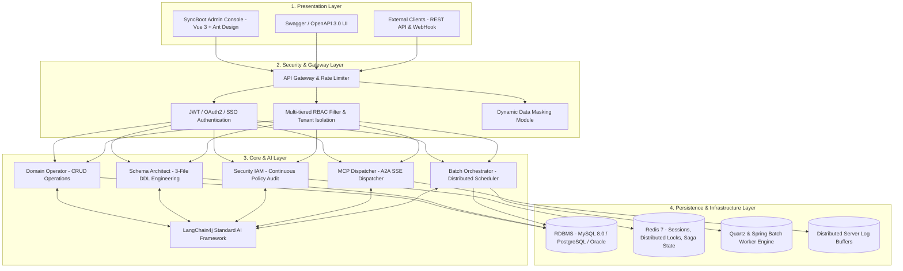

# System Architecture & Modules

SyncBoot is structured with a 4-layer enterprise architecture and 5 functional worker roles to ensure reliability, security, and maintainability.

---

## 4-Layer System Architecture

---

## 5 Functional Worker Specifications

### 1. Domain Operator (Domain CRUD Operations)
- **Role**: Comprehends domain entity models to execute authorized data manipulations (CRUD) and business transactions.
- **Policy**: Prohibited from directly modifying source code or DB schema; operates strictly via pre-compiled APIs and MyBatis Mappers.

### 2. Schema Architect (Schema Engineering)
- **Role**: Analyzes domain requirements to generate 3-File DDL scripts and visual ERD structures.
- **Policy**: Flags high-impact schema modifications (such as table drops or column truncations) and requires developer approval before applying changes.

### 3. Security IAM (RBAC & Multi-Tenant Isolation)
- **Role**: Enforces menu, button, and API access controls and isolates tenant datasets.
- **Capabilities**: Supports dynamic data masking for PII columns and automated Row-Level Security (RLS) SQL injection.

### 4. MCP Dispatcher (Standard Protocol Integration)
- **Role**: Exposes standardized Tools and Resources over HTTP SSE following the Model Context Protocol (MCP) specification.
- **Log Collection**: Aggregates distributed cluster error logs during incidents to facilitate diagnostics.

### 5. Batch Orchestrator (Batch & Job Scheduler)
- **Role**: Dispatches high-volume data settlement and routine scheduled tasks via Quartz and Spring Batch.
- **Resilience**: Utilizes Redis distributed locks and exponential backoff retry mechanisms upon execution failures.

---

## Technology Stack

| Category | Technology | Version / Details |
| :--- | :--- | :--- |
| **Backend Core** | Java, Spring Boot 3 | Java 17/21, Spring Boot 3.2.x |
| **AI Framework** | LangChain4j | langchain4j-spring-boot-starter v0.35+ |
| **ORM / Data** | MyBatis-Plus, Spring Data JPA | HikariCP, MySQL 8.0, PostgreSQL |
| **Protocol** | Model Context Protocol (MCP) | HTTP SSE / JSON-RPC 2.0 |
| **Frontend UI** | Vue 3, Vite, TypeScript | Ant Design Vue 4.x, Pinia, Vue Router |
| **Batch / Cache** | Spring Batch, Quartz, Redis | Redis 7.x, Lettuce |
