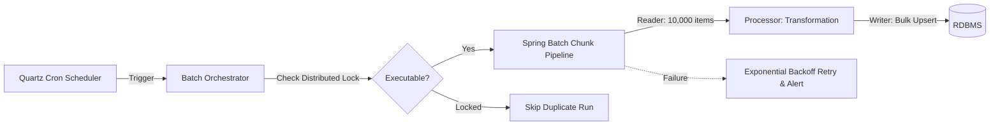

# Batch & Job Scheduler

SyncBoot provides a distributed execution environment based on **Quartz Scheduler and Spring Batch** for high-volume data processing, settlement calculations, and periodic external integrations.

---

## Batch Architecture & Workflow



---

## Key Capabilities

1. **Scheduler Configuration**: Define execution cycles via standard Cron expressions and pass dynamic parameters at runtime.
2. **Chunk-based Streaming**: Processes high-volume records in configurable chunks (e.g., 1,000~5,000 items) to manage memory utilization.
3. **Concurrency Control**: Applies Redis-based distributed locking to prevent duplicate batch runs across multi-instance environments.
4. **Retries & Escalation**: Re-executes operations upon transient timeouts and propagates unrecoverable alerts to designated notification channels.

---

## Batch Job Configuration Sample

```java
@Configuration
@RequiredArgsConstructor
public class SettlementBatchConfig {

    private final JobRepository jobRepository;
    private final PlatformTransactionManager transactionManager;

    @Bean
    public Job dailySettlementJob(Step settlementStep) {
        return new JobBuilder("dailySettlementJob", jobRepository)
                .incrementer(new RunIdIncrementer())
                .start(settlementStep)
                .build();
    }

    @Bean
    public Step settlementStep(
            ItemReader<OrderEntity> orderReader,
            ItemProcessor<OrderEntity, SettlementEntity> settlementProcessor,
            ItemWriter<SettlementEntity> settlementWriter) {
        return new StepBuilder("settlementStep", jobRepository)
                .<OrderEntity, SettlementEntity>chunk(5000, transactionManager)
                .reader(orderReader)
                .processor(settlementProcessor)
                .writer(settlementWriter)
                .faultTolerant()
                .retryLimit(3)
                .retry(DeadlockLoserDataAccessException.class)
                .build();
    }
}
```
