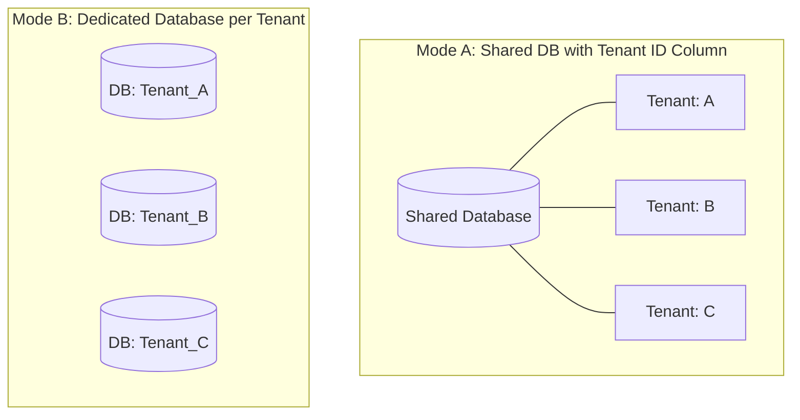

# Multi-Tenant & RBAC Security (IAM)

SyncBoot's security module provides multi-layered data isolation and fine-grained access control tailored for enterprise environments.

---

## Multi-Tenant Isolation Architectures

Two isolation models can be configured depending on operational requirements:



1. **Shared Database Mode**:
   - Each domain table contains a `tenant_id` column. A MyBatis-Plus interceptor appends `WHERE tenant_id = ?` to executed queries.

2. **Dedicated Database Mode**:
   - Dynamic DataSource routing switches the active database connection based on the tenant identifier in the incoming request.

---

## 4-Tier RBAC Access Matrix

| Level | Target | Enforcement Mechanism |
| :--- | :--- | :--- |
| **1. Menu Level** | Admin console navigation | Renders authorized menus based on user roles |
| **2. Action Level** | Buttons (Create/Edit/Export) | `v-hasPermi` directive controls button activation |
| **3. API Level** | Backend REST endpoints | Spring Security `@PreAuthorize` annotation validation |
| **4. Data Level** | Row-Level & Data Masking | Automated SQL predicates and dynamic PII column masking |

---

## Dynamic Data Masking

Sensitive information such as personal identification details can be masked during backend response serialization:

```java
public class UserDetailDTO {

    private Long id;
    private String name;

    @Desensitize(type = DesensitizeType.PHONE) // 010-****-5678
    private String phoneNumber;

    @Desensitize(type = DesensitizeType.EMAIL) // qu***@empasy.com
    private String email;

    @Desensitize(type = DesensitizeType.ID_CARD) // 900101-1******
    private String residentNumber;
}
```
