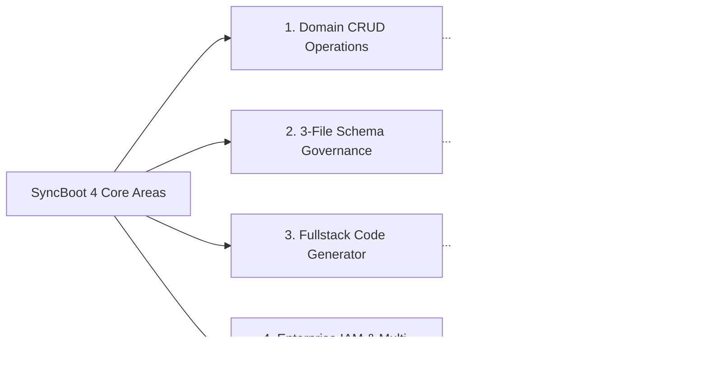

# SyncBoot: Digital Backend Framework Overview

SyncBoot is a Java-based enterprise backend platform designed to recognize business domain context and support database operations and API development.

Built on Spring Boot 3, LangChain4j, and the Model Context Protocol (MCP) standard, SyncBoot provides capabilities for data CRUD operations, schema management, fullstack code scaffolding, and distributed log inspection.

---

## 4 Core Functional Areas

1. **Domain CRUD Operations & Query Execution**:
   - Supports domain data querying and manipulation through natural language queries and standardized MCP tools.
   - Executes database operations safely within authorized transaction boundaries.

2. **Schema Design & 3-File DDL Standard**:
   - Organizes database scripts into the 3-File SQL standard (`init.sql`, `<domain>.sql`, `sample.sql`).
   - Analyzes schema changes in advance and applies migrations following Human-in-the-Loop (HITL) engineer approval.

3. **Low-Code Fullstack API & UI Generator**:
   - Scaffolds Controllers, Services, Mappers, DTOs, and Ant Design Vue 3 frontend screens based on database entity metadata.

4. **Multi-Tenancy & RBAC Security**:
   - Supports tenant data isolation (both Shared DB and Dedicated DB modes), dynamic column-level data masking, and Row-Level Security (RLS) filtering.

---

## 5 Backend Worker Roles

SyncBoot modularizes operational responsibilities across 5 specialized worker roles:

| Role Name | Primary Responsibility | Execution Model |
| :--- | :--- | :--- |
| **Domain Operator** | Executes domain data CRUD and business transactions | Autonomous Execution |
| **Schema Architect** | Designs 3-File DDLs, generates ERDs, and analyzes migration impact | Proposal + Developer Approval |
| **Security IAM** | Enforces RBAC roles, row-level filters, and dynamic data masking | Continuous Policy Enforcement |
| **MCP Dispatcher** | Exposes standard MCP Tools and Resources via HTTP SSE for A2A integration | Standard HTTP SSE Protocol |
| **Batch Orchestrator**| Coordinates high-volume data pipelines and scheduled Quartz/Spring Batch jobs | Scheduler-driven Execution |

---

## Key Benefits

- **Reduced Development Effort**: Reduces repetitive tasks for standard CRUD APIs and administrative UI screens.
- **Controlled Database Migrations**: Pre-migration impact analysis and approval workflows reduce risks during schema updates.
- **Faster Incident Diagnostics**: Aggregates distributed server error logs to accelerate root-cause analysis.
- **Standards Compliance**: Complies with Spring Boot 3, LangChain4j, OpenAPI 3.0, and Model Context Protocol (MCP) specifications.

---

## Documentation Navigation

- [5-Minute QuickStart](./quickstart) - Launching local environment via Docker Compose
- [System Architecture & Modules](./architecture) - 4-layer architecture and worker structure
- [Intelligent Schema Studio](./schema-studio) - 3-File DB standard and DDL approval process
- [Low-Code Fullstack Generator](./lowcode-generator) - Scaffolding backend APIs and Vue 3 UI
- [Multi-Tenancy & RBAC Security](./enterprise-security) - Row-level security and data masking
- [Batch & Job Scheduler](./batch-and-scheduler) - Spring Batch and Quartz task management
- [LangChain4j & MCP Integration](./mcp-and-ai) - Model Context Protocol specifications
- [Production Deployment & Metrics](./production-guide) - Container deployment and performance metrics
- [H2 Embedded Database Setup](./h2) - Local development and unit testing setup
