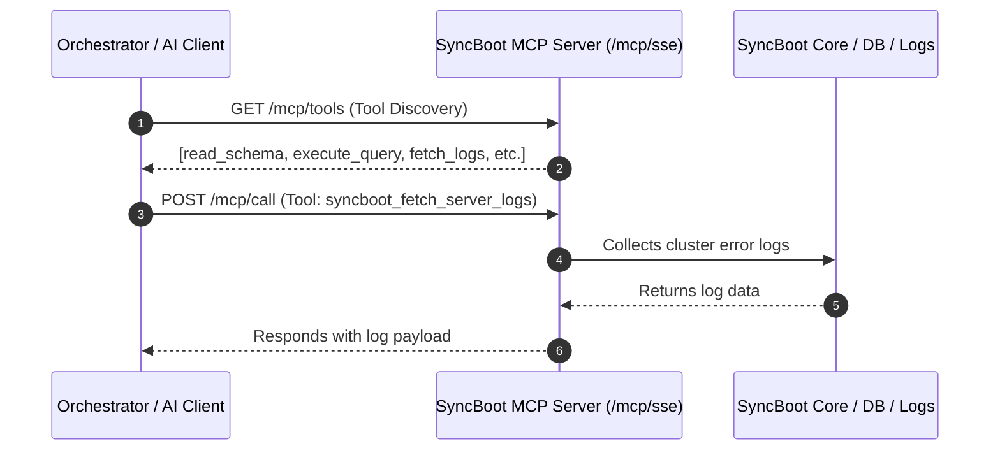

# LangChain4j & Model Context Protocol (MCP) Integration

SyncBoot integrates **LangChain4j** as its enterprise AI framework and exposes **Model Context Protocol (MCP)** interfaces to communicate with external orchestrators and AI clients.

---

## MCP Integration Architecture

SyncBoot provides standardized Tools and Resources via HTTP Server-Sent Events (SSE).



---

## Default MCP Tool Registry

| Tool Name | Description | Parameters | Return Type |
| :--- | :--- | :--- | :--- |
| `syncboot_read_schema` | Inspects table structure and column metadata | `tableName` (String) | JSON (Columns, Types, Nullability, Comments) |
| `syncboot_execute_query` | Executes authorized domain CRUD queries | `sql` (String), `params` (Map) | Record set (max 100 rows) |
| `syncboot_fetch_server_logs`| Extracts recent cluster error logs | `lines` (Int), `level` (ERROR) | Stack trace text |
| `syncboot_get_table_list` | Retrieves all registered business domain tables | `tenantId` (String) | Array of table names and descriptions |

---

## Java Backend Tool Implementation (LangChain4j)

```java
@Component
public class SyncBootMcpTools {

    @Autowired
    private SchemaService schemaService;

    @Autowired
    private LogInspectorService logInspectorService;

    @Tool("Retrieves DDL and metadata for specified table.")
    public TableMetaDTO readSchema(
            @P("Physical table name (e.g. TB_ORDER)") String tableName) {
        return schemaService.getTableMetadata(tableName);
    }

    @Tool("Fetches recent server error logs for analysis.")
    public String fetchServerLogs(
            @P("Number of log lines (default 100)") int lines) {
        return logInspectorService.getRecentErrorLogs(lines);
    }
}
```
