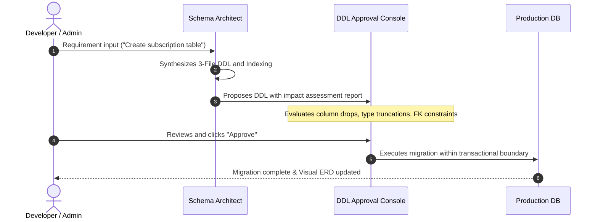

# Intelligent Schema Studio & 3-File DB Standard

SyncBoot applies the **3-File Database Script Standard** and the **HITL (Human-in-the-Loop) Governance Framework** to maintain database consistency and migration safety.

---

## 3-File DB Script Standard Structure

All service modules partition database scripts into 3 standardized files:

```
Server/db/
├── 01. init.sql       # 1. Platform common system DDL & base user/permission seeds
├── 02. syncboot.sql   # 2. SyncBoot domain-specific business tables & metadata
└── 03. sample.sql     # 3. Development and testing sample data
```

| File Name | Content | Management Principle |
| :--- | :--- | :--- |
| **`01. init.sql`** | Platform security tables (`sys_user`, `sys_role`, `sys_permission`, `sys_tenant`) | Platform Common Standard (Read-only) |
| **`02. syncboot.sql`** | Business domain entities (`TB_ORDER`, `TB_PRODUCT`) and indices | Proposed by **Schema Architect** $\rightarrow$ Approved by Developer |
| **`03. sample.sql`** | Sample data for testing and sandboxes | QA and Local Testing |

---

## DDL Review and Approval Process (Human-in-the-Loop)

To prevent unintended database issues in production, SyncBoot follows a structured review sequence:



### Impact Analysis & Detection
- Operations that may affect existing data (such as dropping tables, columns, or narrowing varchar length) are categorized for review.
- Rollback migration scripts are generated alongside forward migrations.

---

## Example DDL Definition

```sql
-- ===================================================
-- 02. syncboot.sql (Domain Table Specification Example)
-- ===================================================

CREATE TABLE IF NOT EXISTS `TB_SUBSCRIPTION` (
  `id` BIGINT NOT NULL AUTO_INCREMENT COMMENT 'Subscription ID (PK)',
  `tenant_id` VARCHAR(64) NOT NULL DEFAULT 'default' COMMENT 'Tenant Identifier',
  `user_id` BIGINT NOT NULL COMMENT 'User ID',
  `plan_code` VARCHAR(32) NOT NULL COMMENT 'Subscription Plan Code',
  `status` VARCHAR(20) NOT NULL DEFAULT 'ACTIVE' COMMENT 'Status (ACTIVE, CANCELED, PAUSED)',
  `started_at` DATETIME NOT NULL COMMENT 'Subscription Start Time',
  `next_billing_at` DATETIME NULL COMMENT 'Next Billing Date',
  `created_by` VARCHAR(64) NOT NULL COMMENT 'Created By',
  `created_at` DATETIME NOT NULL DEFAULT CURRENT_TIMESTAMP COMMENT 'Created Timestamp',
  `updated_at` DATETIME NOT NULL DEFAULT CURRENT_TIMESTAMP ON UPDATE CURRENT_TIMESTAMP COMMENT 'Updated Timestamp',
  PRIMARY KEY (`id`),
  INDEX `idx_sub_tenant_user` (`tenant_id`, `user_id`),
  INDEX `idx_sub_billing` (`status`, `next_billing_at`)
) ENGINE=InnoDB DEFAULT CHARSET=utf8mb4 COLLATE=utf8mb4_unicode_ci COMMENT='Subscription Master';
```
