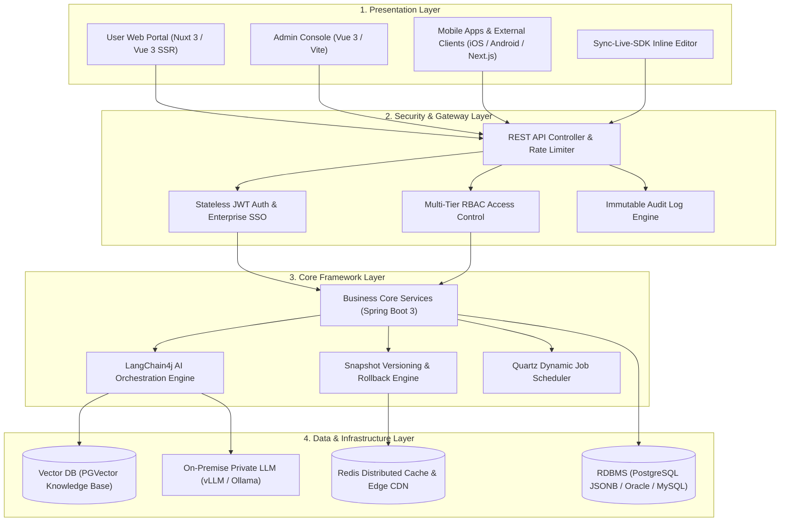
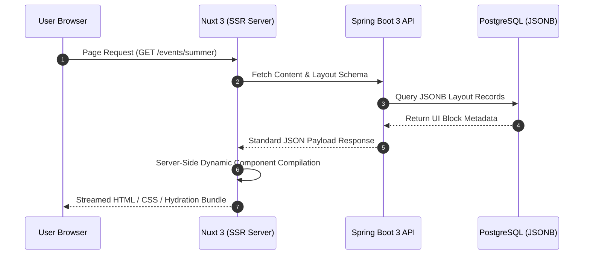

# SyncCMS System Architecture

SyncCMS is engineered with a **Clean Architecture 4-layer structure** to ensure horizontal scalability, high availability, and operational stability under heavy traffic loads.

---

## 4-Layer Architecture Diagram

---

## Detailed Layer Specifications

### 1. Presentation Layer
- **User Web (Nuxt 3)**: Implements Server-Side Rendering (SSR) to pre-render dynamic component hierarchies fetched from backend APIs, optimizing Initial Page Load and Search Engine Optimization (SEO).
- **Admin Console (Vue 3 / Vite)**: Provides a modular management interface with Ant Design Vue, featuring drag-and-drop block builders, menu management, and Quartz scheduler monitoring.
- **Sync-Live-SDK**: A lightweight JavaScript library enabling direct DOM element selection and inline editing on production frontend applications.

### 2. Security & Gateway Layer
- **Stateless JWT Authentication**: Delivers sub-millisecond authentication verification without session replication overhead across cluster nodes.
- **Multi-Tier RBAC**: Enforces granular role-based permissions across system administrators, site managers, content editors, and compliance approvers.
- **Audit Logging**: Persists all content creation, modification, approval, deployment, and rollback events with user identities, client IPs, and state diffs.

### 3. Core Framework Layer
- **Spring Boot 3 & Java 17+**: Provides robust transaction management, modular extension points, and enterprise-grade reliability.
- **LangChain4j AI Engine**: Standardizes private LLM communication, prompt template lifecycle management, and RAG knowledge base retrieval in pure Java.
- **Snapshot Rollback Engine**: Manages immutable version snapshots to execute 1-click zero-downtime rollback in incident response scenarios.
- **Quartz Scheduler**: Manages cron-based asynchronous batch jobs and scheduled publishing without restarting applications.

### 4. Data & Infrastructure Layer
- **PostgreSQL JSONB Storage**: Stores unstructured UI block trees and flexible form definitions in binary JSON with GIN indexing for fast querying.
- **Redis Distributed Cache**: Offloads high-frequency headless content requests to sub-millisecond memory stores.
- **On-Premise AI Infrastructure**: Executes open-weight LLMs via vLLM or Ollama on private GPU instances within air-gapped corporate networks.

---

## Dynamic Page Rendering Pipeline

SyncCMS decouples UI layouts from static template files by persisting dynamic component schemas in database records:

