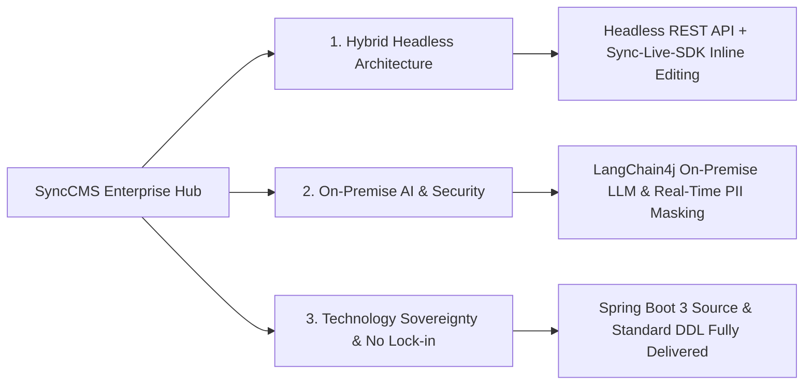

# SyncCMS: Enterprise Hybrid Headless CMS

**SyncCMS** is an **enterprise hybrid headless content management system (CMS)** designed to centrally orchestrate digital content across web portals, mobile applications, and internal intranets from a unified hub.

By implementing strict **Separation of Concerns** between the backend (Spring Boot 3 REST API) and frontend (Vue 3 / Nuxt 3), SyncCMS delivers both frontend inline visual editing via **Sync-Live-SDK** and private on-premise AI orchestration powered by **LangChain4j**. All core business source codes and standard RDBMS DDL schemas are fully delivered, allowing enterprises to internalize the system as a permanent digital asset.

---

## Core Architectural Pillars



### 1. Hybrid Headless Flexibility
- **API-First Architecture**: Delivers structured JSON content via standard REST APIs to any frontend framework (React, Vue, Next.js, Nuxt, iOS, Android).
- **Sync-Live-SDK**: Enables marketers and operators to select and edit text or media directly on live production screens without navigating through back-office menus.
- **Dynamic Component Rendering**: Stores UI layouts and modular block schemas in PostgreSQL `JSONB` columns, enabling server-side rendering (SSR) on Nuxt 3.

### 2. On-Premise AI & PII Governance
- **Zero-Egress Private LLM Integration**: Connects to on-premise open-weight models (Llama-3, EXAONE, Solar) deployed on local GPU infrastructure (vLLM / Ollama) via LangChain4j without sending data to external public cloud APIs.
- **Real-Time PII De-identification**: Automatically detects and masks sensitive personal data (Resident IDs, credit cards, bank accounts, phone numbers) before processing.
- **Advertising Compliance Screening**: Analyzes copy in real time against corporate glossaries and legal compliance rules to prevent false or misleading claims.

### 3. Technology Sovereignty & Asset Internalization
- **Open Business Source Code**: Spring Boot 3 controllers, services, and database DDL scripts are provided transparently, eliminating black-box dependency.
- **Zero Recurring License Overhead**: No usage-based or tier-based pricing tied to API request volumes, administrative accounts, or traffic spikes.
- **Enterprise Integration**: Seamlessly connects with enterprise groupware e-approval workflows, ERP systems, and corporate SSO (OAuth2 / SAML / JWT).

---

## CMS Architectural Comparison

| Comparison Metric | Global SaaS Headless (Contentful, etc.) | Legacy Monolithic CMS | SyncCMS Enterprise |
| :--- | :--- | :--- | :--- |
| **Architecture Model** | API-Only Headless (Cloud-locked) | Monolithic (JSP / Legacy Framework) | **Hybrid Headless (API + Live SDK)** |
| **Air-Gapped Network Support** | Not Supported (Multi-tenant SaaS) | Supported (On-premise package) | **Supported (Complete On-Premise / Air-Gapped)** |
| **AI Integration Engine** | Public AI APIs (Per-token billing) | Not Supported or Rule-based | **LangChain4j On-Premise LLM Pipeline** |
| **Live Screen Inline Editing** | Complex setup / Limited | Not Supported (Back-office only) | **Sync-Live-SDK Direct Screen Editing** |
| **Source Code Delivery** | Black-box API only | Binary / Encrypted delivery | **Core Source Code & DDL Fully Provided** |
| **Disaster Recovery** | Manual storage backup restoration | Manual DB restore (Hours of downtime) | **Snapshot-based 3-Stage Zero-Downtime Rollback** |
| **License Model** | Tier-based monthly SaaS subscription | Perpetual license + annual maintenance | **Permanent Asset Internalization (No added fees)** |

---

## Local Development Quick Start

Run SyncCMS in 3 steps on a local development workstation (JDK 17+, Node.js 20+, pnpm, Docker).

### Step 1: Start PostgreSQL Database
```bash
# Launch local PostgreSQL container
docker compose up -d postgres

# Initialize schema and seed data (Run data/synccms/synccms.sql)
```

### Step 2: Launch Backend API Server (Spring Boot 3)
```bash
cd backend
mvn clean install -DskipTests
mvn spring-boot:run
# API Server endpoint: http://localhost:8080
```

### Step 3: Launch Admin Console & User Web (Vue 3 / Nuxt 3)
```bash
# Admin Console (SyncCMS Admin)
cd frontend/admin
pnpm install
pnpm dev
# Admin Console URL: http://localhost:5666

# User Web Portal (Nuxt 3)
cd frontend/web
pnpm install
pnpm dev
# User Portal URL: http://localhost:3000
```

---

## Technical Documentation Index

Refer to the technical documentation below for comprehensive architecture guides and API specifications:

1. [System Architecture](/synccms/architecture): Clean Architecture 4-layer overview and tech stack
2. [Sync-Live-SDK Integration Guide](/synccms/live-sdk-guide): Frontend embedding and inline visual editing binding
3. [On-Premise AI & Security Compliance](/synccms/onpremise-ai-security): LangChain4j on-premise configuration and PII filtering
4. [Enterprise Governance & Snapshot Rollback](/synccms/integration-governance): E-approval workflow and 3-stage rollback
5. [Headless REST API Reference](/synccms/api-reference): REST API specification, JSON schemas, and cURL examples
6. [Enterprise Operations & Technical FAQ](/synccms/enterprise-faq): Infrastructure specifications, JSONB indexing, and support channels
