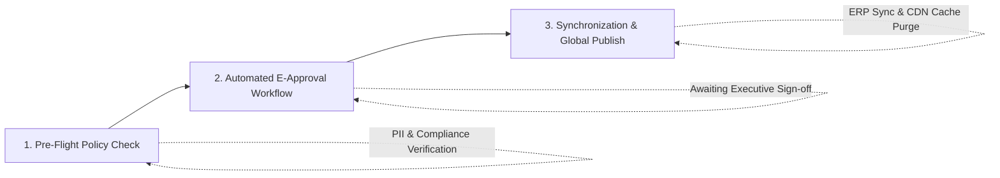

# Enterprise Governance & Snapshot Rollback

SyncCMS integrates natively with enterprise groupware e-approval systems, ERP platforms, and corporate SSO, providing a **snapshot-based 3-stage zero-downtime rollback mechanism** for operational continuity.

---

## 3-Stage Publishing Approval Pipeline



1. **Pre-Flight Policy Check**: Automatically scans drafts for PII leakage, regulatory keyword violations, and broken links prior to approval submission.
2. **Automated E-Approval Workflow**: Constructs standardized approval drafts and differential summaries for groupware API transmission to compliance and management approvers.
3. **Synchronization & Global Publish**: Upon receiving approval confirmation webhooks, commits RDBMS transactions, updates ERP promotion databases, and purges distributed caches.

---

## Snapshot-Based 3-Stage Zero-Downtime Rollback

In the event of an incident or erroneous content publication, a single rollback command restores previous validated states with zero service downtime:

```
[Stage 1: RDBMS Snapshot Restoration]
 └── Restores content state from target snapshot_id within an ACID database transaction

[Stage 2: Redis Distributed Cache Invalidation]
 └── Atomically invalidates distributed cache keys across all API instances and repopulates valid data

[Stage 3: Global Edge CDN Purge]
 └── Invokes cache invalidation APIs across edge CDN providers (Cloudflare / CloudFront / Akamai)
```

---

## Audit Log Database Schema

Maintains an immutable append-only record of all operational actions to satisfy compliance and internal audit requirements:

```sql
CREATE TABLE sys_cms_audit_log (
    audit_id        BIGSERIAL PRIMARY KEY,
    site_key        VARCHAR(50) NOT NULL,
    content_id      VARCHAR(100) NOT NULL,
    action_type     VARCHAR(30) NOT NULL,    -- CREATE, UPDATE, APPROVE, PUBLISH, ROLLBACK
    actor_id        VARCHAR(50) NOT NULL,    -- User Account ID
    actor_ip        VARCHAR(45) NOT NULL,    -- Request IP Address
    previous_state  JSONB,                   -- Pre-change state snapshot (JSONB)
    current_state   JSONB,                   -- Post-change state snapshot (JSONB)
    diff_summary    TEXT,                    -- Summary of modifications
    approval_doc_no VARCHAR(100),            -- Enterprise Approval Document Number
    created_at      TIMESTAMP WITH TIME ZONE DEFAULT CURRENT_TIMESTAMP NOT NULL
);

-- Indexing for high-speed audit retrieval
CREATE INDEX idx_cms_audit_content ON sys_cms_audit_log(site_key, content_id);
CREATE INDEX idx_cms_audit_created ON sys_cms_audit_log(created_at DESC);
```
