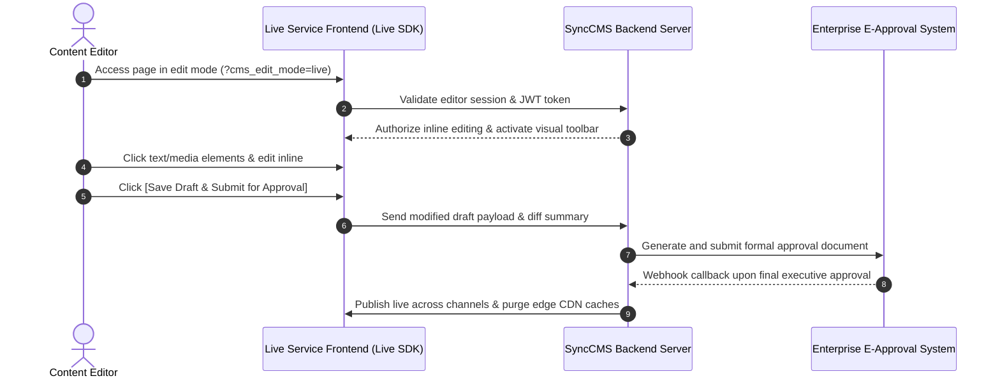

---
title: Sync-Live-SDK Integration Guide | SyncCMS
description: Step-by-step guide to embedding and binding Sync-Live-SDK on frontend web applications for real-time visual inline editing and enterprise approval workflows.
head:
  - - meta
    - name: keywords
      content: Sync-Live-SDK, Inline Editing, Frontend SDK, React Integration, Vue Integration, Next.js, Nuxt 3, E-Approval Workflow, Headless CMS
  - - meta
    - property: og:title
      content: Sync-Live-SDK Integration Guide | SyncCMS
  - - meta
    - property: og:description
      content: Guide to integrating Sync-Live-SDK for real-time inline content editing on live frontend screens.
sort: 3
---

# Sync-Live-SDK Integration Guide

**Sync-Live-SDK** is a lightweight frontend library that allows operators and marketers to **select and edit text, banners, and links directly on live service screens** without logging into separate back-office consoles.

All changes made via the SDK are saved as isolated drafts and submitted to enterprise approval workflows before being published to production.

---

## Operational Workflow Sequence



---

## 1. Vanilla HTML Integration

Add the SDK script tag before the closing `</body>` tag and annotate target DOM elements with data attributes:

```html
<!DOCTYPE html>
<html lang="en">
<head>
    <meta charset="UTF-8">
    <title>Promotion Page</title>
</head>
<body>
    <!-- Target editable content block -->
    <div id="hero-section" data-sync-content-id="PROMO_2026_FALL">
        <h1 data-sync-field="headline">2026 Fall Membership Benefits</h1>
        <p data-sync-field="description">Join today to receive welcome coupon packs and double reward points.</p>
    </div>

    <!-- Sync-Live-SDK script tag -->
    <script src="https://empasy.io/sdk/sync-live-sdk.js"
            data-sync-cms-endpoint="https://empasy.io/api/v1"
            data-sync-site-key="SITE_PORTAL_EN"
            async></script>
</body>
</html>
```

### Required Data Attributes
- `data-sync-content-id`: Unique identifier for the content group.
- `data-sync-field`: Field identifier within the content group (e.g., `headline`, `description`, `ctaText`).

---

## 2. React / Next.js Integration

Use `@empasy/sync-live-react` or custom React hooks to bind dynamic content to React component states:

```tsx
import React from 'react';
import { useSyncContent } from '@empasy/sync-live-react';

interface PromoContent {
  headline: string;
  description: string;
  ctaText: string;
}

export default function HeroBanner() {
  const { content, isEditMode } = useSyncContent<PromoContent>({
    contentId: 'PROMO_2026_FALL',
    defaultData: {
      headline: '2026 Fall Membership Benefits',
      description: 'Join today to receive welcome coupon packs and double reward points.',
      ctaText: 'Claim Offer'
    }
  });

  return (
    <section className={`hero-container ${isEditMode ? 'sync-live-active' : ''}`}>
      <h1 data-sync-field="headline">{content.headline}</h1>
      <p data-sync-field="description">{content.description}</p>
      <button data-sync-field="ctaText">{content.ctaText}</button>
    </section>
  );
}
```

---

## 3. Vue 3 / Nuxt 3 Integration

Use custom directives (`v-sync-editable`) to bind template fields in Vue 3 applications:

```vue
<template>
  <div class="banner-wrapper" :class="{ 'edit-mode': isEditMode }">
    <h2 v-sync-editable="{ contentId: 'BANNER_MAIN', field: 'title' }">
      {{ bannerData.title }}
    </h2>
    <p v-sync-editable="{ contentId: 'BANNER_MAIN', field: 'summary' }">
      {{ bannerData.summary }}
    </p>
  </div>
</template>

<script setup lang="ts">
import { ref } from 'vue';
import { useSyncLive } from '@empasy/sync-live-vue';

const { isEditMode } = useSyncLive();

const bannerData = ref({
  title: 'Data-Driven Enterprise Operations',
  summary: 'Centrally control enterprise infrastructure and digital content.'
});
</script>
```

---

## 4. Security & Publishing Governance

1. **Token Authentication**: Live editing mode is activated strictly when verified administrator credentials or signed JWT tokens (`?cms_token=...`) are provided.
2. **Draft Isolation**: Unapproved changes are stored in isolated draft records and never served to public production endpoints.
3. **Automated Publishing Pipeline**: Upon receiving approval confirmation webhooks, backend transactions commit changes, invalidate Redis caches, and invoke CDN purge webhooks.
