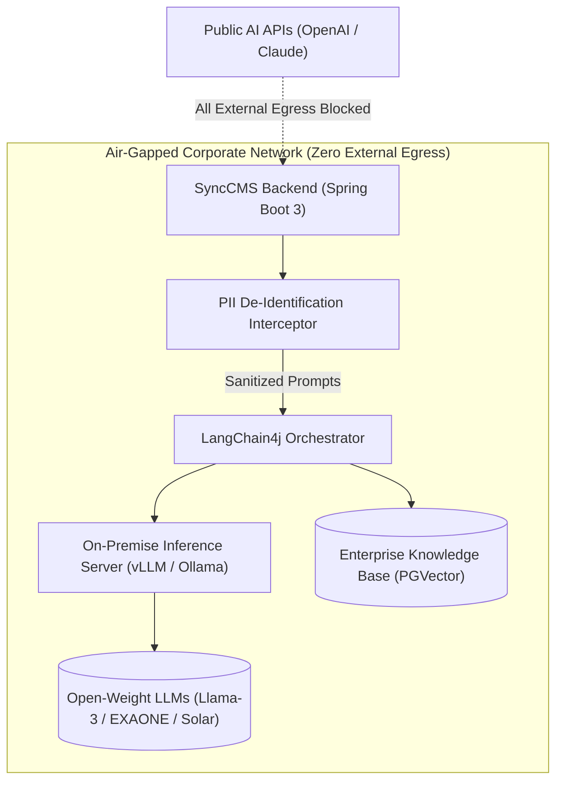

# On-Premise AI & PII Security Compliance

SyncCMS provides dedicated on-premise AI pipelines and real-time security interceptors designed to comply with strict **financial network separation regulations and privacy laws**.

---

## Air-Gapped AI Architecture



---

## 1. LangChain4j On-Premise Model Configuration

Configure private GPU cluster endpoints (vLLM or Ollama) as standard `ChatLanguageModel` Spring beans.

### `application.yml` Configuration
```yaml
langchain4j:
  open-ai:
    chat-model:
      base-url: http://internal-vllm-cluster.local:8000/v1
      api-key: none  # Optional token for internal service auth
      model-name: meta-llama/Llama-3-70b-Instruct
      temperature: 0.2
      timeout: PT60S
      max-retries: 2
```

### Java Configuration Class
```java
package com.empasy.synccms.config;

import dev.langchain4j.model.chat.ChatLanguageModel;
import dev.langchain4j.model.openai.OpenAiChatModel;
import org.springframework.beans.factory.annotation.Value;
import org.springframework.context.annotation.Bean;
import org.springframework.context.annotation.Configuration;

import java.time.Duration;

@Configuration
public class AiModelConfiguration {

    @Value("${langchain4j.open-ai.chat-model.base-url}")
    private String baseUrl;

    @Value("${langchain4j.open-ai.chat-model.model-name}")
    private String modelName;

    @Bean
    public ChatLanguageModel onPremiseChatModel() {
        return OpenAiChatModel.builder()
                .baseUrl(baseUrl)
                .apiKey("internal-key")
                .modelName(modelName)
                .temperature(0.2)
                .timeout(Duration.ofSeconds(60))
                .maxRetries(2)
                .build();
    }
}
```

---

## 2. Real-Time PII De-Identification Interceptor

Automatically intercepts and sanitizes sensitive Personally Identifiable Information (PII) before prompt transmission or log storage:

```java
package com.empasy.synccms.security;

import java.util.regex.Pattern;

public class PiiMaskingInterceptor {

    // National Identity / Resident ID Pattern (e.g. 900101-1234567 -> 900101-1******)
    private static final Pattern RRN_PATTERN = 
        Pattern.compile("\\b(\\d{6})-[1-4]\\d{6}\\b");

    // Credit Card Number Pattern (e.g. 1234-5678-9012-3456 -> 1234-****-****-3456)
    private static final Pattern CARD_PATTERN = 
        Pattern.compile("\\b(\\d{4})-\\d{4}-\\d{4}-(\\d{4})\\b");

    // Mobile Phone Number Pattern (e.g. 010-1234-5678 -> 010-****-5678)
    private static final Pattern PHONE_PATTERN = 
        Pattern.compile("\\b(01[016789])-\\d{3,4}-(\\d{4})\\b");

    public static String maskSensitiveData(String input) {
        if (input == null || input.isBlank()) {
            return input;
        }

        String masked = RRN_PATTERN.matcher(input).replaceAll("$1-*******");
        masked = CARD_PATTERN.matcher(masked).replaceAll("$1-****-****-$2");
        masked = PHONE_PATTERN.matcher(masked).replaceAll("$1-****-$2");

        return masked;
    }
}
```

---

## 3. Compliance Screening & Corporate Glossary

- **Advertising Compliance Checking**: Detects high-risk claims (`100% Guaranteed`, `Absolute Best`, `Unconditional`) that require legal substantiation.
- **System Prompt Glossary Injection**: Automatically injects official corporate terminology, naming standards, and compliance rules into AI system prompts.

---

## 4. Regulatory Compliance Matrix

| Compliance Domain | Regulatory Standard | SyncCMS Implementation |
| :--- | :--- | :--- |
| **Network Separation** | Electronic Financial Supervision Regulation Art. 15 | Air-gapped on-premise execution via vLLM / Ollama |
| **Privacy Protection** | Personal Information Protection Act Art. 29 | Real-time PII regex filtering & log sanitization |
| **Audit Traceability** | Financial Security Framework Art. 20 | Immutable append-only audit logging of all modifications |
