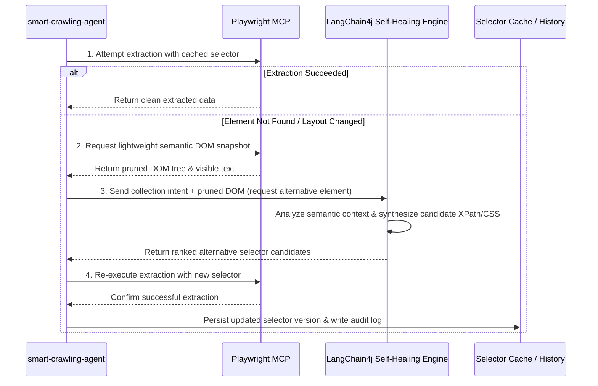

# Adaptive Crawling & AI Self-Healing Engine

A significant portion of maintenance overhead in traditional crawling pipelines stems from **target website UI updates and breaking DOM/CSS changes**. SyncCrawl addresses this operational challenge through **Playwright MCP** and **Self-Healing selector recovery algorithms**.

---

## Traditional Scrapers vs. SyncCrawl Engine

| Capability | Traditional Scrapers (Scrapy, Puppeteer) | SyncCrawl Adaptive Engine |
| :--- | :--- | :--- |
| **Selector Strategy** | Fixed CSS / XPath queries | **Semantic Meaning + Multi-Weight Heuristics** |
| **Response to Redesigns** | Pipeline interruption and manual code updates | **Discovers alternative elements and updates selectors** |
| **Dynamic SPA Support** | Fixed sleep timers with risk of timing failures | **Intelligent sync via DOM mutations & Network Idle** |
| **Complex Workflows** | Custom script writing for clicks / logins | **Natural language scenario builder with action steps** |

---

## Self-Healing Selector Recovery Flow

When target DOM elements cannot be located by initial rules, SyncCrawl executes a multi-step recovery flow:



---

## Technical Details

### 1. Semantic DOM Pruning
Full webpage HTML often contains extraneous elements. SyncCrawl strips non-essential nodes (`<script>`, `<style>`, `<svg>`) to generate a lightweight DOM tree containing visible text, form inputs, table structures, and semantic tags (`article`, `section`, `nav`).

### 2. Multi-Weight Heuristics
The engine evaluates candidate elements using multiple criteria:
- **Textual Label Similarity**: Semantic match of surrounding label text (e.g., "Notice Date", "Author", "Price").
- **Topological Continuity**: Relative parent/child hierarchy patterns compared to previous runs.
- **Accessibility Signatures**: Validation based on `aria-label`, `role`, and `title` attributes.

### 3. Automated Rule Persistence
Once an alternative selector successfully extracts data, it is saved in the database. Subsequent runs utilize the updated selector directly without incurring additional LLM analysis.

---

## Dynamic Interactions & Complex Scenarios

SyncCrawl supports rich browser interactions beyond basic page fetching:

```typescript
// Scenario Agent Execution Payload (Playwright MCP Bridge)
await scenarioRunner.execute([
  { action: 'NAVIGATE', url: 'https://partner.portal.com/login' },
  { action: 'FILL_CREDENTIALS', userField: '#loginId', passField: '#passwd' },
  { action: 'WAIT_FOR_NAVIGATION', waitUntil: 'networkidle' },
  { action: 'HANDLE_MODAL', selector: '.popup-close-btn', optional: true },
  { action: 'INFINITE_SCROLL', maxRounds: 5, scrollDelayMs: 800 },
  { action: 'EXTRACT_LIST', targetSelector: '.data-row', schema: ContentSchema }
]);
```

- **Popup & Modal Handling**: Detects and dismisses promotional modals or cookie consent banners.
- **Virtual & Infinite Scroll**: Intercepts background API requests or scrolls dynamically to collect lazy-loaded items.
