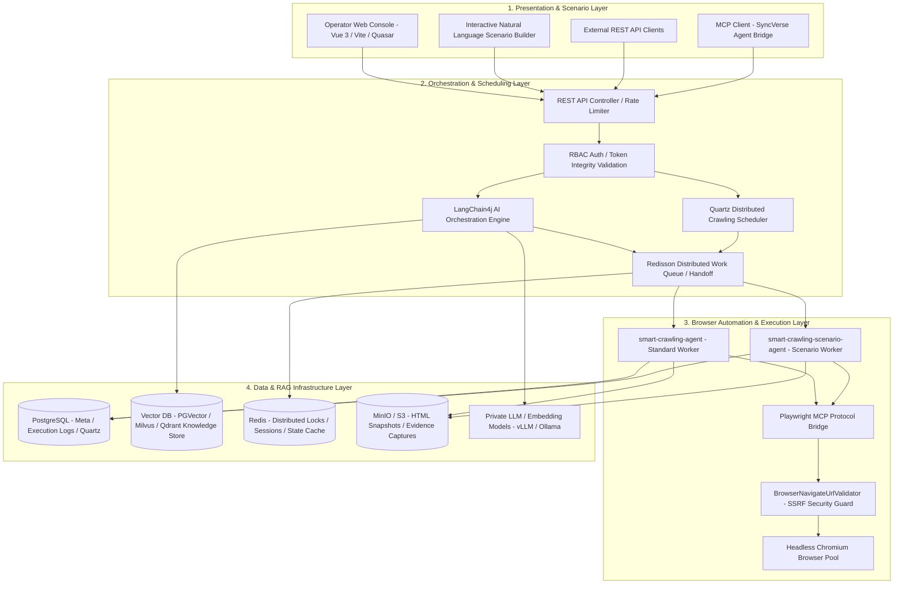

# SyncCrawl System Architecture

SyncCrawl is built on a **4-Layer Clean Architecture** designed for high-concurrency crawling workloads, stable operation, and enterprise RAG pipeline orchestration.

---

## 4-Layer Architecture Diagram

---

## 4 Core Distributed Container Images

SyncCrawl is packaged into 4 independent container images for zero-downtime deployment and dynamic scaling in Kubernetes clusters:

| Container Image | Tech Stack | Role & Responsibilities |
| :--- | :--- | :--- |
| **`smart-crawling-server`** | Java 21, Spring Boot 3.5, LangChain4j, Flyway | API endpoints, Quartz scheduling, AI planning, RAG vector synchronization |
| **`smart-crawling-agent`** | Java 21, Playwright Java, MCP SDK | Standard web page fetching, DOM parsing, data extraction, HTML snapshots |
| **`smart-crawling-scenario-agent`** | Java 21, Node.js/Playwright MCP, Chromium | Complex multi-step actions (login, multi-form entry, infinite scrolling, SPA) |
| **`smart-crawling-console`** | Vue 3, TypeScript, Vite, Quasar | Dashboard monitoring, natural language scenario builder, RAG QA testing console |

---

## Layer Details

### 1. Presentation & Scenario Layer
- **Conversational Scenario Builder**: Interacts with the backend LangChain4j agent to generate multi-step browser interaction scenarios from natural language prompts.
- **Live Stream Monitoring**: Streams browser rendering screenshots and step logs via WebSocket and SSE.

### 2. Orchestration & Scheduling Layer
- **LangChain4j AI Engine**: Dynamically binds Playwright tools and plans crawling actions based on page structure and user intent.
- **Quartz Distributed Scheduler**: Dispatches recurring crawling batches with cluster-safe locking.
- **Redisson Distributed Queue**: Manages work handoff, concurrency throttling, and worker health failover.

### 3. Browser Automation & Execution Layer
- **Playwright MCP Bridge**: Controls browser instances using the Model Context Protocol.
- **SSRF Security Guard (`BrowserNavigateUrlValidator`)**: Validates requests against loopback hosts (`127.0.0.1`, `localhost`) and private CIDR ranges prior to navigation.
- **Self-Healing Recovery Engine**: Analyzes textual context and DOM hierarchy to discover alternative CSS/XPath selectors dynamically.

### 4. Data & RAG Infrastructure Layer
- **PostgreSQL & Flyway**: Manages configuration, schedules, and execution records with automated migrations.
- **Vector DB & Embeddings**: Stores semantic chunks in PGVector, Milvus, or Qdrant for enterprise RAG retrieval.
- **MinIO / S3 Storage**: Stores raw HTML archives and screenshot evidence for compliance audits.
