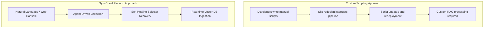

# Enterprise FAQ & Adoption Guide

Architectural and operational questions and answers for IT leaders, software architects, and data engineers evaluating SyncCrawl.

---

## Q1. How does SyncCrawl compare to open-source libraries (Scrapy, Selenium, Puppeteer)?

Open-source libraries provide low-level scripting capabilities. Operating them in production requires implementing custom distributed schedulers, database connectors, monitoring interfaces, RAG pipelines, and **allocating ongoing engineering resources for script maintenance when target sites change**.

SyncCrawl integrates **Self-Healing selector recovery**, **RAG ingestion**, and **distributed architecture** into a unified platform, substantially reducing ongoing maintenance overhead.

---

## Q2. How does SyncCrawl handle anti-bot detection and rate limiting?

SyncCrawl supports configurable controls for stable harvesting:

1. **Browser Environment Emulation**: Configures canvas signatures, WebGL rendering, User-Agents, and screen viewports through Playwright.
2. **Dynamic Request Timing**: Supports randomized interval delays (Jittering) and simulated mouse movements.
3. **Enterprise Proxy Integration**: Connects with corporate egress gateways or external proxy pools for IP rotation.

---

## Q3. How does the architecture scale for large-scale crawl operations?

SyncCrawl is designed for **Kubernetes Horizontal Pod Autoscaling (HPA)**:

- **Microservice Separation**: Decoupling `smart-crawling-server` (orchestration) from `smart-crawling-agent` (worker) allows worker pools to scale horizontally during peak loads.
- **Redisson Distributed Queue**: Provides job dispatching, per-domain concurrency limits, and worker failover.

---

## Q4. What compliance and privacy controls are provided?

SyncCrawl includes features to support compliance management:

- **Robots.txt Adherence**: Provides options to parse and respect target site `robots.txt` crawling directives.
- **PII Masking Filter**: Identifies and masks personally identifiable information (identifiers, email addresses, phone numbers) in collected text.
- **Audit Trails**: Retains records of execution parameters, requesting operators, and data hashes.

---

## Q5. What on-premises (Air-Gapped) deployment options are available?

SyncCrawl supports **Air-Gapped On-Premises environments**:

- **Isolated Installation**: Deploys via container images onto internal Kubernetes clusters or Linux VMs without external internet access.
- **Private AI Infrastructure**: Integrates with on-premise LLMs (vLLM, Ollama) and Vector DBs to maintain internal data boundaries.
- **Integration Support**: Provides technical guidance for enterprise SSO integration and custom scraping scenarios.
