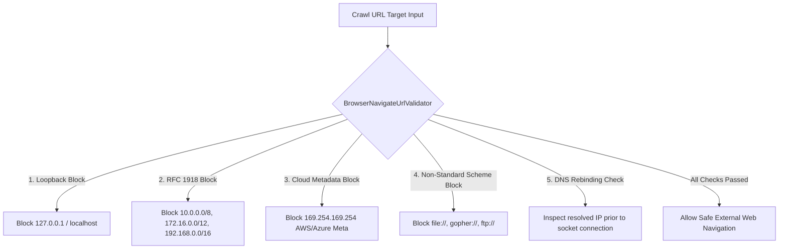
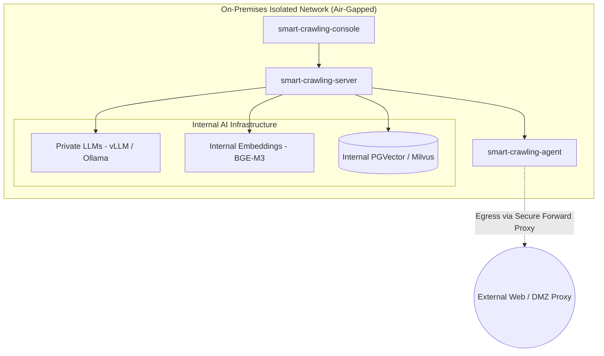

# Enterprise Security & Governance

Security and compliance are essential when operating web crawlers within enterprise infrastructure. SyncCrawl incorporates multi-layered controls to safeguard against unauthorized network exploration and data exposure.

---

## SSRF (Server-Side Request Forgery) Defense

Web crawlers execute network requests to external targets. Without proper validation, unauthorized requests to private IP spaces or cloud metadata endpoints (`169.254.169.254`) could pose security risks.

SyncCrawl implements the **`BrowserNavigateUrlValidator`** module to enforce URL filtering policies:

### Key SSRF Security Controls
- **Loopback & Private Subnet Filtering**: Prohibits requests to `localhost`, `127.0.0.1`, and RFC 1918 internal subnets.
- **Cloud Metadata Shield**: Restricts access to cloud instance metadata services (`169.254.169.254`).
- **DNS Rebinding Verification**: Resolves domain names and verifies the destination IP address prior to opening socket connections.
- **Protocol Whitelist**: Allows `http://` and `https://` schemes while excluding non-standard protocols (`file://`, `jar://`, `dict://`).

---

## Air-Gapped Network & On-Premises Isolation

SyncCrawl operates within isolated enterprise intranets:

- **Private LLM Integration**: Connects with on-premise `vLLM`, `Ollama`, or `LocalAI` instances to minimize data egress risks.
- **DMZ Forward Proxy Support**: Routes external web requests through designated enterprise forward proxies.
- **Air-Gapped Registry Ready**: Container images and dependencies can be served from private registries (Harbor, Nexus).

---

## Granular RBAC & Audit Trails

Crawling operations and knowledge searches are managed through role-based access control and logged for audit purposes:

### 1. Role-Based Access Control (RBAC)
- **Crawling Engineer (Admin)**: Scenario authoring, Quartz schedule management, selector rule tuning.
- **Business Analyst (Analyst)**: Data exploration, RAG testing, report exporting.
- **Compliance Officer (Auditor)**: Access logs, egress traffic inspection, security policy monitoring.

### 2. Audit Trail Logging
For every crawling execution, SyncCrawl records:
- Execution ID, requesting user identity, and client IP.
- Requested URL and canonical destination URL after redirects.
- Execution duration, HTTP status code, and response size.
- SHA-256 hash of archived HTML snapshots.
- Self-Healing diffs showing selector modifications.
