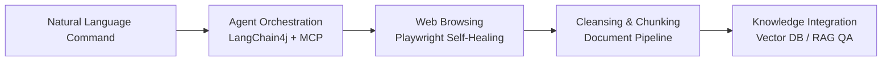

# SyncCrawl™: Web Crawling & RAG Knowledge Platform

SyncCrawl™ is an enterprise web data collection and RAG (Retrieval-Augmented Generation) knowledge construction platform combining **Natural Language Processing (NLP)**, **Playwright MCP browser automation**, and **vector knowledge pipelines**.

When target website UI/DOM layouts change, SyncCrawl analyzes context to reconstruct selectors (Self-Healing), continuously refining and embedding unstructured web data into enterprise vector knowledge stores.

---

## Core Capabilities & Architecture

SyncCrawl addresses the maintenance challenges of traditional crawlers and unifies data harvesting with vector indexing.

### 1. Adaptive Crawling (Self-Healing Crawling)
- **Natural Language Parsing**: Define crawling tasks using standard business language (e.g., "Collect and summarize the 10 latest press releases with attachments").
- **Adaptive Selector Recovery**: When CSS/XPath selectors break due to site redesigns, the agent inspects DOM semantics to locate target elements.

### 2. Enterprise RAG Knowledge Base
- **Context-Preserving Chunking**: Extracts main content while preserving document structure and metadata.
- **Multilingual Embeddings**: Supports domain-optimized embedding models for semantic retrieval.
- **Vector DB Integration**: Provides synchronization with PGVector, Milvus, Qdrant, and Weaviate.

### 3. Distributed Runtime & Enterprise Security
- **4 Distributed Container Images**: `Server`, `Agent`, `Scenario-Agent`, and `Console` allow independent scaling in Kubernetes.
- **SSRF Defense**: Integrated `BrowserNavigateUrlValidator` validates URLs against private network exploration and unauthorized redirects.
- **Air-Gapped Network Support**: Operates in isolated environments with private LLM instances (vLLM, Ollama).

---

## Technical Specifications Summary

| Category | Supported Technologies & Specs |
| :--- | :--- |
| **Core Backend** | Java 21, Spring Boot 3.5, LangChain4j, Flyway |
| **Browser Automation** | Playwright MCP, Headless Chromium, Distributed Workers |
| **Storage & Cache** | PostgreSQL, Redis, MinIO / S3 Object Storage |
| **Vector Databases** | PGVector, Milvus, Qdrant, Weaviate |
| **Management Console** | Vue 3, Vite, TypeScript, Quasar Design System |
| **Deployment** | Docker Multi-Arch (amd64/arm64), Kubernetes (AKS), Air-Gapped Runner |

---

## Documentation Sections

- [System Architecture & Clean Architecture](./architecture.md): 4-layer distributed architecture and service topology
- [Adaptive Crawling & AI Self-Healing Engine](./adaptive-crawling-engine.md): Playwright MCP and dynamic selector recovery algorithm
- [RAG Knowledge Pipeline & Vector Storage](./rag-knowledge-pipeline.md): Data cleaning, semantic chunking, and Vector DB synchronization
- [Enterprise Security & Air-Gapped Governance](./enterprise-security-governance.md): SSRF protection, isolated networks, and RBAC audit trail
- [REST API & MCP Tool Reference](./api-reference.md): Endpoints, JSON response schemas, and MCP specifications
- [Enterprise FAQ & Adoption Guide](./enterprise-faq.md): Anti-bot mitigation, scaling, and compliance FAQs