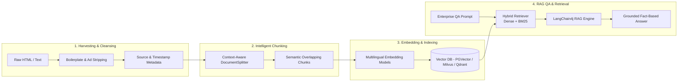

# RAG Knowledge Pipeline & Vector Store

SyncCrawl processes raw web data to generate **RAG (Retrieval-Augmented Generation) knowledge bases** for enterprise generative AI applications.

---

## End-to-End Knowledge Pipeline



---

## Core Processing Stages

### 1. Boilerplate Stripping & Structural Extraction
Raw webpages contain headers, footers, ad scripts, and navigation elements that can dilute retrieval accuracy.
- **Density-Based Text Extraction**: Identifies primary content using DOM text-density analysis.
- **Metadata Preservation**: Enriches each chunk with canonical URL, crawl timestamp, document title, and category taxonomy for verified citations.

### 2. Context-Preserving Semantic Chunking
- **Structural Boundary Detection**: Splits content along headings (`<h1>`–`<h6>`), paragraphs (`<p>`), tables (`<table>`), and list tags.
- **Sliding Window Overlap**: Maintains token overlaps (e.g., 100–200 tokens) between adjacent chunks to preserve context across boundaries.

### 3. Enterprise Embedding Models
Standard integration with LangChain4j allows modular selection of embedding models:

| Category | Recommended Models | Environment |
| :--- | :--- | :--- |
| **On-Premise (Air-Gapped)** | `BGE-M3`, `KoSimCSE`, `Snowflake-Arctic` | Isolated on-premise GPU environments |
| **Cloud API** | `OpenAI text-embedding-3-large`, `Cohere v3` | Global multilingual applications |
| **Edge / CPU** | `all-MiniLM-L6-v2`, `ONNX Runtime` | Resource-constrained edge environments |

---

## Supported Vector Databases

SyncCrawl provides drivers for standard vector databases:

```java
// LangChain4j Vector DB Configuration (Spring Boot Bean)
@Bean
public EmbeddingStore<TextSegment> embeddingStore(PgVectorProperties properties) {
    return PgVectorEmbeddingStore.builder()
            .host(properties.getHost())
            .port(properties.getPort())
            .database(properties.getDatabase())
            .user(properties.getUsername())
            .password(properties.getPassword())
            .table("synccrawl_knowledge_vectors")
            .dimension(1024) // BGE-M3 standard
            .build();
}
```

- **PostgreSQL (pgvector)**: Unified relational and vector storage without requiring a dedicated vector database.
- **Milvus / Qdrant**: Distributed clustering capable of managing large vector indices with fast search.
- **Elasticsearch / OpenSearch**: Hybrid search combining BM25 keyword matching with dense vector embeddings.

---

## Synchronization & Lifecycle Governance

- **Incremental Change Sync**: Recalculates embeddings when page content hash changes.
- **TTL-Based Expiration**: Purges outdated items from vector stores based on configurable TTL policies.
- **Domain Trust Weighting**: Configures search weighting between official sources and general web targets.
