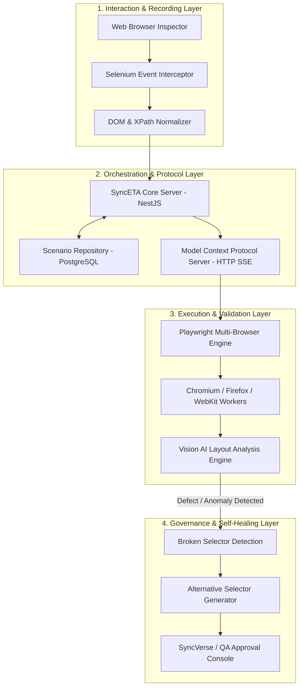

# System Architecture & Pipelines

SyncETA operates across a modular 4-layer architecture spanning event capture, distributed execution, visual verification, and automated self-healing.

---

## 4-Layer Architecture Diagram

---

## Component Specifications

### 1. Interaction & Recording Layer
- **Selenium Event Interceptor**: Intercepts real-time browser user events (`click`, `input/change`, `scroll`, `tab switch`).
- **DOM Normalizer**: Extracts absolute and relative XPath, CSS IDs, class combinations, and hierarchy trees for each event target.
- **Serialization**: Converts raw events into standardized, portable JSON/YAML scenario definitions.

### 2. Orchestration & Protocol Layer
- **NestJS Core Server**: Manages test scenario versioning, project isolation, dataset bindings, and cron execution schedules.
- **Model Context Protocol (MCP) Server**: Provides standardized, stateless tool calling interfaces via HTTP Server-Sent Events (SSE).
- **JWT Authorization**: Verifies role claims and tenant IDs on every incoming request.

### 3. Execution & Validation Layer
- **Playwright MCP Engine**: Spins up containerized Chromium, Firefox, and WebKit browser instances for concurrent test execution.
- **Artifact Collector**: Captures before/after DOM trees, console logs, and synchronized MP4 video recordings for failure triage.
- **Vision AI Engine**: Inspects rendered screenshots to identify visual overlapping, clipped text, and responsive layout breakage.

### 4. Governance & Self-Healing Layer
- **Broken Selector Detection**: Triggers visual localization when DOM selectors fail due to frontend refactoring.
- **Alternative Selector Generator**: Generates replacement DOM paths corresponding to the visually identified target component.
- **Human-in-the-Loop Governance**: Requires explicit QA approval before applying permanent updates to test scenario definitions.
