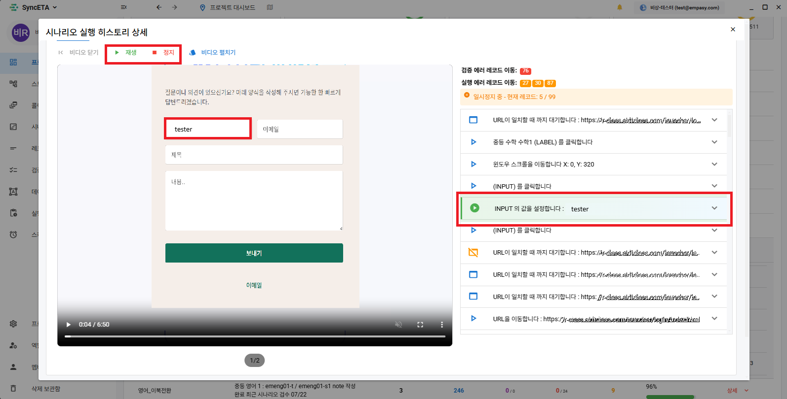
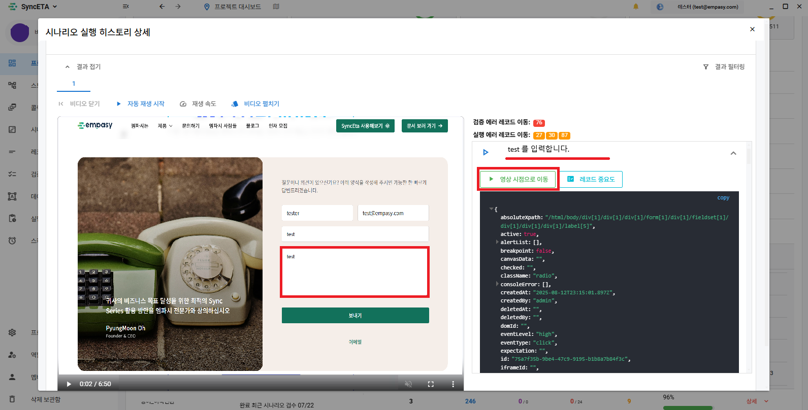

# Dashboard

## Test Results

#### You can view the results by setting the execution type/period.

#### Displays statistics for test results within the inquiry period.

::: info

1. Total number of scenario executions
2. Total number of record executions
3. Execution success rate of records set with 'High' importance (Importance setting is below)
4. Verification success rate of verification records
   :::

#### How to check the detailed execution results of a scenario

#### Auto Play

#### You can easily check the execution result by focusing on the record at the time of the video.

#### You can view videos from multiple tabs at once.

#### Clicking will scroll to the corresponding error record.

#### Moves to the video at the time of record execution.

#### You can write comments on test results.

::: info

- Can tag team members using @
  :::

#### You can check tagged comments.

## Collected Information

1. **Self-Information Collection**  
    SyncETA automatically collects and provides relevant information during regression testing based on the information collected at the time of recording.
   ::: info
   Collects various information of the dom where the event occurred based on user actions.
   :::
   
2. **ConsoleError Collection**  
    You can check ConsoleErrors occurring on the test target page by automatically detecting and collecting them.
   ::: info
   Collects and provides console Errors that occurred during the test.
   :::
   

3. **HTML5 Validation (Feature being added)**  
   Automatically conducts W3C-based HTML5 validation during regression testing, and the results can be collected and utilized to improve the user experience.

4. **SSL Certificate Check**  
    Automatically checks and collects the expiration date of the SSL certificate of the tested page, and informs via a mailing service if the expiration is imminent.
   ::: info
   Collects and provides the SSL certificate expiration date of the service where the test was conducted.

- SSL certificate automatic renewal feature is being added
  :::
  
