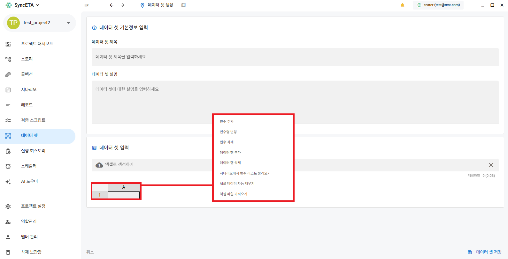
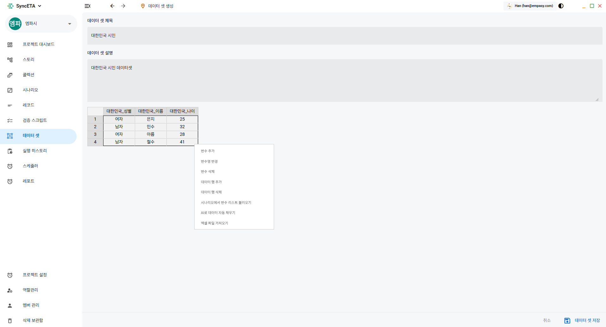

# Dataset Management (Data-Driven Testing)

**'Datasets'** enable parameterizing test inputs to run scenarios repeatedly against extensive data combinations (boundary values, localized text, invalid formats).

---

## 1. Structure & Capabilities

- **Spreadsheet UI**: Familiar row/column interface for managing parameters.
- **Excel Import/Export**: Import external test sheets via [dataset_form.xlsx](./image/dataset/dataset_form.xlsx).
- **Dynamic Variables**: Substitute hardcoded values with `{{username}}` or `{{search_keyword}}`.

---

## 2. Managing Datasets

---

## 3. Applying to Scenarios

<iframe width="100%" height="400" src="https://www.youtube.com/embed/d2RU8aabXIQ" frameborder="0" allowfullscreen allow="autoplay; encrypted-media"></iframe>
