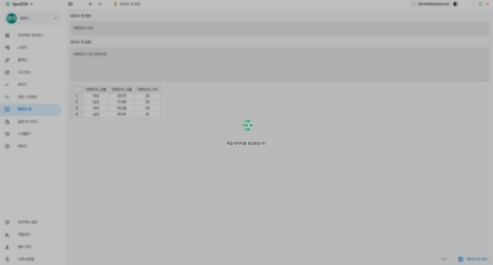

# Dataset

## What is a Dataset?

A dataset plays the role of automatically mapping pre-generated mockup data in a Key-Value structure to variables set in a scenario.
You can generate mockup data based on pre-defined variables, and AI can automatically generate suitable data for the variables.

## Create a Dataset

The dataset is designed with a structure similar to an Excel sheet, making it familiar to users and easy to create and manage.

You can freely add and delete variables and rows, and it provides a function to load variable values pre-set in the scenario.
You can import pre-generated data from an Excel file, and after setting variables, you can automatically generate mockup data using AI.

::: info

- Right-click the sheet
  :::
  

## Create with Excel

#### Excel form [Download](./image/dataset/dataset_form.xlsx)

## Automatic Generation using AI

After setting variables, click 'Auto-fill data with AI', and the AI will automatically generate mockup data that matches the variables.

- Loading
  
- Screen after data generation
  

## Apply Dataset

<iframe width="100%" height="400" src="https://www.youtube.com/embed/d2RU8aabXIQ" frameborder="0" allowfullscreen allow="autoplay; encrypted-media"></iframe>
