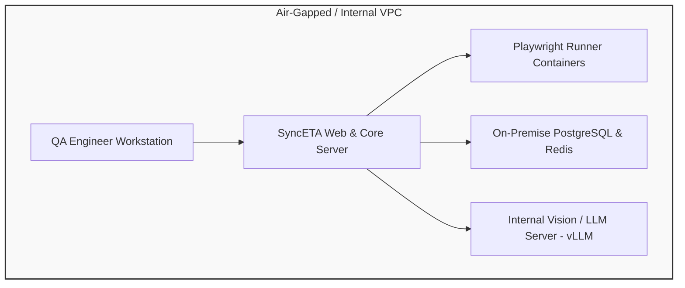

# Enterprise Security & On-Premises Deployment

SyncETA supports full **air-gapped on-premises deployment** and **data governance controls** to satisfy enterprise compliance requirements in financial and public sectors.

---

## 1. Air-Gapped Network Architecture

SyncETA operates fully within closed internal networks without requiring outbound internet connectivity.

### Local Vision / LLM Integration
- **Open-Weight Models**: Deploy models like Qwen2-VL or LLaVA on internal GPU clusters via vLLM or Ollama.
- **OpenAI-Compatible Endpoints**: Connect simply by setting the base URL (`http://vllm.internal:8000/v1`).

---

## 2. PII Data Masking

- **DOM Masking**: Sensitive form fields (`type="password"`) and regex-matched values are obfuscated to `********` during capture.
- **Visual Blur**: Configured selector areas are blurred prior to saving screenshots and video artifacts.

---

## 3. RBAC & Audit Trails

- **Role-Based Access**: Restricts scenario editing, test execution, and API key management across Admin, Lead, Engineer, and Viewer tiers.
- **Audit Logging**: Retains immutable logs of test executions and self-healing approvals for compliance verification.
