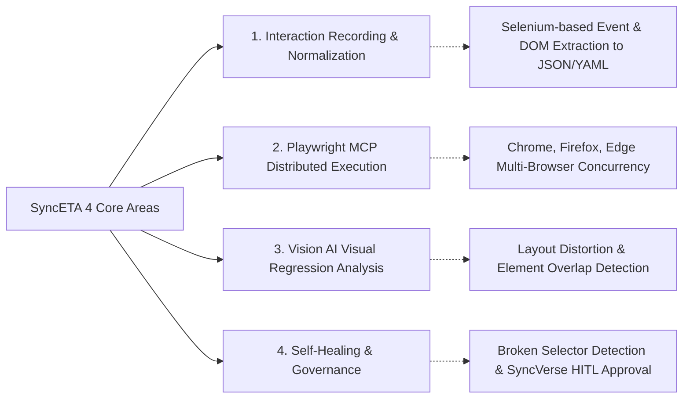
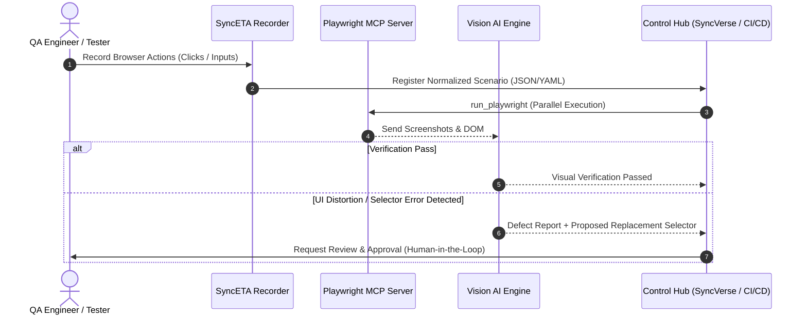

# SyncETA: Autonomous Regression Testing & Self-Healing Platform

SyncETA is an enterprise QA platform that captures user interactions in web applications, executes automated tests via the Model Context Protocol (MCP) standard, detects visual layout anomalies, and performs selector self-healing.

---

## 4 Core Functional Areas

1. **Interaction Recording & Normalization**:
   - Captures user browser operations (clicks, keystrokes, navigation, tab switching) in real time.
   - Collected events are structured with XPath, CSS Selectors, and DOM hierarchy into standardized JSON/YAML formats.

2. **Playwright MCP Distributed Execution**:
   - Executes tests across multi-browser engines (Chromium, Firefox, WebKit) concurrently using standardized Model Context Protocol (MCP) tools.
   - Automatically archives DOM snapshots, console logs, and synchronized video recordings upon test failure.

3. **Vision AI Visual Regression Analysis**:
   - Evaluates layout integrity (element overlapping, text clipping, responsiveness) from a human perception perspective rather than simple pixel diffing.
   - Supports masking for dynamic content areas (timestamps, dynamic banners).

4. **Selector Self-Healing & Governance**:
   - When existing DOM selectors fail due to UI updates, the engine analyzes screen visual layout to locate replacement selectors.
   - Operates under Human-in-the-Loop governance: proposed repairs are submitted to the QA approval queue rather than modifying test assets without review.

---

## 5-Stage End-to-End Test Pipeline

---

## Key Benefits

- **Reduced Script Maintenance Overhead**: Rapidly recovers broken test steps caused by frontend UI updates via self-healing pipelines.
- **Accelerated Cross-Browser Verification**: Parallel execution across multi-browser containers shortens regression test cycles.
- **Accurate Visual Integrity**: Vision AI filtering prevents false alarms caused by minor font antialiasing while capturing genuine UI breakage.
- **Standard Protocol Interoperability**: HTTP SSE-based MCP interface allows seamless integration with enterprise CI/CD pipelines (Jenkins, GitHub Actions) and AI orchestrators.

---

## Documentation Navigation

### 1. Overview & Architecture
- [System Architecture & Pipelines](./architecture) - 4-layer architecture and component communications
- [5-Minute QuickStart Guide](./quickstart) - Container launch and first test execution

### 2. User Guides
- [Account & Workspace Management](./account) - Signup, profiles, and environment preferences
- [Project & RBAC Management](./project) - Projects, roles, permissions, and member invitations
- [Scenario Recording & Studio](./scenario-create) - Browser recording, wait conditions, assertions, recovery scripts
- [Scenario Execution & Scheduling](./scenario-run) - Cross-browser execution, headless mode, and scheduled runs
- [Collection Management](./collection) - Batch sequential and parallel execution suites
- [Story Workflow Studio](./story) - Flowchart-based scenario chaining and multi-tab workflows
- [Dataset Management](./dataset) - Excel integration and Data-Driven Testing
- [Dashboard & Failure Analysis](./dashboard) - Execution statistics, console logs, DOM snapshots, and video replay

### 3. Advanced & Enterprise
- [Visual Regression & Self-Healing](./self-healing-and-vision) - Vision AI inspection and selector repair governance
- [MCP Protocols & CI/CD Integration](./mcp-and-cicd) - Standard Tool schemas and pipeline integration
- [Enterprise Security & On-Premises](./enterprise-security) - Local LLM integration, air-gapped deployment, data masking
- [Technical Glossary](./glossary) - Definitions for Record, Scenario, Collection, Story, MCP, etc.
