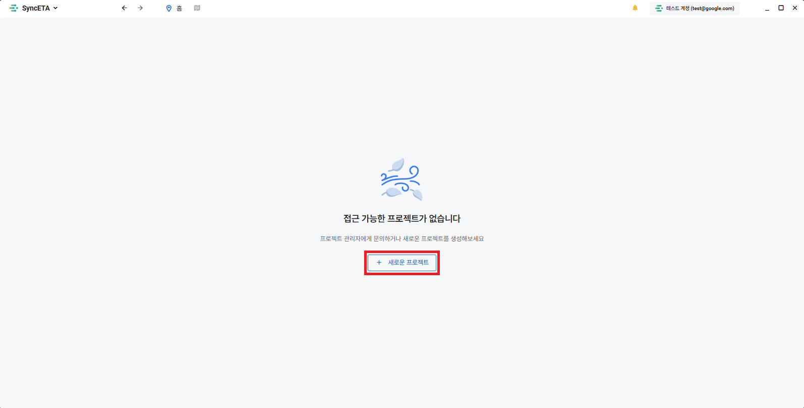
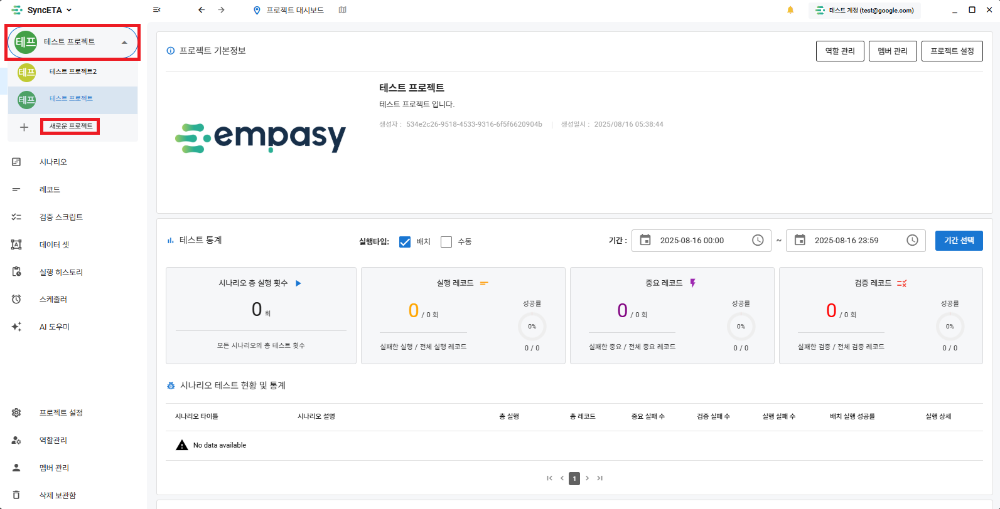
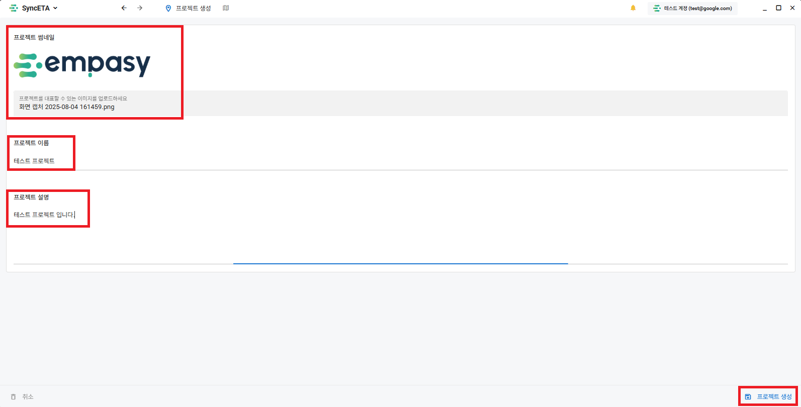
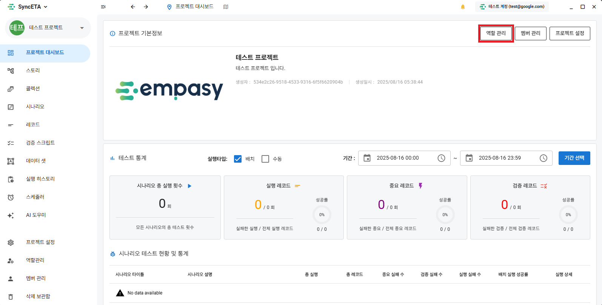
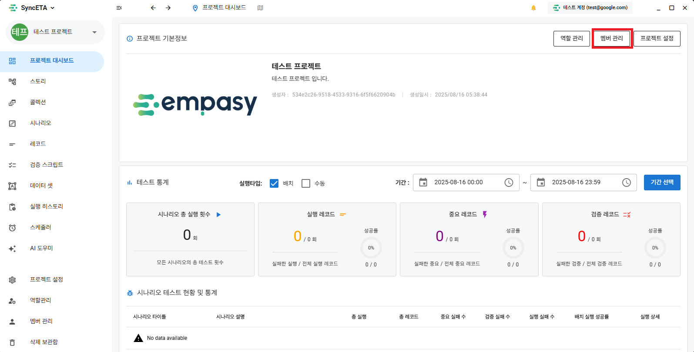
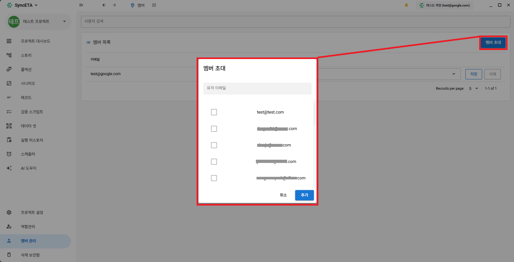
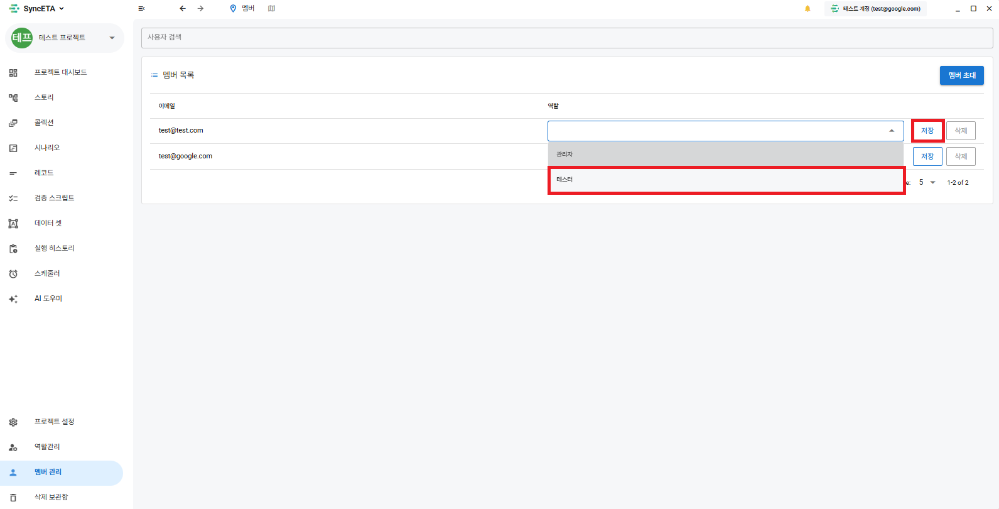

# Project

You will manage various **_'unit tests'_** and **_'integration tests'_** through SyncETA.

A **_'Project'_** is the largest classification unit for managing multiple tests.  
Users are registered as **_'members'_** in a project and use the SyncETA solution.  
We will explain how to invite members to a project and grant operation permissions to each member.

## Create a Project

::: info
How to create a project in the following 3 cases:

1. When not belonging to any project
2. When belonging to an existing project
3. When working in another project
   :::

#### 1. How to create a project when not belonging to any project.

::: info
If you do not belong to a project, click the **_'New Project'_** button in the center of the screen.
:::

#### 2. How to add a project when belonging to an existing project.

::: info
If you belong to a project and want to add another, click the **_'New Project'_** button at the top left of the project list.
:::

#### 3. How to add a project while working in another project.

::: info
Click the **_'New Project'_** button on the project toolbar at the top left of the screen.
:::

#### 4. Project Creation

::: info
You can move to the project creation screen using the 3 methods above.  
Create a project by entering the project profile image, project name, and project description.
:::

## Project List

#### 1. Move to Project List

::: info
Click the **_'Close Project'_** button at the top right to check the list of projects you currently belong to.
:::

#### 2. View Project List

::: info
You can check the list of projects you belong to.
:::

## Role / Permission Settings

::: info
You can create roles and grant permissions for each project.
:::

#### 1. Create Role

::: info
Move to the role creation screen
:::

#### 2. Permission Settings

::: info
Set the permissions to be granted to the role.
:::

## Member Management

::: info
Invite members to a project and grant them working permissions.
:::

#### 1. Invite Members

::: info
Move to the member invitation screen
:::

#### 2. Invite Members

::: info
Select members to invite to the project.
:::

#### 3. Grant Permissions

::: info
Grant permissions to invited members.

- This permission is valid only within the project.  
  ex) A user with admin permissions in Project A may have tester (example) permissions in Project B.
  :::
  
