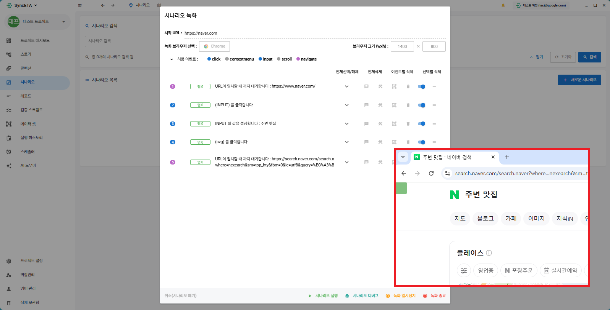
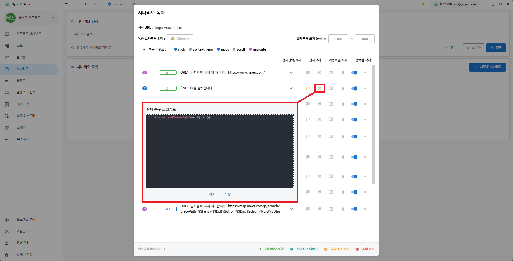

# Scenario Recording & Studio Guide

The SyncETA Studio captures browser actions (clicks, keyboard input, page navigation) and structures them with DOM details (XPath, CSS selectors, tag attributes) into automated test cases.

---

## 1. Scenario Definition

A **'Scenario'** represents an end-to-end user workflow.

Example: `E-Commerce Search & Cart Checkout`
1. Navigate to homepage
2. Click search box and input `Wireless Mouse`
3. Submit search query
4. Click first product from search results
5. Click 'Add to Cart' and verify confirmation modal

---

## 2. Recording Workflow

### Step 1: Open Scenario Creator
Navigate to **'Scenarios'** ➔ click **'New Scenario'**.

### Step 2: Configure Browser & Viewport
Set target URL, browser engine (Chrome/Edge), and viewport resolution.

### Step 3: Event Filters
Select event types to capture (clicks, inputs, hover, scrolls). Default settings are recommended.

### Step 4: Record Actions
Perform actions in the dedicated recording browser. Events appear in sequence below.

---

## 3. Wait Conditions

| Type | Description | Best Used For |
| :--- | :--- | :--- |
| **Fixed Timeout** | Pauses execution for a specified millisecond duration. | External API response latency |
| **DOM Visible** | Waits until target element renders in DOM. | Dynamic modal popups |
| **Value Match** | Waits until target element's text matches expected value. | Status change to 'Completed' |

---

## 4. Assertions

| Type | Description |
| :--- | :--- |
| **DOM Visible Assertion** | Asserts that a target UI component is present on screen. |
| **Value Assertion** | Asserts that text or attribute value matches expected string. |
| **Vision AI Assertion** | Analyzes rendered screenshot to verify layout visual correctness. |

---

## 5. Editing & Additional Features

- **Continue Recording**: Resume recording from a specific existing step.
  
- **Step Comments**: Attach documentation notes to individual steps.
  
- **Recovery Scripts**: Execute fallback JavaScript upon step failure.
  
- **Dataset Variables**: Bind input fields to dynamic variables (`{{username}}`).
  
