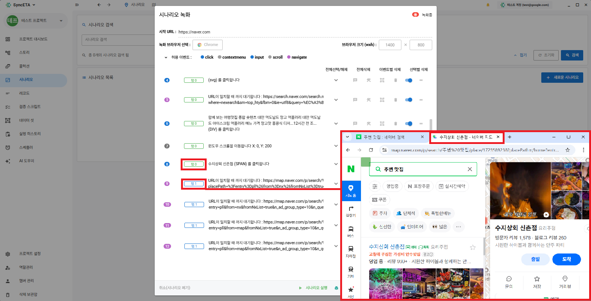
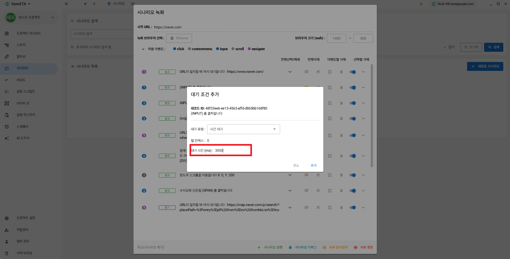
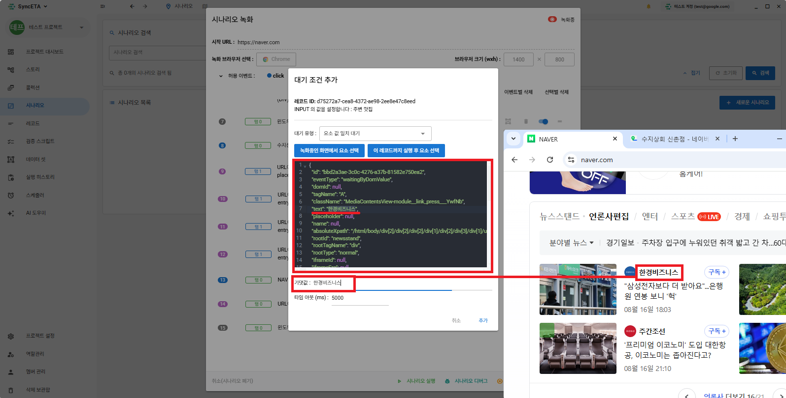
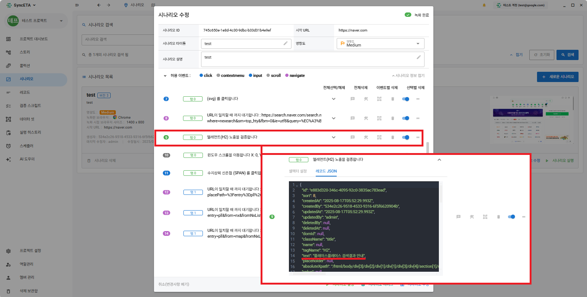
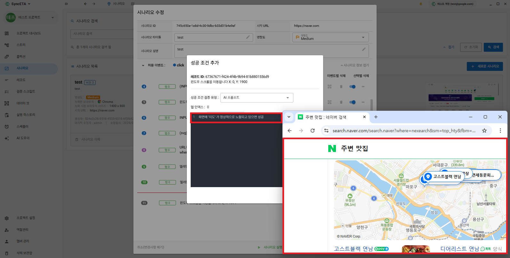
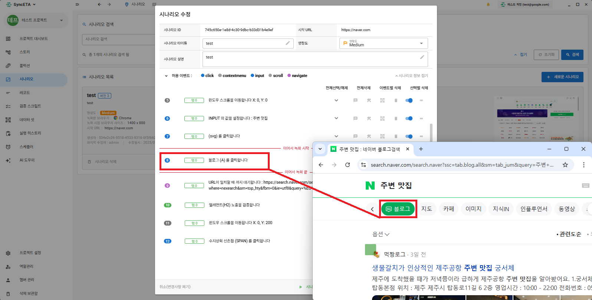

# Scenario

Using SyncETA, you can create and manage test cases through the actual UI without writing complex test code.

## What is a Scenario?

#### A **_'Scenario'_** refers to a functional test unit like the following.

##### [ Access the **_'empasy'_** homepage and send an inquiry ]

1. Access the **_'empasy'_** homepage.
2. Click **_'Contact Us'_**.
3. Enter inquiry details.
4. Send inquiry.
5. Verify successful transmission.

## Create Scenario

#### 1. Go to Scenario Menu

::: info

1. Click the **_'Scenario'_** menu on the left sidebar
2. Click **_'New Scenario'_** at the top right
3. A settings modal required for scenario recording will appear.
   :::
   

#### 2. Set Recording Browser

::: info

1. Enter the URL of the webpage to create the scenario.
2. Select the browser for recording.

- Can choose Chrome for recording -> Edge for execution (Cross-browsing test)

3. Set the size of the browser for recording.

- 1400 x 800 for recording -> 800 x 600 for execution is possible (Responsive test)
  :::
  

#### 3. Set Collection Events

::: info

- After selecting the event type to collect, click the start recording button at the bottom right of the modal.  
  It is recommended to proceed with recording using the default settings.
  :::
  

#### 4. Start Recording

::: info
When you start recording, the browser will appear on the screen.  
Please proceed with the actual test in that browser.  
EX) Search for **_'nearby restaurants'_** on Naver

You can see that records have been collected as shown in the picture.

1. Move to URL
2. Click search bar
3. Enter search term (**_'nearby restaurants'_**)
4. Click search button
   :::
   

#### 4. Collect DOM Information

::: info

- All records have information about the DOM where the event occurred.  
  EX) Collect attributes of the input element where the search term (**_'nearby restaurants'_**) was entered
  :::
  

#### 5. When a new tab opens during recording

::: info
You can continue scenario recording in the exact same way on any new tab added in the browser.
:::

## Wait Record

::: info
This is a function that gives a wait time between executions of records until a specific condition is met.

3 Types of Wait Records

1. Time Wait - Waits for the set time.
2. Element Exposure Wait - Waits until a specific element appears on the screen.
3. Element Value Match Wait - Waits until a specific value is exposed on the screen.

:::

#### 1. Add Time Wait Condition

::: info
Grants wait time before executing a record.

1. Right-click the record that requires waiting.
2. Click Add Wait Condition and set the wait time. (1000 = 1 second)
   :::
   Right-click record
   
   Set Wait Time
   
   Create Wait Record
   
   ::: info
   EX) Add a time wait condition to wait for screen loading (about 3 seconds considering network conditions) after moving to URL, then click the search bar
   :::

#### 2. Add Element Exposure Wait Condition

::: info
Waits until a specific element is exposed on the screen.

1. Right-click the record that requires waiting.
2. Click Add Wait Condition and select Element Exposure Wait.
   :::
   Right-click record
   
   After clicking Select Element on the recording screen,  
   Select the element to wait for in the browser where recording is in progress.
   
   Create Element Exposure Wait Record
   
   ::: info
   EX) Wait until the search bar (input) is actually loaded on the screen before clicking the search bar
   :::

#### 3. Add Element Value Match Wait Condition

::: info
Waits until the set value is exposed on a specific element.
:::

Right-click record

After clicking Select Element on the recording screen,  
Select the element to wait for in the browser where recording is in progress.

::: info
EX) Wait until **_'Hankyung Business'_** is exposed on the news carousel
:::

## Verification Record

::: info
This is a function to verify whether a specific element or a specific value is exposed between executions of records.

1. Verify whether a specific element is exposed on the screen  
   EX) Check if **_'Restaurant Map'_** is exposed on the screen after searching for restaurants
2. Verify whether a specific value is exposed on the screen  
    EX) Check if **_'OO Restaurant'_** is exposed at the top of **_'Places'_**
   :::

#### 1. Add Element Exposure Verification Record

::: info
Verifies whether a specific element is exposed on the screen.
:::

Right-click record

After clicking Select Element on the recording screen,  
Select the element to verify in the browser where recording is in progress.

Create Verification Record

::: info
EX) Verify whether **_'Places'_** is exposed after searching for **_'nearby restaurants'_** on Naver.
:::

#### 2. Add Element Value Verification Record

::: info
Verifies whether a specific value is exposed on the screen.
:::

Right-click record

After clicking Select Element on the recording screen,  
Select the element to verify in the browser where recording is in progress.  
EX) Verify whether **_'Dearest Yeonnam'_** is exposed at the top of Places

Create Verification Record

::: info
EX) Check if **_'Dearest Yeonnam'_** is exposed at the top of **_'Places'_**
:::

#### 3. Screen Verification using AI

::: info
Used when image-based verification is needed, rather than the exposure of specific values or elements on the screen.
:::

Right-click record

Select AI Prompt and enter the prompt.  
The Sync-ETA agent automatically captures the current browser screen and verifies it with AI.
::: info
Using AWS Bedrock - claude-3-haiku model
:::

::: info
EX) Check if **_'Map'_** is normally exposed on the screen after searching for **_'nearby restaurants'_**
:::

## Edit Scenario

::: info
This is a feature to continue recording from a specific part of an existing scenario.
:::

#### 1. Select Scenario to Edit

Click Edit Scenario

Select the record from which to continue recording.

::: info

1. The recording browser appears just like when creating a scenario.
2. The script runs up to the record where you wish to continue recording.
3. Once the set record is reached, it collects events occurring in the browser from that point onward.
   :::
   

## Additional Features

#### 1. Note Feature

::: info
Enter the contents of the record.
:::

#### 2. Failure Recovery Script

::: info
If a record fails, a recovery script is executed.
:::

#### 3. Dataset

::: info
Specifies the input value.  
EX) Replaces the search term (**_'nearby restaurants'_**) with a value specified by the user.  
** For detailed explanation, refer to **_'Dataset'_\*\*
:::

#### 4. Delete

::: info
Deletes the collected record.  
EX) If you click the wrong part while recording, delete that record.
:::

#### 5. Disable

::: info
Excludes collected information during execution without deleting it.
:::

