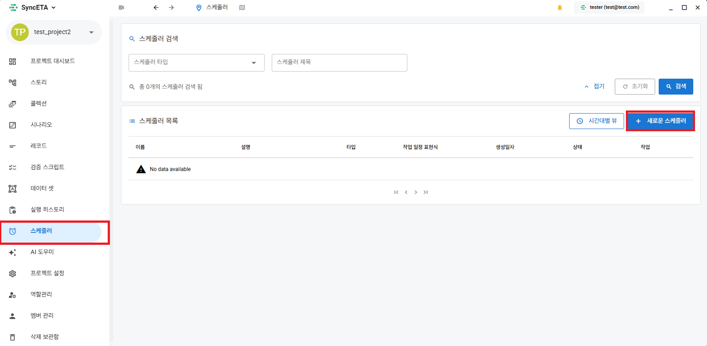

# How to Run

#### Introducing various methods to automate E2E tests through SyncETA.

##### 1. Direct Scenario Execution

##### 2. Automatic Execution via Scheduler

::: info

- Direct execution launches a browser directly on the PC where SyncETA is installed to execute the scenario.
- The scheduler executes the scenario on the server at the set time and provides the results along with a video.
  :::

##### 3. Integrated testing by combining multiple scenarios through the **_'Story'_** feature

##### 4. Execute multiple scenarios in series/parallel through the **_'Collection'_** feature

##### 5. Execute scenarios by setting input values through the **_'Dataset'_** feature

::: info

- For **_'Story'_**, **_'Collection'_**, and **_'Dataset'_** features, please refer to their respective menus.
  :::

## Direct Execution

<iframe width="100%" height="400" src="https://www.youtube.com/embed/ZTwlHnBf3lY" frameborder="0" allowfullscreen allow="autoplay; encrypted-media"></iframe>

::: info

- Various settings are available before executing a scenario.
  :::
  

##### 1. For this feature, please refer to the **_'Dataset'_** section.

##### 2. Browser to Execute - Select the browser in which to execute the scenario.

##### 3. Browser Size - Set the size of the browser.

##### 4. Number of Iterations - Set the number of times to iterate the scenario.

Series: Executes the same scenario sequentially for a total of N times.  
Parallel: Executes the scenario simultaneously with a total of N browsers.

##### 5. When Headless Browser is checked: Executes the scenario without launching a real browser (Background execution).

##### 6. When Close Browser After Execution is checked: Closes the browser after the scenario finishes.

##### 7. When Save Video During Execution is checked: Records the browser screen.

##### 8. Record Execution Interval: Sets the default wait time between executing each record.

## Scheduler Settings

##### 1-1. Go to the **_'Scheduler'_** menu.

##### 1-2. Set the scheduler execution time.

##### 1-3. Select a scenario.

::: info

- You can set the execution browser type, browser size, etc.
  :::
  

##### 1-4. Confirm Scheduling

::: info

- You can check the scenarios executed by time slot.
  :::
  
