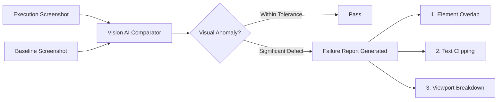
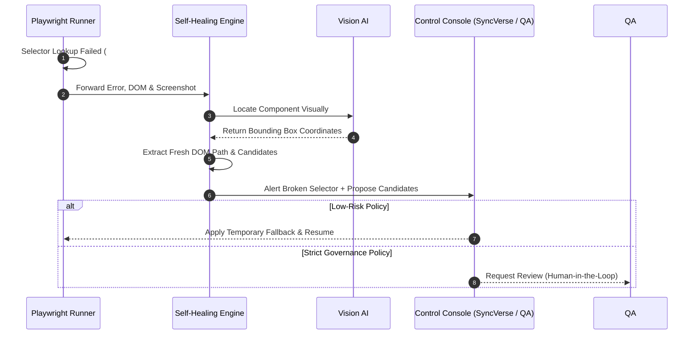

# Visual Regression & Selector Self-Healing

Frequent frontend deployments often break existing DOM selectors or introduce visual defects that traditional unit tests miss. SyncETA combines **Vision AI analysis** with **Selector Self-Healing** to keep regression suites stable.

---

## 1. Vision AI Visual Regression

Traditional pixel diffing frequently causes false positives due to font antialiasing or 1-pixel shifts. SyncETA evaluates rendered layouts from a human perception perspective.

### Visual Inspection Criteria
- **Element Overlap**: Detects popups or banners obstructing key interactive buttons.
- **Text Clipping**: Identifies button labels or descriptions overflowing container boundaries.
- **Ignored Regions**: Masks dynamic components (timestamps, live feeds) from comparisons.

---

## 2. Selector Self-Healing Pipeline

When DOM selectors fail due to framework upgrades or class obfuscation, SyncETA automatically identifies replacement candidates.

---

## 3. Human-in-the-Loop Governance

- **Healing Review Queue**: Lists broken selectors alongside AI-proposed replacements.
- **Side-by-Side Visual Diff**: Compares original and current component screenshots for 1-click approval or rejection.
- **Audit Logs**: Records approval timestamps and user identity to ensure test suite integrity.
