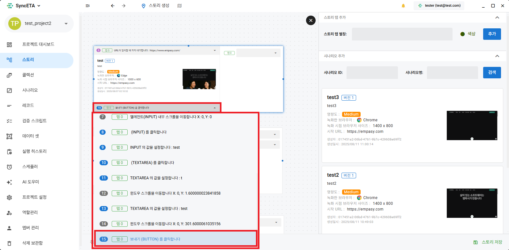

# Story

## Story Features

#### Connect multiple scenarios and run them integrally in a single browser

## Create Story

#### 1. Go to Story Menu

#### 2. Select and drag a scenario to be created as a story from the scenario list on the right.

#### 3. Create a tab alias.

::: tip

- Uniquely identifies each tab.
  :::
  

#### 4. Apply the alias to the tab.

::: tip

- Records are executed sequentially for each tab with the same alias.
  :::
  

#### 5. Connect scenarios to be executed subsequently.

#### 6. Select the start and end records of the selected scenarios.

