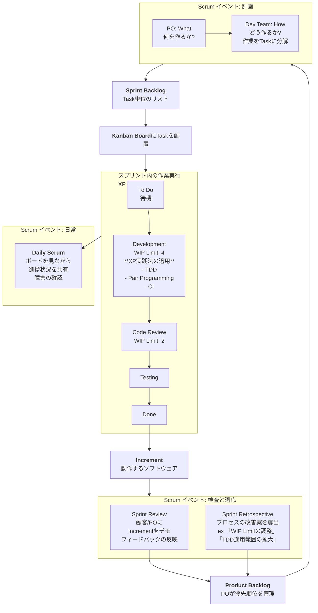

## XP、Scrum、Kanban 統合ガイド: アジャイル開発方法論の比較と実務適用戦略

### 序論: アジャイルの本質と進化

アジャイル(Agile)は、「俊敏な」という意味の通り、変化する要件に素早く対応し、継続的に価値を提供するためのソフトウェア開発哲学とフレームワークの集合体です。2001年に発表された「アジャイルソフトウェア開発宣言」は、プロセスやツールよりも **個人と対話** を、包括的なドキュメントよりも **動くソフトウェア** を、契約交渉よりも **顧客との協調** を、計画に従うことよりも **変化への対応** をより価値あるものとしています。

本ガイドでは、アジャイルを実現する代表的な3つの方法論である eXtreme Programming(XP)、Scrum、Kanbanを比較分析し、それらの相互関係を説明するとともに、これらを統合的に活用する方法論を提示します。

---

### 1. XP、Scrum、Kanbanの比較

#### **1.1 eXtreme Programming (XP) - エンジニアリング実践法**

XPは、ソフトウェアの品質を高め、開発チームの生産性と対応能力を最大化することに焦点を当てた **開発フレームワーク** です。顧客の急速に変化する要件に対応することを核心的な目標としています。

- **哲学:** 「もしそれが良いことなら、極端に行う方がさらに良いだろう。」
- **適用範囲:** 主にソフトウェアの **コード開発段階** に深く関与します。
- **周期:** **イテレーション(Iteration)** という短い周期(通常1〜2週間)で開発を進めます。
- **核心的な実践法 (Practices):**
  - **ペアプログラミング (Pair Programming):** 2人の開発者が1台のコンピュータで作業し、リアルタイムでコードをレビューし、知識を共有します。
  - **テスト駆動開発 (TDD - Test Driven Development):** 作成するコードに対する **失敗するテストコードを先に作成** し、その後、そのテストを通過する最小限のコードを作成します。これを繰り返すことでコードの信頼性を高めます。
  - **継続的インテグレーション (CI - Continuous Integration):** 1日に複数回コードをメインリポジトリに統合し、自動化されたテストを実行して問題を早期に発見します。
  - **リファクタリング (Refactoring):** 機能を変更することなくコードの内部構造を改善し、可読性と保守性を高めます。
  - **シンプルな設計 (Simple Design):** 現在の要件を満たす最もシンプルなシステムを設計します。
  - **コードの共同所有 (Collective Code Ownership):** 誰でもシステムのどの部分でも修正できます。
  - **オンサイト顧客 (On-Site Customer):** 顧客が開発現場に常駐するか、非常に容易にアクセスできなければなりません。

- **メリット:** 高いコード品質、バグの減少、技術的負債の最小化、変化に対する恐れの軽減。
- **デメリット:** 実践法の導入に対する学習曲線が高く、集中力が必要。ペアプログラミングへの抵抗感、オンサイト顧客確保の難しさ。

#### **1.2 Scrum - プロジェクト管理フレームワーク**

Scrumは、複雑な製品を開発・管理するための **プロジェクト管理フレームワーク** です。誰が、何を、いつ行うかに関する役割、意思決定構造、イベントを明確に定義します。

- **哲学:** 経験主義(Empiricism)に基づいて、**透明性、検査、適応** のサイクルを通じて複雑な問題を解決します。
- **適用範囲:** プロジェクトの **管理およびコラボレーションプロセス** 全般にわたって適用されます。
- **周期:** **スプリント(Sprint)** という固定された長さ(通常2〜4週間)のタイムボックス(Time-box)で作業を進めます。
- **核心的な役割 (Roles):**
  - **プロダクトオーナー (PO - Product Owner):** 製品の価値を最大化する責任を負い、要件を **プロダクトバックログ(Product Backlog)** として管理し、優先順位を指定します。
  - **スクラムマスター (SM - Scrum Master):** チームがScrumを効果的に実践できるようにコーチし、障害を取り除きます。管理者ではなく **サーバントリーダー** の役割です。
  - **開発チーム (Development Team):** 実際に製品を作るクロスファンクショナル(cross-functional)で自己組織化(self-organizing)されたチームです。
- **核心的な成果物 (Artifacts):**
  - **プロダクトバックログ (Product Backlog):** 製品に必要なすべての機能、改善事項、修正事項の優先順位リスト。
  - **スプリントバックログ (Sprint Backlog):** 現在のスプリントで実行することにしたプロダクトバックログの項目と、それを完了するための計画。
  - **インクリメント (Increment):** スプリント終了時に生み出された「動作する製品」の成果物。
- **核心的なイベント (Events):** (すべてTime-boxed)
  - **スプリントプランニング (Sprint Planning):** 何を、どのように行うかを計画します。
  - **デイリースクラム (Daily Scrum):** 15分間で進捗状況を共有し、障害を確認します。
  - **スプリントレビュー (Sprint Review):** 成果物を顧客/ステークホルダーに見せ、フィードバックを受けます。
  - **スプリントレトロスペクティブ (Sprint Retrospective):** チームのプロセスをレビューし、改善点を導き出します。

- **メリット:** 明確な役割と責任、定期的なフィードバックと適応、透明な進捗状況、チームの自己組織化の誘導。
- **デメリット:** エンジニアリング実践法に対する直接的なガイドラインがない(品質はチームに依存する)、スプリント内の変更禁止による硬直性(変更は次のスプリントまで待機)。

#### **1.3 Kanban - 継続的フロー改善システム**

Kanbanは、**作業のフロー(Flow)** を視覚化し、進行中の作業(WIP - Work In Progress)を制限することで効率を最大化する **継続的フロー(Continuous Flow)システム** です。漸進的なプロセス改善に焦点を当てます。

- **哲学:** 「現在のプロセスを出発点として認め、漸進的な変化を通じて継続的な改善を追求する。」
- **適用範囲:** **どのようなプロセスにも適用可能**です。(開発、保守、マーケティング、人事など)
- **周期:** **継続的(Continuous)** です。タイムボックスの概念がなく、作業が完了すればすぐに次の作業を開始します。
- **核心的な実践法 (Practices):**
  - **視覚化 (Visualize):** **カンバンボード (Kanban Board)** を使用して、作業のフローと状態(例: To Do, In Progress, Done)を一目でわかるように表示します。
  - **進行中の作業の制限 (WIP Limit):** 各段階(特に「In Progress」)で同時に進行できる作業の最大数を制限します。これにより、ボトルネック現象を発見・解決し、チームの集中力を高めます。
  - **フロー管理 (Manage Flow):** 作業がボード上でどのように流れているかを観察し、待機、遅延、ボトルネックを測定して、継続的にフローを円滑にします。
  - **明確なプロセスポリシー (Explicit Policies):** 各作業段階の定義と完了(DoD - Definition of Done)基準を明確にします。
  - **フィードバックループ (Feedback Loops):** 運用会議、デリバリー会議などを定期的に開催し、フローと品質をレビューします。

- **メリット:** 非常に柔軟で変更に即座に対応可能、導入の障壁が低い、ボトルネック現象の把握と処理時間(Cycle Time)の短縮に優れている。
- **デメリット:** 役割と締め切りが明確でないため、チームの規律がないと難航する。長期的な計画の策定が難しい。変化のスピードが遅い場合がある。

#### **1.4 比較要約表**

| 特徴 | **eXtreme Programming (XP)** | **Scrum** | **Kanban** |
| :-------------- | :---------------------------------------- | :------------------------------- | :------------------------------------- |
| **本質** | **エンジニアリング実践法の集合** | **プロジェクト管理フレームワーク** | **継続的フロー改善システム** |
| **焦点** | コードの品質、技術的卓越性 | チームコラボレーション、価値提供、適応 | ワークフローの効率化、待機時間の短縮 |
| **周期** | イテレーション (1〜2週間) | スプリント (2〜4週間、固定) | 継続的 (タイムボックスなし) |
| **変化への対応** | イテレーション内でも可能 | スプリント中は変更禁止 | いつでも可能 (非常に柔軟) |
| **役割** | コーチ、顧客、開発者 | PO、SM、開発チーム | 特定の役割を強要しない |
| **主要ツール** | TDD、ペアプログラミング、CI | スプリントバックログ、バーンダウンチャート | **カンバンボード、WIP制限** |
| **測定指標** | 単体テストカバレッジなど | スプリントベロシティ(Velocity) | **サイクルタイム、スループット(Throughput)** |
| **適した状況** | 要件が非常に頻繁に変更される、高い品質が求められる | 明確な目標と迅速な成果物の提供が必要 | 保守、不規則な業務量、漸進的な改善 |

---

### 2. 3つの方法論の関係: 相互補完的かつ進化的な関係

XP、Scrum、Kanbanは互いに競争する方法論ではありません。これらは異なる問題を解決する、**相互補完的**かつ**進化的**な関係にあります。

1. **Scrum + XP: 最も一般的な強力な組み合わせ**
- Scrumは、**「何をするか(What)」** と **「いつするか(When)」** に関する管理フレームワークを提供します。
- XPは、**「どのように上手くやるか(How)」** に関するエンジニアリング実践法を提供します。
- つまり、Scrumチームがスプリントで約束したインクリメントを、**高い品質**で、**持続可能**な速度で生産するために、XPの実践法(TDD、CI、リファクタリング)を導入するのは非常に自然なことです。Scrumは骨組みを、XPは肉付けを提供すると言えます。

2. **Kanban -> Scrum: 漸進的なアジャイル導入の道**
- Kanbanは既存のプロセスを壊すことなく、視覚化とWIP制限から始めて漸進的に改善します。
- したがって、アジャイル/スクラムを初めて導入する組織は、Kanbanで現在の状態を視覚化しフローを改善した後、徐々にScrumの役割(Roles)、イベント(Events)、成果物(Artifacts)を導入する **進化的なアプローチ** を取ることができます。

3. **Scrum -> Kanban: スクラムの柔軟性の拡張 (Scrumban)**
- Scrumチームが、スプリントの境界なしにより柔軟なワークフローを必要とする場合(例: 保守チーム)、Kanbanのフロー中心のアプローチを取り入れます。
- これは **Scrumban(スクラムバン)** と呼ばれ、スプリントプランニング/レビュー/振り返りのようなScrumの規律は維持しつつ、デイリースクラムと作業の実行はKanbanボードとWIP制限を使用して継続的なフローで進める方式です。

---

### 3. Scrum、XP、Kanbanの実践的統合

理想的なチームは、3つの方法論の強みを調和させてブレンドします。以下はこれを体系的に適用する方法です。

#### **3.1 統合の原則**

1. **Scrumを基本の骨組み(Backbone)として使用:** プロジェクト管理とコラボレーションの枠組みは、Scrumの役割、イベント、成果物に従います。
2. **XPの実践法で品質(Quality)を保証:** 開発段階でコード品質と持続可能なスピードのために、XPの実践法を積極的に導入します。
3. **Kanbanのフロー(Flow)でプロセスを改善:** スプリント内のワークフローを管理し、ボトルネック現象を発見するために、KanbanボードとWIP制限を活用します。

#### **3.2 段階別チェックリスト (統合適用ロードマップ)**

**🔹 Phase 1: 準備および導入 (1〜2ヶ月)**
- [ ] **関係者の教育:** すべてのメンバー(開発者、管理者、顧客)が、Scrum、XP、Kanbanの基本概念と統合の目的を理解するようにします。
- [ ] **Scrumの枠組み構築:**
  - [ ] **プロダクトオーナー(PO)** を指定し、**プロダクトバックログ** を初期作成します。
  - [ ] **スクラムマスター(SM)** を指定します。
  - [ ] **開発チーム** を構成します (可能な限りクロスファンクショナルに)。
  - [ ] **スプリントの周期**(例: 2週間)を決定します。
- [ ] **ツールの設定:** Jira、Trello、Azure Boardsなど、**Kanban Board**機能があるコラボレーションツールを設定します。(物理的なボードも可能)

**🔹 Phase 2: 最初のスプリントの実行およびXP実践法の導入 (3〜6ヶ月)**
- [ ] **Scrumイベントの実行:**
  - [ ] **Sprint Planning:** POと一緒にスプリントバックログを策定します。
  - [ ] **Daily Scrum:** Kanban Boardを見ながら進捗状況を共有します。 (「ボードに語りかける」)
  - [ ] **Sprint Review & Retrospective:** 最初のスプリントの結果をレビューし、改善点を議論します。
- [ ] **Kanban Boardの活用:**
  - [ ] スプリントバックログの項目をKanban Boardの「To Do」に配置します。
  - [ ] カンバンボードの段階をチームの状況に合わせて設定します。(例: `To Do` -> `Development` -> `Code Review` -> `Testing` -> `Done`)
  - [ ] **WIP Limitを「Development」段階から適用開始**します。 (例: 開発者数 * 1.5)
- [ ] **XP実践法の導入 (1つずつ段階的に):**
  - [ ] **CI(継続的インテグレーション)の導入:** 自動化されたビルド/テスト環境を構築します。(**最優先**)
  - [ ] **TDDの導入:** コアモジュールから始め、テストケースを先に作成する文化を訓練します。
  - [ ] **リファクタリング時間の確保:** スプリント計画時、リファクタリング作業をTaskとして明示的に含めます。

**🔹 Phase 3: 成熟および高度化 (6ヶ月以上)**
- [ ] **プロセスの定量化と改善:**
  - [ ] **Cycle Time/Throughputの測定:** Kanbanの指標を通じて、チームの平均処理速度を測定します。
  - [ ] **Velocityの測定:** Scrumのベロシティ(Velocity)を測定し、予測の精度を高めます。
  - [ ] **WIP Limitの調整:** データとチームの感覚に基づいて、WIP Limitを最適化します。
- [ ] **XP実践法の深化:**
  - [ ] **ペアプログラミングの試行:** 難しいバグ修正や新入社員のオンボーディングで試してみます。
  - [ ] **シンプルな設計:** 振り返りで設計の複雑さについて定期的に議論します。
- [ ] **文化の定着:**
  - [ ] **失敗に対する恐れの除去:** TDDと振り返りを通じて、失敗を学びの機会にする文化を定着させます。
  - [ ] **チームの自己組織化の奨励:** スクラムマスターは命令ではなくコーチングによって、チームが自ら問題を解決するように誘導します。

#### **3.3 統合運用図解: 「1つのスプリントのフロー」**

---

### 結論: 状況に合った最適な組み合わせを見つける

「万能な解決策」という方法論は存在しません。XP、Scrum、Kanbanはそれぞれ明確な強みと焦点を持ったツールです。

- **新しい製品を高速で開発する必要があるチーム**は、**Scrum**の構造を骨組みとし、**XP**の実践法で品質を担保し、**Kanban**ボードでスプリント内のワークフローを円滑にする「統合的アプローチ」が非常に効果的です。
- **主に保守を担当するチーム**は、**Kanban**を主力として使用しつつ、定期的な**振り返り(Scrum)** を通じて改善し、重要なバグ修正には**TDD(XP)** を適用することができます。

最も重要なのは、チームが自らの状況と問題点を認識し、これらの方法論の原理と価値を理解した上で、**継続的に実験し改善していく**ことです。このガイドがその旅の出発点となることを願っています。

---

## 🧠 AI時代のソフトウェア開発の速度とその限界 (GeekNews Chatgpt 要約)

- 出典 : [AI時代にエクストリーム・プログラミング(XP)を再考すべきか？](https://news.hada.io/topic?id=23013)

* AIツールとプラットフォームの革新によりコード生成速度は飛躍的に向上しましたが、プロジェクトの成功率は依然として低く、失敗率が高いままです。
* 問題は速度ではなく、検証とアライメントの欠如であり、XPは意図的な制約を通じて学習、アライメント、品質向上を促します。

---

## ⚖️ XPの役割: 速度に対するカウンターウェイト

- 無制限な加速は、学習、間違いの発見、方向修正の機会を奪う問題を引き起こします。
- XPは意図的な摩擦・制約を導入し、チームが正しい方向に動くように設計されています。
- 代表的な実践: ペアプログラミングは意図的に産出量を半分に減らします。
- ペアプログラミングは産出物を半分に減らすかもしれませんが、共通理解、信頼、品質、チーム内の能力向上など、ポジティブな効果を2倍に提供します。

---

## 🤖 AIと共にさらに深まるXPの問題認識

- AIがコード生成を無労力(no-effort)にするにつれ、十分に検証されていないソフトウェアの大量生産の危険性が高まります。
- 制約のない自動化システムが未検証のロジックを多層的に積み重ね、複雑さと脆弱性を悪化させます。
- 最近の研究では、LLMのコンテキストウィンドウが長くなるほど精度が悪化することが証明されています。
- 結果として、保守コストが高く簡単に壊れるコードにつながり、XPはこのような無秩序なエントロピーを防ぐために生まれました。

---

## 🧑‍💻 ソフトウェアは依然として人間の領域

- AIが発展しても、ソフトウェアは人間が人間のために、組織内のコミュニケーションと文化の中で作るという本質は変わりません。
- デリバリーの主な障害要因は自動化の度合いではなく、アライメント、共有コンテキスト、明確な結果、ユーザーの検証などの人間ベースの要素です。
- XPの核心的な価値: Simplicity(シンプルさ)、Communication(コミュニケーション)、Feedback(フィードバック)、Respect(尊重)、Courage(勇気)。

---

## 🚀 フィーチャーファクトリー(Feature Factory)から真の価値提供へ

- 成功しているチームは、速度そのものよりもフロー(flow)とフィードバックを優先します。
- XPの小ロット化、継続的インテグレーション、自動テスト、共同所有などの実践が、適応性とユーザー中心性に貢献します。
- 今後コード生産がより速くなるほど、これらの方法が品質、リスク、意図の管理に不可欠になります。

---

## 📉 過去の教訓

- CHAOSレポートの統計:
  - 1994年: 予算内で予定通りに成功したプロジェクトは16%。
  - 2012年: 37%に改善。
  - 2020年: 再び31%に低下。
- 20年以上の革新と変化(agile, DevOps, クラウドネイティブ, AIなど)の後でも、全体的な信頼性はわずか14%ポイントしか上昇していません。
- ツールチェーンだけでは問題解決は不可能です。
- 正しい方法論の重要性を再確認。

---

## 🔮 今後何が必要か

1. アウトプットはもはや制約ではない: コード生産力は検証・アライメントの速度を上回っています。
2. 成果中心の能力強化: フィードバック、明確な製品の方向性、強力なコラボレーション、優れた設計などが必須。
3. より人間的なプロセスが必要: AIが発展しても継続的デリバリーはコラボレーションに依存します。

- 実際に効果的なプロダクト・オペレーティング・モデルは、人—コラボレーション、明確さ、フロー—中心の運用から生まれるという点を強調しています。
- 技術的な革新(プラットフォーム)よりもチーム戦略、運用リズム、エンジニアリング慣行を隙間なくアライメント(整列)させた時、AI時代の持続可能なソフトウェア提供環境の構築が可能になります。

---

## ✅ 結論: AI時代、XPは必要か？

- はい。
- より強力になるツールの中で、人間中心の実践を固定してくれるフレームワークが必要です。
- XPはチーム中心、共感能力、共通理解、正しい目標志向を同時に提供します。
- 単なる出力速度ではなく、意味のある方向性とチーム内のアライメントに焦点を当てます。
- AIの加速と制限のない生産の時代において、XPはソフトウェアが人間の仕事であることを思い出させてくれる稀有な方法論です。
