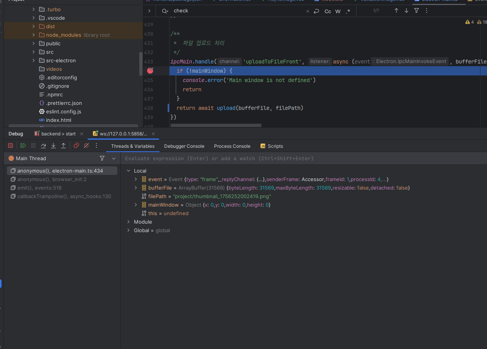

---
title: Electron デバッグ
description: 記憶はすぐに消えますが、ログは永遠です！🎯 私たちのチームの楽しくて自由な作業記録スペース
head:
  - - meta
    - name: keywords
      content: 勉強したことを書いてみましょう
  - - meta
    - property: og:title
      content: 作業ログの遊び場 - 自由な作業記録スペース 🎪
  - - meta
    - property: og:description
      content: ここはチームメンバーが自由に作業ログを記録して共有するスペースです。強制なしで必要な時に気軽に追加できる楽しい作業ログシステムを紹介します。
  - - meta
    - property: og:image
      content: https://empasy.io/docs/images/favicon.png
  - - meta
    - property: og:url
      content: https://empasy.io/study/
sort: 300
---

# IntellijでのElectronデバッグ

1. dev:debug を実行
   

2. デバッガを実行

   - "Debugger listening on ws://127.0.0.1:5858/cc94b3d2-5a48-461b-9fb8-6ee3ee3e38fd" の部分をクリック
     

3. ブレークポイント
   
