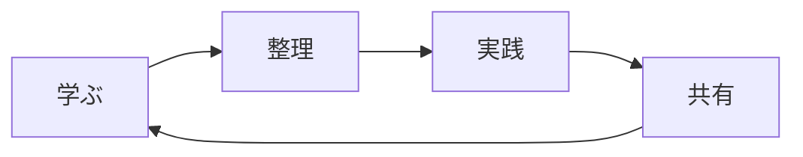

---
title: 勉強したことを書いてみましょう
description: 忘れないように楽しく保存しよう！🎯 勉強した内容を自由に記録する楽しい知識リポジトリ
head:
  - - meta
    - name: keywords
      content: 勉強記録, 学習日記, 知識リポジトリ, 勉強ログ, 学習管理, 勉強ノート, 知識整理, 勉強方法, 学習保存, 記憶補助
  - - meta
    - property: og:title
      content: 📚 頭脳リポジトリ - 楽しい勉強記録の遊び場
  - - meta
    - property: og:description
      content: 忘れないように楽しく保存しよう！🎯 勉強した内容を自由に記録する楽しい知識リポジトリ
  - - meta
    - property: og:image
      content: https://empasy.io/docs/images/favicon.png
  - - meta
    - property: og:url
      content: https://empasy.io/study/
sort: 200
---

# 📚 自分だけの知識の遊び場 🎪

## 「教えるほど、より深く理解できる」

**「学んだことを共有すれば喜びは2倍！」**  
勉強した様々な知識や気づきを楽しく共有する空間です 🎯

## 🎯 学習サイクル

**共に学び、共に成長しよう！**  
皆さんの学習の旅も応援しています 

---

> ** 最後のヒント:** 学んだことを整理し、共有する習慣が  
> **最も強力な学習の武器** になるでしょう！一緒にやりましょう 
