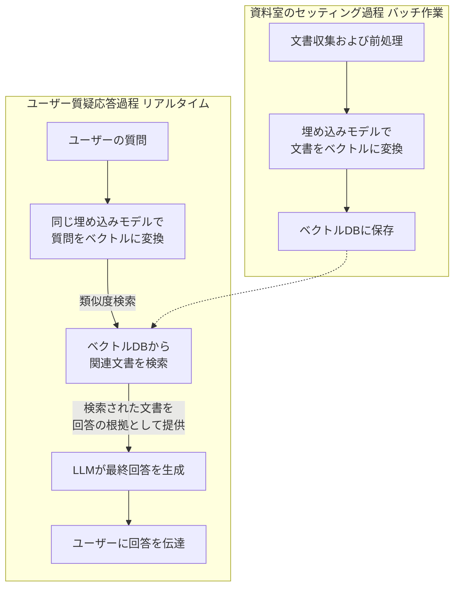

## **RAG(ラグ)構築完璧ガイド: 初心者のための親切な説明書**

### **目次**

1.  [RAGとは何ですか？簡単な比喩で理解する](#1-ragとは何ですか-簡単な比喩で理解する)
2.  [なぜRAGが必要なのでしょうか？](#2-なぜragが必要なのでしょうか)
3.  [RAGを構築するには何が必要でしょうか？ (準備物)](#3-ragを構築するには何が必要でしょうか-準備物)
4.  [RAG構築5段階: 真似するだけです！](#4-rag構築5段階-真似するだけです)
5.  [どんなツールを使えばいいでしょうか？](#5-どんなツールを使えばいいでしょうか)

---

### **1. RAGとは何ですか？簡単な比喩で理解する**

**RAG(Retrieval-Augmented Generation)** は **「情報検索(Retrieval) + 回答生成(Generation)」** を組み合わせた技術です。

- **`R`(Retrieval - 検索)**: 膨大な文書の山から **質問に関連する情報を見つけ出す** 段階
- **`AG`(Augmented Generation - 強化された生成)**: 見つけ出した情報に基づいて **LLMが正確な回答を生成する** 段階

#### **🛎️ 簡単な比喩: 頑張る秘書さん**

皆さんに **`A`** と **`B`** 、二人の秘書がいると想像してみてください。

- **秘書A (一般的なLLM)**: 頭がとても良くて数多くの本を読みました。しかし、たまに **忘れてしまったり、最新情報を知らない時があります。** そして時々 **「それっぽい」言葉をでっち上げる(Hallucination)こともあります。**
- _「2024年の韓国サッカー国家代表チームの監督は誰ですか？」_
- _「うーん... クリンスマン... かな？それともホン・ミョンボ...？ (確信がない、または間違った回答)」_

- **秘書B (RAGを使用するLLM)**: 秘書Aと同じくらい頭が良いですが、 **隣に完璧な資料室があります。** 皆さんが質問すると、

1.  まず **資料室(DB)に走っていって** 最新ニュース、会社の文書、報告書など **関連資料を見つけてきます。 (Retrieval)**
2.  見つけてきた資料を秘書Aに渡しながら **「さあ、この資料を見ながら答えて」** と言います。
3.  秘書Aは **正確な資料に基づいて** 自信を持って答えます。 **(Augmented Generation)**

- _「2024年の韓国サッカー国家代表チームの監督は誰ですか？」_
- _「(資料室から『2024年3月、大韓サッカー協会、ファン・ソンホン監督選任』の記事を見つけてくる)」_
- _「はい、2024年現在の韓国サッカー国家代表チームの監督はファン・ソンホン監督です。関連記事の内容は次のとおりです...」_

**結論: RAGはLLMに「正確な資料」を先に見つけてあげることで、より信頼できる回答を作らせてくれる「賢い秘書システム」です。**

---

### **2. なぜRAGが必要なのでしょうか？**

一般的なLLM(例: ChatGPT)の **欠点を解決** してくれます。

1.  **最新情報の不足**: LLMは学習が途切れた時点のデータしか知りません。RAGはリアルタイムの文書を提供して最新情報で回答させます。
2.  **妄想(Hallucination)**: 存在しない事実をでっち上げることがあります。RAGは **「根拠資料」** を提供してこれを防ぎます。
3.  **内部情報の活用不可**: 会社のマニュアル、契約書、メールなど **非公開文書をLLMは知りません。** RAGはこの内部文書を資料室に入れて活用させます。
4.  **透明性と信頼性**: 回答の出所(どの文書の何ページ)を提供して **「なぜそのように答えたのか」** 確認が可能です。

---

### **3. RAGを構築するには何が必要でしょうか？ (準備物)**

大きく分けて4つの構成要素が必要です。

1.  **知識(Knowledge) / 文書データ**: 回答の根拠となる **内部文書** (PDF, HWP, Word, Excel, PPT, ウェブページ, DBなど)
2.  **埋め込みモデル(Embedding Model)**: 文書の **「意味」を数値に変換** してくれるAI。例えるなら **「文書をコンピューターが理解できるバーコード(ベクトル)にしてくれるスキャナー」** です。
3.  **ベクトルデータベース(Vector DB)**: その「バーコード(ベクトル)」を **保存し、高速に検索できる** 特別なDB。 **「超高速に整理された資料室」** だと考えてください。
4.  **LLM(Large Language Model)**: 最終的に **回答を生成する** AI。 (例: GPT-4, Claude, Llama2など)

---

### **4. RAG構築5段階: 真似するだけです！**

全体のプロセスは **「資料室のセッティング」** と **「質問-回答」** の2つのパートに分けられます。



#### **パート1: 資料室のセッティング (一度やっておけば使い続けられる)**

**第1段階: 文書収集および前処理**

- **やること**: PDF、Wordなど多様な形式の文書の **テキストだけを抽出して** 整理します。
- **詳細作業**:
- **テキスト抽出**: 文書から文字だけを抽出します。
- **分割(Chunking)**: 100ページの文書を丸ごと入れると効率が悪いです。 **意味が通じる単位(例: 3〜5段落ずつ)** に切り分けます。これが **資料室の一枚一枚** になります。
- **クレンジング**: 不要な空白、特殊文字を整理します。

**第2段階: 文書を数値(ベクトル)に変換 (埋め込み)**

- **やること**: 切り分けたテキストの断片を **埋め込みモデル** に入れて **数値の羅列(ベクトル)** に変換します。意味が似ている文書は似た数値の値を持ちます。

**第3段階: ベクトルデータベースに保存**

- **やること**: 変換された数値(ベクトル)と元のテキストを **ベクトルDB** にペアにして保存します。これで **「意味ベース」で検索できる資料室** が完成しました。

#### **パート2: 質問-回答 (ユーザーが質問するたびに進行)**

**第4段階: 質問を数値(ベクトル)に変換および検索**

- **やること**: ユーザーの質問も **全く同じ埋め込みモデル** を利用して数値(ベクトル)に変換します。
- その後、 **ベクトルDBから** この質問のベクトルと **最も似ているベクトル(つまり、最も関連性の高い文書)** を見つけて、その **元のテキストを取り出してきます。**

**第5段階: LLMが最終回答を生成**

- **やること**: 次のような **「説明書(プロンプト)」** と共に見つけてきた文書をLLMに渡します。
- _「あなたは有用なAssistantです。以下の[参考文書]の内容だけを正確に参考にして、ユーザーの質問に答えてください。分からないことは分からないと答えてください。」_
- `[参考文書]:` (第4段階で見つけてきたテキスト群)
- `[ユーザーの質問]:` 「うちの会社の休暇規定はどうなっていますか？」
- LLMは **与えられた文書を参照して** 正確で信頼できる回答を生成します。

---

### **5. どんなツールを使えばいいでしょうか？**

コーディングなしでもGUIで簡単に始められるツールと、本格的に開発する時に有用なオープンソースツールを紹介します。

#### **初心者/非開発者向けツール (Low-Code/No-Code)**

- **ChatPDF, AskYourPDF**: ただPDFファイルをアップロードすればすぐに質問できるサービス。RAGの最も簡単な形態です。
- **Microsoft Copilot Studio**: Microsoft 365製品群を使用しているなら、SharePointやWordファイルに基づくRAGチャットボットを簡単に作ることができます。
- **Notion AI**: Notion workspace内の文書に基づいて回答。

#### **本格的に開発するためのオープンソースツール**

- **埋め込みモデル**: `all-MiniLM-L6-v2` (軽くて良い)、 `BGE`、 `OpenAIの text-embedding-3` (性能が良い)
- **ベクトルDB**: `Chroma` (最も簡単)、 `Weaviate`、 `Qdrant`、 `Pinecone` (クラウドサービス)
- **LLM**: `OpenAI API (GPT-4)`、 `Anthropic API (Claude)`、 `Llama 3` (オープンソース)
- **フレームワーク**: `LangChain`、 `LlamaIndex` - RAGシステムの **接着剤** のような役割。上記のすべての要素を簡単に繋げるのを助けてくれるPythonライブラリです。

**始めるのにおすすめの組み合わせ:** `LangChain` + `Chroma DB` + `all-MiniLM-L6-v2` + `GPT-4 API` の組み合わせが学習に最適です。

# RAG(Retrieval-Augmented Generation) 構築ガイド: Java 開発者サンプル

## 目次

1. [RAGとは何か？](#1-ragとは何か)
2. [RAGの必要性](#2-ragの必要性)
3. [RAGシステム構成要素](#3-ragシステム構成要素)
4. [JavaベースのRAG実装手順](#4-javaベースのrag実装手順)
5. [簡単なJava実装例](#5-簡単なjava実装例)
6. [今後の発展方向](#6-今後の発展方向)

---

## 1. RAGとは何か？

RAG(Retrieval-Augmented Generation)は **情報検索(Retrieval)** と **回答生成(Generation)** を組み合わせた技術で、大規模言語モデル(LLM)が外部の知識ソースを活用して、より正確で信頼できる回答を生成できるようにします。

### 🎯 簡単な比喩: 図書館の司書

- **一般のLLM**: 百科事典を丸暗記した天才 (ただし、最新情報がなく、たまに間違える)
- **RAG LLM**: 図書館で関連資料を探してきて参考にしながら答える司書 (正確で最新の情報を提供)

---

## 2. RAGの必要性

| 問題点 | 一般のLLM | RAG適用時 |
| --- | --- | --- |
| 最新情報の不足 | ❌ 学習データのみに依存 | ✅ リアルタイム情報の活用 |
| 妄想(Hallucination) | ❌ たまにでっち上げる | ✅ 根拠資料ベース |
| 内部情報の活用 | ❌ 不可能 | ✅ 可能 |
| 透明性の不足 | ❌ 回答の根拠が不明確 | ✅ 出所の明示が可能 |

---

## 3. RAGシステム構成要素

1. **文書リポジトリ**: PDF、Word、内部文書などの原本資料
2. **埋め込みモデル**: テキスト → 数値ベクトル変換
3. **ベクトルデータベース**: ベクトルの保存と類似度検索
4. **LLM**: 最終回答の生成

---

## 4. JavaベースのRAG実装手順

### 手順1: 環境設定 (依存関係の追加)

```xml
<!-- pom.xml -->
<dependencies>
    <dependency>
        <groupId>org.springframework.ai</groupId>
        <artifactId>spring-ai-openai-spring-boot-starter</artifactId>
        <version>0.8.1</version>
    </dependency>
    <dependency>
        <groupId>org.springframework.boot</groupId>
        <artifactId>spring-boot-starter-web</artifactId>
    </dependency>
    <!-- ベクトルDBの依存関係 (オプション) -->
</dependencies>
```

### 手順2: 文書の読み込みと分割

```java
public class DocumentLoader {
    public List<String> loadAndSplitDocuments(String filePath, int chunkSize) throws IOException {
        String content = new String(Files.readAllBytes(Paths.get(filePath)));
        return splitTextIntoChunks(content, chunkSize);
    }

    private List<String> splitTextIntoChunks(String text, int chunkSize) {
        List<String> chunks = new ArrayList<>();
        for (int i = 0; i < text.length(); i += chunkSize) {
            chunks.add(text.substring(i, Math.min(i + chunkSize, text.length())));
        }
        return chunks;
    }
}
```

### 手順3: テキスト埋め込みの生成

```java
@Service
public class EmbeddingService {
    private final OpenAiEmbeddingClient embeddingClient;

    public EmbeddingService(OpenAiEmbeddingClient embeddingClient) {
        this.embeddingClient = embeddingClient;
    }

    public List<Double> generateEmbedding(String text) {
        return embeddingClient.embed(text);
    }
}
```

### 手順4: ベクトルの保存と検索 (簡単な実装)

```java
public class SimpleVectorStore {
    private Map<String, List<Double>> vectorMap = new HashMap<>();
    private Map<String, String> textMap = new HashMap<>();

    public void storeVector(String id, String text, List<Double> vector) {
        vectorMap.put(id, vector);
        textMap.put(id, text);
    }

    public String findMostSimilar(List<Double> queryVector) {
        String mostSimilarId = null;
        double maxSimilarity = -1;

        for (Map.Entry<String, List<Double>> entry : vectorMap.entrySet()) {
            double similarity = cosineSimilarity(queryVector, entry.getValue());
            if (similarity > maxSimilarity) {
                maxSimilarity = similarity;
                mostSimilarId = entry.getKey();
            }
        }

        return textMap.get(mostSimilarId);
    }

    private double cosineSimilarity(List<Double> vectorA, List<Double> vectorB) {
        double dotProduct = 0.0;
        double normA = 0.0;
        double normB = 0.0;

        for (int i = 0; i < vectorA.size(); i++) {
            dotProduct += vectorA.get(i) * vectorB.get(i);
            normA += Math.pow(vectorA.get(i), 2);
            normB += Math.pow(vectorB.get(i), 2);
        }

        return dotProduct / (Math.sqrt(normA) * Math.sqrt(normB));
    }
}
```

### 手順5: RAGシステムの統合

```java
@Service
public class RagService {
    private final EmbeddingService embeddingService;
    private final SimpleVectorStore vectorStore;
    private final OpenAiChatClient chatClient;

    public RagService(EmbeddingService embeddingService,
                     SimpleVectorStore vectorStore,
                     OpenAiChatClient chatClient) {
        this.embeddingService = embeddingService;
        this.vectorStore = vectorStore;
        this.chatClient = chatClient;
    }

    public String query(String question) {
        // 1. 質問の埋め込み生成
        List<Double> questionEmbedding = embeddingService.generateEmbedding(question);

        // 2. 関連文書の検索
        String relevantText = vectorStore.findMostSimilar(questionEmbedding);

        // 3. LLMにコンテキストと共に質問
        String prompt = "次の文書の内容を参考にして質問に答えてください:\n\n" +
                       "文書: " + relevantText + "\n\n" +
                       "質問: " + question + "\n\n" +
                       "回答:";

        return chatClient.call(prompt);
    }
}
```

---

## 5. 簡単なJava実装例

### アプリケーションコード全体

```java
@SpringBootApplication
public class SimpleRagApplication implements CommandLineRunner {
    @Autowired
    private RagService ragService;

    @Autowired
    private DocumentLoader documentLoader;

    @Autowired
    private EmbeddingService embeddingService;

    @Autowired
    private SimpleVectorStore vectorStore;

    public static void main(String[] args) {
        SpringApplication.run(SimpleRagApplication.class, args);
    }

    @Override
    public void run(String... args) throws Exception {
        // 文書の読み込みと処理
        List<String> chunks = documentLoader.loadAndSplitDocuments("data/company_policy.txt", 500);

        // ベクトルストアに文書を保存
        for (int i = 0; i < chunks.size(); i++) {
            List<Double> embedding = embeddingService.generateEmbedding(chunks.get(i));
            vectorStore.storeVector("doc_" + i, chunks.get(i), embedding);
        }

        // 簡単なクエリインターフェース
        Scanner scanner = new Scanner(System.in);
        System.out.println("RAGシステムが準備できました。質問を入力してください (終了: exit):");

        while (true) {
            System.out.print("> ");
            String question = scanner.nextLine();

            if ("exit".equalsIgnoreCase(question)) {
                break;
            }

            String answer = ragService.query(question);
            System.out.println("回答: " + answer);
        }

        scanner.close();
    }
}
```

### application.properties の設定

```properties
# OpenAI API 設定
spring.ai.openai.api-key=your-openai-api-key
spring.ai.openai.chat.model=gpt-3.5-turbo
spring.ai.openai.embedding.model=text-embedding-ada-002
```

---

## 6. 高度な機能

1. **高度なベクトルデータベースの導入**: Chroma, Pinecone, Weaviate など
2. **パフォーマンスの最適化**: 埋め込みのキャッシング、非同期処理
3. **精度の向上**: 多様な検索アルゴリズム、再ランク付け
4. **セキュリティの強化**: アクセス制御、データ暗号化
