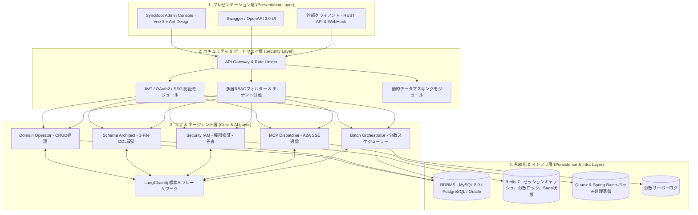

# システムアーキテクチャおよびモジュール構成

SyncBootは、安定したサービス運用と拡張性を確保するため、4層アーキテクチャと5大機能モジュール協調構造を採用しています。

---

## 4層システムアーキテクチャ

---

## 5大機能モジュール仕様

### 1. Domain Operator (ドメインデータ運用)
- **役割**: ドメインエンティティのモデル構造を認識し、CRUDおよびビジネストランザクションクエリを実行します。
- **ポリシー**: ソースコードやDBスキーマを変更せず、定義されたAPIおよびマッパーの範囲内でのみ動作します。

### 2. Schema Architect (スキーマ設計)
- **役割**: 要件を分析して3-File標準DDLを作成し、ERD構造を設計します。
- **ポリシー**: スキーマ変更の影響度を事前分析し、開発者の承認（HITL）後にのみDDLを適用します。

### 3. Security IAM (RBAC & テナント分離)
- **役割**: ロールに応じた画面・APIアクセスの制御およびテナント間のデータ分離を維持します。
- **機能**: 個人情報カラムの動的マスキングおよび行レベルセキュリティ（RLS）SQLの自動注入。

### 4. MCP Dispatcher (標準プロトコル連携)
- **役割**: Model Context Protocol (MCP)標準に準拠し、外部システムに標準ツールをHTTP SSE経由で提供します。
- **ログ収集**: 障害発生時にクラスタ内のエラーログを収集して伝達します。

### 5. Batch Orchestrator (バッチ & ジョブスケジューラー)
- **役割**: 大規模データ集計や定期バッチ処理をQuartzおよびSpring Batchにより分散実行します。
- **耐障害性**: Redis分散ロックの管理と、障害発生時の自動リトライ（Exponential Backoff）を実行します。

---

## 技術スタック

| 区分 | 技術要素 | バージョンおよび詳細 |
| :--- | :--- | :--- |
| **Backend Core** | Java, Spring Boot 3 | Java 17/21, Spring Boot 3.2.x |
| **AI Framework** | LangChain4j | langchain4j-spring-boot-starter v0.35以上 |
| **ORM / Data** | MyBatis-Plus, Spring Data JPA | HikariCP, MySQL 8.0, PostgreSQL |
| **Protocol** | Model Context Protocol (MCP) | HTTP SSE / JSON-RPC 2.0 |
| **Frontend UI** | Vue 3, Vite, TypeScript | Ant Design Vue 4.x, Pinia, Vue Router |
| **Batch / Cache** | Spring Batch, Quartz, Redis | Redis 7.x, Lettuce |
