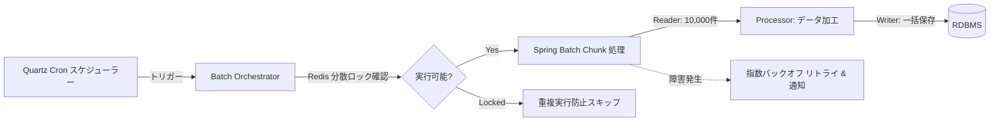

# バッチ & ジョブスケジューラー

SyncBootは、大容量データ処理、精算、定期外部連携タスクのために**QuartzスケジューラーとSpring Batch**をベースとした実行基盤を提供します。

---

## バッチアーキテクチャおよび処理フロー



---

## 主な機能

1. **スケジューラー設定**: Cron式に基づいて定期実行サイクルを設定し、実行時パラメータを伝達します。
2. **Chunkストリーミング**: 大容量データをChunk単位（例: 1,000〜5,000件）に分割処理し、メモリ使用量を管理します。
3. **分散ロックによる重複防止**: 複数インスタンス環境下で同一ジョブの重複実行を防止するためRedis分散ロックを適用します。
4. **リトライと障害通知**: 一時的なタイムアウト時にリトライを実行し、回復不能なエラー時は指定チャンネルへ通知します。

---

## バッチJob設定例

```java
@Configuration
@RequiredArgsConstructor
public class SettlementBatchConfig {

    private final JobRepository jobRepository;
    private final PlatformTransactionManager transactionManager;

    @Bean
    public Job dailySettlementJob(Step settlementStep) {
        return new JobBuilder("dailySettlementJob", jobRepository)
                .incrementer(new RunIdIncrementer())
                .start(settlementStep)
                .build();
    }

    @Bean
    public Step settlementStep(
            ItemReader<OrderEntity> orderReader,
            ItemProcessor<OrderEntity, SettlementEntity> settlementProcessor,
            ItemWriter<SettlementEntity> settlementWriter) {
        return new StepBuilder("settlementStep", jobRepository)
                .<OrderEntity, SettlementEntity>chunk(5000, transactionManager)
                .reader(orderReader)
                .processor(settlementProcessor)
                .writer(settlementWriter)
                .faultTolerant()
                .retryLimit(3)
                .retry(DeadlockLoserDataAccessException.class)
                .build();
    }
}
```
