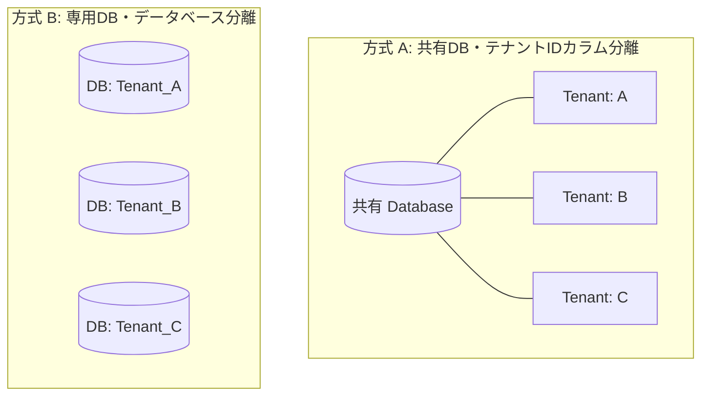

# マルチテナント & RBACセキュリティ (IAM)

SyncBootのセキュリティモジュールは、エンタープライズ環境に応じた多層データ分離とアクセス制御を提供します。

---

## マルチテナント分離方式

要件に応じて2種類の分離方式を選択可能です。



1. **共有DB方式**:
   - テーブルの`tenant_id`カラムを基に、MyBatis-Plusインターセプターが自動的に`WHERE tenant_id = ?`条件を追加します。

2. **専用DB方式**:
   - リクエストのテナント識別子に応じてDynamic DataSourceを切り替え、物理的に独立したDBに接続します。

---

## 4段階RBACアクセスマトリックス

| 権限レベル | 制御対象 | 制御方式 |
| :--- | :--- | :--- |
| **1. メニュー (Menu)** | 管理画面メニュー | ユーザーのロールに割り当てられたメニューのみ描画 |
| **2. アクション (Action)** | ボタン操作 | `v-hasPermi`ディレクティブによる制御 |
| **3. API (Endpoint)** | バックエンドREST API | Spring Security `@PreAuthorize`による検証 |
| **4. データ (Data)** | 行レベル & マスキング | 行レベルSQLフィルタリングおよび個人情報マスキング |

---

## 動的データマスキング

```java
public class UserDetailDTO {

    private Long id;
    private String name;

    @Desensitize(type = DesensitizeType.PHONE) // 010-****-5678
    private String phoneNumber;

    @Desensitize(type = DesensitizeType.EMAIL) // qu***@empasy.com
    private String email;

    @Desensitize(type = DesensitizeType.ID_CARD) // 900101-1******
    private String residentNumber;
}
```
