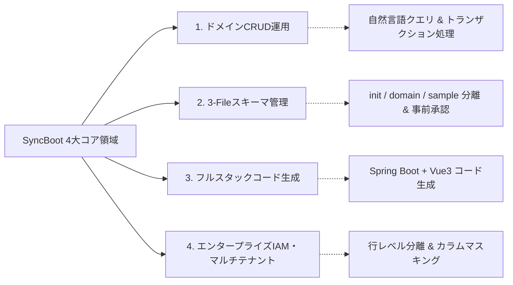

# SyncBoot: デジタルバックエンドフレームワーク概要

SyncBootは、ビジネスドメインの文脈を認識し、データベース運用とAPI開発を支援するJavaベースのエンタープライズバックエンドプラットフォームです。

Spring Boot 3、LangChain4j、Model Context Protocol (MCP)標準を基盤とし、データCRUD、スキーマ管理、フルスタックコード生成、分散ログ診断機能を提供します。

---

## 4大コア機能領域

1. **ドメインCRUD運用 & クエリ実行**:
   - 自然言語クエリおよび標準MCPツールを介してドメインデータを安全に照会・操作できます。
   - 認可されたトランザクション境界内でデータを処理します。

2. **スキーマ設計 & 3-File DDL標準**:
   - 3-File SQL（`init.sql`、`<domain>.sql`、`sample.sql`）標準構造を適用します。
   - スキマ変更の影響度を事前分析し、開発者の事前承認（Human-in-the-Loop）を経てデータベースに反映します。

3. **ローコードフルスタックAPI & UIジェネレーター**:
   - DBエンティティメタデータからController、Service、Mapper、DTO、およびAnt Design Vue 3管理画面コードを生成します。

4. **マルチテナント & RBACセキュリティ**:
   - テナント分離（専用DBおよび共有DB方式）、カラム単位の動的データマスキング、行レベルセキュリティ（RLS）をサポートします。

---

## 5大バックエンドワーカー役割体系

| 役割名 | 主な担当業務 | 実行モデル |
| :--- | :--- | :--- |
| **Domain Operator** | ドメインデータモデルに基づくCRUDおよびビジネストランザクション処理 | 自律実行 |
| **Schema Architect** | 3-File DDL設計、ERD生成、マイグレーション影響度分析 | 提案後開発者承認 |
| **Security IAM** | RBACロール監査、行レベルデータ分離、動的データマスキング | 常時ポリシー適用 |
| **MCP Dispatcher** | 外部システムとのA2A通信のための標準MCP Tools/Resources提供 | HTTP SSEプロトコル |
| **Batch Orchestrator**| 大容量データ処理および定期Quartz/Spring Batchジョブの分散実行 | スケジューラー駆動 |

---

## 導入時の主な効果

- **バックエンド開発工数の削減**: 定型的なCRUD APIや管理画面の実装工数を削減します。
- **DBマイグレーションの安全性向上**: 影響度事前分析と承認フローにより、スキーマ変更時の障害リスクを軽減します。
- **障害調査時間の短縮**: 分散サーバーのエラーログを集約し、原因究明を支援します。
- **標準フレームワーク準拠**: Spring Boot 3、LangChain4j、OpenAPI 3.0、MCP仕様に準拠しています。

---

## ドキュメント目次

- [5分クイックスタート](./quickstart) - Docker Composeによるローカル起動
- [システムアーキテクチャおよびモジュール構成](./architecture) - 4層構造とワーカー仕様
- [知能型スキーマスタジオ & 3-File標準](./schema-studio) - 3-File DB標準とDDL承認フロー
- [ローコードフルスタック生成器](./lowcode-generator) - Spring Boot + Vue 3自動生成
- [マルチテナント & RBACセキュリティ](./enterprise-security) - 行レベルセキュリティとマスキング
- [バッチ & ジョブスケジューラー](./batch-and-scheduler) - Spring Batch & Quartzタスク管理
- [LangChain4j & MCP連携](./mcp-and-ai) - Model Context Protocolツール仕様
- [本番デプロイ & 性能指標](./production-guide) - コンテナデプロイと性能指標
- [H2 組込データベース設定](./h2) - ローカル開発および単体テスト設定
