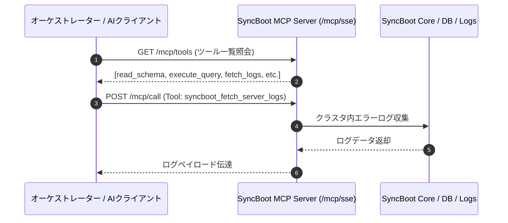

# LangChain4j & Model Context Protocol (MCP) 連携

SyncBootは、標準AIフレームワークである**LangChain4j**および**Model Context Protocol (MCP)**インターフェースを内包し、オーケストレーターやクライアントとの連携をサポートします。

---

## MCP 連携アーキテクチャ

SyncBootは、HTTP Server-Sent Events (SSE)ベースでツール（Tools）とリソース（Resources）を提供します。



---

## 提供ツール仕様

| ツール名 | 機能説明 | パラメータ | 戻り値 |
| :--- | :--- | :--- | :--- |
| `syncboot_read_schema` | テーブル構造とメタデータを取得 | `tableName` (String) | カラム名、データ型、Null許容、コメント |
| `syncboot_execute_query` | 認可された範囲内でCRUDクエリを実行 | `sql` (String), `params` (Map) | レコード一覧（最大100件） |
| `syncboot_fetch_server_logs`| 直近のエラーログを収集 | `lines` (Int), `level` (ERROR) | スタックトレース |
| `syncboot_get_table_list` | 管理対象のドメインテーブル一覧を取得 | `tenantId` (String) | テーブル名および説明配列 |

---

## Java バックエンドツール実装例 (LangChain4j)

```java
@Component
public class SyncBootMcpTools {

    @Autowired
    private SchemaService schemaService;

    @Autowired
    private LogInspectorService logInspectorService;

    @Tool("指定テーブルのDDLおよびメタデータを取得します。")
    public TableMetaDTO readSchema(
            @P("対象テーブル物理名 (例: TB_ORDER)") String tableName) {
        return schemaService.getTableMetadata(tableName);
    }

    @Tool("障害分析のために直近のサーバーエラーログを取得します。")
    public String fetchServerLogs(
            @P("取得行数 (デフォルト100)") int lines) {
        return logInspectorService.getRecentErrorLogs(lines);
    }
}
```
