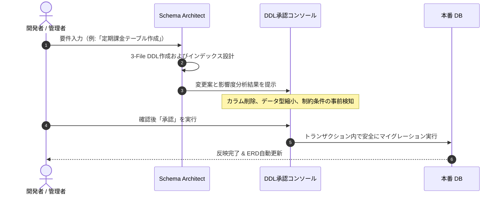

# 知能型スキーマスタジオ & 3-File DB標準

SyncBootは、データベース設計の一貫性と安全性を確保するため、**3-File DBスクリプト標準**と**事前承認（HITL）プロセス**を適用します。

---

## 3-File DBスクリプト標準構造

```
Server/db/
├── 01. init.sql       # 1. プラットフォーム共通システムテーブル DDL & 基本初期データ
├── 02. syncboot.sql   # 2. ビジネスドメインテーブル DDL & メタデータ
└── 03. sample.sql     # 3. 開発および検証環境用サンプルデータ
```

| ファイル名 | 内容 | 管理原則 |
| :--- | :--- | :--- |
| **`01. init.sql`** | `sys_user`, `sys_role`, `sys_permission`, `sys_tenant` などの基盤テーブル | プラットフォーム共通標準 |
| **`02. syncboot.sql`** | `TB_ORDER`, `TB_PRODUCT` などのドメイン業務テーブルおよびインデックス | **Schema Architect** 提案 $\rightarrow$ 開発者承認 |
| **`03. sample.sql`** | 開発およびテスト用初期データ | 開発・QAテスト用 |

---

## DDL事前承認フロー (Human-in-the-Loop)



### 影響度分析
- `DROP TABLE`やカラム削除、型縮小など既存データに影響を及ぼすクエリを事前に分類して提示します。
- ロールバック用のスクリプト生成もサポートします。

---

## DDL定義例

```sql
-- ===================================================
-- 02. syncboot.sql (ドメインテーブル定義例)
-- ===================================================

CREATE TABLE IF NOT EXISTS `TB_SUBSCRIPTION` (
  `id` BIGINT NOT NULL AUTO_INCREMENT COMMENT 'サブスクリプションID (PK)',
  `tenant_id` VARCHAR(64) NOT NULL DEFAULT 'default' COMMENT 'テナント識別子',
  `user_id` BIGINT NOT NULL COMMENT 'ユーザーID',
  `plan_code` VARCHAR(32) NOT NULL COMMENT 'プランコード',
  `status` VARCHAR(20) NOT NULL DEFAULT 'ACTIVE' COMMENT 'ステータス (ACTIVE, CANCELED, PAUSED)',
  `started_at` DATETIME NOT NULL COMMENT '開始日時',
  `next_billing_at` DATETIME NULL COMMENT '次回請求日',
  `created_by` VARCHAR(64) NOT NULL COMMENT '作成者',
  `created_at` DATETIME NOT NULL DEFAULT CURRENT_TIMESTAMP COMMENT '作成日時',
  `updated_at` DATETIME NOT NULL DEFAULT CURRENT_TIMESTAMP ON UPDATE CURRENT_TIMESTAMP COMMENT '更新日時',
  PRIMARY KEY (`id`),
  INDEX `idx_sub_tenant_user` (`tenant_id`, `user_id`),
  INDEX `idx_sub_billing` (`status`, `next_billing_at`)
) ENGINE=InnoDB DEFAULT CHARSET=utf8mb4 COLLATE=utf8mb4_unicode_ci COMMENT='定期課金マスタ';
```
