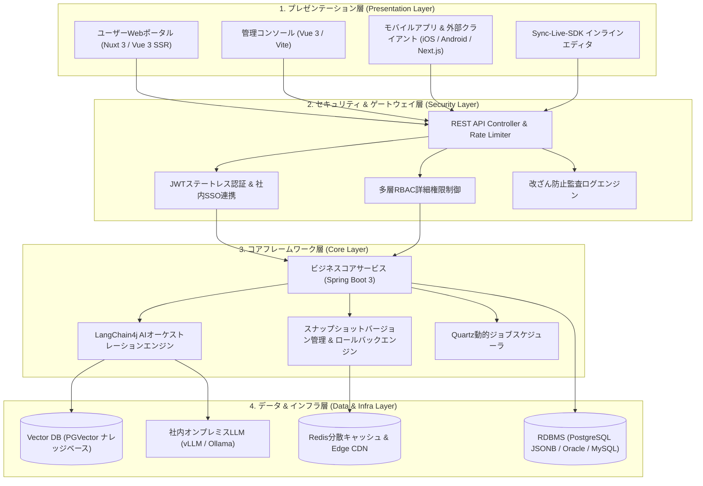
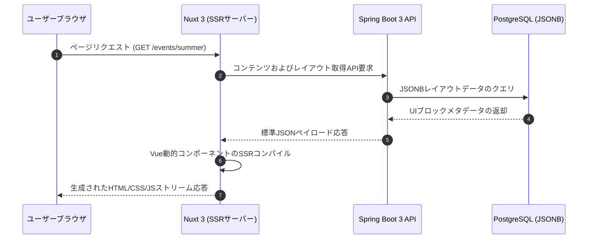

# SyncCMS システムアーキテクチャ

SyncCMSは、大規模トラフィック処理とエンタープライズ環境での拡張性を確保するため、**Clean Architecture 4層構造**で設計されています。

---

## 4層アーキテクチャ概要図

---

## 各層の技術仕様

### 1. プレゼンテーション層 (Presentation Layer)
- **ユーザーWeb (Nuxt 3)**: SSR(サーバーサイドレンダリング)を活用し、バックエンドAPIから取得したコンポーネントツリーをサーバー側で事前レンダリングすることで、初期読み込み速度の向上と検索エンジン最適化(SEO)を実現します。
- **管理コンソール (Vue 3 / Vite)**: TypeScriptおよびAnt Design Vueを採用し、ドラッグ＆ドロップによるブロックレイアウトビルダーやQuartz監視コンソールを提供します。
- **Sync-Live-SDK**: 実際の運用Web画面上で直接コンテンツ要素を選択し、インライン編集を行える軽量フロントエンドSDKです。

### 2. セキュリティ & ゲートウェイ層 (Security Layer)
- **ステートレスJWT認証**: サーバー間のセッション同期オーバーヘッドを排除し、分散ノード環境での高速認証処理をサポートします。
- **多層RBAC (Role-Based Access Control)**: システム管理者、サイト運用者、コンテンツ作成者、承認権限者など、役割に応じてAPIエンドポイントおよびメニューアクセス権限を厳密に制御します。
- **監査ログ (Audit Logging)**: コンテンツの作成、修正、承認、配信、ロールバックなどの全操作履歴を、ユーザーID、IPアドレス、変更差分(diff)とともに不変ログとして記録します。

### 3. コアフレームワーク層 (Core Layer)
- **Spring Boot 3 & Java 17+**: 標準Javaフレームワークをベースとし、堅牢なトランザクション管理と高い保守性を提供します。
- **LangChain4j AIエンジン**: Java環境において、オンプレミスLLM連携、プロンプトテンプレート制御、RAG(検索拡張生成)検索を統合パイプラインとして実行します。
- **スナップショットロールバックエンジン**: 配信時点のコンテンツ状態をバージョンごとのスナップショットとして保持し、障害発生時に1クリックでの即時復旧を可能にします。
- **Quartzスケジューラ**: 定期バッチジョブや予約配信をアプリケーション停止なしで動的に制御します。

### 4. データ & インフラ層 (Data & Infra Layer)
- **PostgreSQL JSONBストレージ**: 構造化されていないUIブロックデータや動的フォーム定義をJSONB形式で保存し、GINインデックスにより高速な検索性能を担保します。
- **Redis分散キャッシュ**: 頻繁に参照されるヘッドレスコンテンツをキャッシュし、DB負荷の低減とレスポンスの高速化を図ります。
- **社内オンプレミスAIインフラ**: 閉域網環境下でvLLMまたはOllamaを通じてオープンウェイトモデルを駆動します。

---

## 動的ページレンダリングパイプライン

SyncCMSの画面構成は、固定されたテンプレートファイルではなく、データベース内のJSON構造を通じて柔軟に生成およびレンダリングされます。

