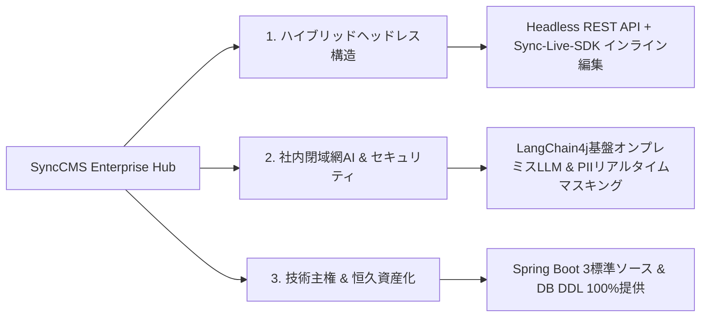

# SyncCMS: エンタープライズ・ハイブリッドヘッドレスCMS

**SyncCMS**は、Webポータル、モバイルアプリ、社内イントラネットなど、企業のデジタル接点におけるコンテンツを単一のハブで一元管理する**エンタープライズ・ハイブリッドヘッドレス・コンテンツ管理システム(Content Management System)**です。

バックエンド(Spring Boot 3 REST API)とフロントエンド(Vue 3 / Nuxt 3)の明確な関心事の分離(Separation of Concerns)を実現し、運用画面上で直接編集可能な**Sync-Live-SDK**と、社内閉域網AIオーケストレーション(**LangChain4j**)を標準提供します。主要なビジネスソースコードと標準DDLを全面的に公開し、導入システム全体をお客様の恒久的なITソフトウェア資産として内製化できるよう支援します。

---

## 主なアーキテクチャの特徴



### 1. ハイブリッドヘッドレス (Hybrid Headless)
- **APIファースト設計**: React、Vue、Next.js、Nuxt、iOS、Androidなど、多様なクライアントに対して標準JSON REST APIでコンテンツを配信します。
- **Sync-Live-SDK**: 管理画面に移動することなく、実際の運用画面上でテキストや画像を直接選択してインライン編集できる軽量SDKを提供します。
- **動的コンポーネントレンダリング**: PostgreSQLの`JSONB`カラムを活用してUIレイアウトやブロック構造を柔軟に保存し、Nuxt 3上でサーバーサイドレンダリング(SSR)を行います。

### 2. 社内閉域網AIとPIIセキュリティ・ガバナンス
- **オンプレミスLLM連携**: 外部パブリッククラウドとの通信を行わず、社内インフラ(vLLM / Ollama)に構築されたオープンウェイトモデル(Llama-3、EXAONE、Solarなど)をLangChain4j経由で直接連携します。
- **個人情報(PII)のリアルタイム非識別化**: 住民登録番号、口座番号、クレジットカード番号、電話番号などの機密情報を正規表現パターンフィルターでリアルタイムにマスキング処理します。
- **表示広告法および社内用語の事前検証**: 法的リスクのある誇大表現や社内禁止用語を下書き作成段階で事前スクリーニングします。

### 3. 技術的独立性と恒久資産化
- **ビジネスソースコードの開示**: Spring Boot 3のコアController、Serviceロジック、およびRDBMS DDLスキーマを透過的に提供し、お客様の開発チームによる自由な拡張・カスタマイズを可能にします。
- **追加ライセンス費用ゼロ**: APIリクエスト数やユーザー数の増加に伴う従量課金体系は一切存在しません。
- **社内基幹システム連携**: 社内グループウェアの電子決裁承認フロー、基幹ERP、社内SSO(OAuth2/SAML/JWT)と柔軟に連携できます。

---

## CMSアーキテクチャ比較表

| 比較項目 | グローバルSaaS Headless (Contentful等) | 国内レガシー構築型CMS | SyncCMS エンタープライズ |
| :--- | :--- | :--- | :--- |
| **アーキテクチャ形態** | API-Only Headless (クラウド従属) | モノリシック構築型 (JSP/レガシー) | **ハイブリッドヘッドレス (API + Live SDK)** |
| **社内閉域網(網分離)対応** | 非対応 (海外マルチテナントSaaS) | 対応 (オンプレミス設置) | **対応 (完全オンプレミス / 閉域網対応)** |
| **AI連携エンジン** | 有料パブリックAI API (従量課金) | 非対応または簡易ルールエンジン | **LangChain4j基盤オンプレミスLLM連携** |
| **実画面インライン編集** | 複雑な設定が必要 / 制限あり | 非対応 (管理画面での分離作業) | **Sync-Live-SDKによる画面直接編集** |
| **ビジネスソースコード** | 非公開 (ブラックボックスAPI) | 非公開 (バイナリ納品形態) | **主要ビジネスソース & DDLを全面提供** |
| **障害復旧方式** | 手動ストレージバックアップ復元 | DB手動復旧 (数時間の停止) | **スナップショット基盤の3段階無停止ロールバック** |
| **ライセンスモデル** | トラフィック/ユーザー数従量課金 | 恒久ライセンス + 年間保守費 | **恒久資産化 (追加ライセンス料なし)** |

---

## ローカル開発環境クイックスタート

ローカル開発環境(JDK 17+、Node.js 20+、pnpm、Docker)において、以下の3ステップでSyncCMSを起動できます。

### ステップ1: PostgreSQLデータベースの起動
```bash
# Docker Composeを使用したローカルPostgreSQLの起動
docker compose up -d postgres

# DB起動後、スキーマおよび初期データを投入 (data/synccms/synccms.sqlを実行)
```

### ステップ2: バックエンドAPIサーバーの起動 (Spring Boot 3)
```bash
cd backend
mvn clean install -DskipTests
mvn spring-boot:run
# APIサーバーのデフォルトURL: http://localhost:8080
```

### ステップ3: 管理コンソールおよびユーザーWebの起動 (Vue 3 / Nuxt 3)
```bash
# 管理コンソール (SyncCMS Admin)
cd frontend/admin
pnpm install
pnpm dev
# 管理コンソールURL: http://localhost:5666

# ユーザーWebポータル (Nuxt 3)
cd frontend/web
pnpm install
pnpm dev
# ユーザーポータルURL: http://localhost:3000
```

---

## 公式技術ドキュメント目次

SyncCMSの詳細な技術仕様と実装ガイドは、以下のドキュメントをご参照ください:

1. [システムアーキテクチャ (Architecture)](/synccms/architecture): Clean Architecture 4層構成および技術スタック詳細
2. [Sync-Live-SDK連携ガイド (Live SDK)](/synccms/live-sdk-guide): フロントエンド埋め込みおよびインライン編集バインディング
3. [社内閉域網AIおよびセキュリティ (AI & Security)](/synccms/onpremise-ai-security): オンプレミスLLM連携設定およびPII非識別化
4. [基幹系連携およびスナップショットロールバック (Governance)](/synccms/integration-governance): 電子決裁承認フロー連携および3段階ロールバック
5. [ヘッドレスREST APIリファレンス (API Reference)](/synccms/api-reference): REST API仕様、JSONスキーマおよびcURL例
6. [エンタープライズ運用および技術FAQ (FAQ)](/synccms/enterprise-faq): インフラ推奨スペック、JSONBインデックス最適化、技術サポート窓口
