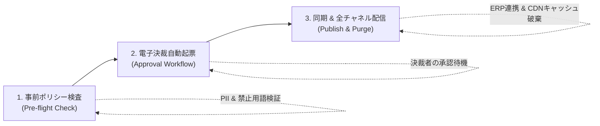

# 基幹系連携およびスナップショットロールバック・ガバナンス

SyncCMSは、企業の社内グループウェア電子決裁、ERP、SSOとセキュアに連携し、緊急障害時には**スナップショット基盤の3段階無停止ロールバック**を通じて運用継続性を担保します。

---

## 3段階配信承認パイプライン



1. **事前ポリシー検査 (Pre-flight Check)**: 配信要求時にPIIの漏洩、不当景品類及び不当表示防止法への抵触可能性、リンク切れ(Broken Link)を自動検証します。
2. **電子決裁自動起票 (Approval Workflow)**: 社内グループウェアのAPI仕様に沿って起票文書および変更差分(diff)を自動生成し、法務・コンプライアンス部門および責任者の承認ラインへ送信します。
3. **同期 & 全チャネル配信 (Publish & Purge)**: 承認完了Webフックを受信すると、対象RDBMSのトランザクションをコミットし、ERPプロモーションマスタと同期した上で分散キャッシュとEdge CDNを更新します。

---

## スナップショット基盤の3段階無停止ロールバック

不適切なコンテンツ配信やシステム障害が発生した場合、1クリックで直前の正常なスナップショットへ無停止復旧します:

```
[第1段階: RDBMSスナップショット復旧]
 └── DBトランザクション内で指定されたsnapshot_idの状態へレコードを安全に復元

[第2段階: Redis分散キャッシュ更新]
 └── 接続された全APIサーバーのキャッシュキーを一括無効化し、新規データを再配置

[第3段階: 全チャネルEdge CDN Purge]
 └── Cloudflare / CloudFront / Akamai等のエッジキャッシュ破棄APIを一括呼び出し
```

---

## 監査ログ (Audit Log) データベーススキーマ

内部統制監査および金融規制への対応のため、すべての変更履歴を不変ログとして永続保持します:

```sql
CREATE TABLE sys_cms_audit_log (
    audit_id        BIGSERIAL PRIMARY KEY,
    site_key        VARCHAR(50) NOT NULL,
    content_id      VARCHAR(100) NOT NULL,
    action_type     VARCHAR(30) NOT NULL,    -- CREATE, UPDATE, APPROVE, PUBLISH, ROLLBACK
    actor_id        VARCHAR(50) NOT NULL,    -- ユーザーID
    actor_ip        VARCHAR(45) NOT NULL,    -- 接続IPアドレス
    previous_state  JSONB,                   -- 変更前スナップショット (JSONB)
    current_state   JSONB,                   -- 変更後スナップショット (JSONB)
    diff_summary    TEXT,                    -- 変更概要
    approval_doc_no VARCHAR(100),            -- 社内電子決裁文書番号
    created_at      TIMESTAMP WITH TIME ZONE DEFAULT CURRENT_TIMESTAMP NOT NULL
);

-- 高速検索用インデックスの定義
CREATE INDEX idx_cms_audit_content ON sys_cms_audit_log(site_key, content_id);
CREATE INDEX idx_cms_audit_created ON sys_cms_audit_log(created_at DESC);
```
