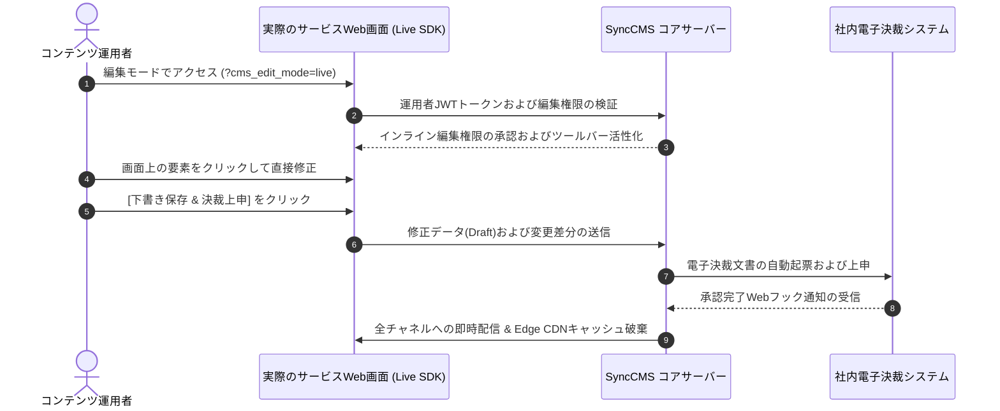

---
title: Sync-Live-SDK フロントエンド連携ガイド | SyncCMS
description: 実際の運用画面上で直接テキストやバナーを選択してインライン編集できるSync-Live-SDKの導入、バインディング、および電子決裁承認連携方法を解説します。
head:
  - - meta
    - name: keywords
      content: Sync-Live-SDK, インライン編集, フロントエンドSDK, React連携, Vue連携, Next.js, Nuxt 3, 電子決裁承認, ヘッドレスCMS
  - - meta
    - property: og:title
      content: Sync-Live-SDK フロントエンド連携ガイド | SyncCMS
  - - meta
    - property: og:description
      content: 実際の運用画面上でコンテンツを直接インライン編集するSync-Live-SDKの連携ガイド
sort: 3
---

# Sync-Live-SDK 連携ガイド

**Sync-Live-SDK**は、コンテンツ運用者やマーケターが専用の管理画面へ移動することなく、**実際のサービスWeb/モバイル画面上でテキストや画像を直接クリックしてインライン修正**できる軽量フロントエンドSDKです。

編集された内容は本番環境へ即座には公開されず、社内の電子決裁承認フローを経た上で無停止配信されます。

---

## 運用ワークフローシーケンス



---

## 1. 基本HTML環境での導入 (Vanilla HTML)

HTMLファイルの`<body>`タグ下部にSDKスクリプトを追加し、編集対象のDOM要素に識別属性を設定します。

```html
<!DOCTYPE html>
<html lang="ja">
<head>
    <meta charset="UTF-8">
    <title>プロモーションページ</title>
</head>
<body>
    <!-- 編集対象コンテンツブロック -->
    <div id="hero-section" data-sync-content-id="PROMO_2026_FALL">
        <h1 data-sync-field="headline">2026年 秋の新規会員特典のご案内</h1>
        <p data-sync-field="description">今すぐ登録してウェルカムクーポンとポイント特典をご確認ください。</p>
    </div>

    <!-- Sync-Live-SDK スクリプトの埋め込み -->
    <script src="https://empasy.io/sdk/sync-live-sdk.js"
            data-sync-cms-endpoint="https://empasy.io/api/v1"
            data-sync-site-key="SITE_PORTAL_JA"
            async></script>
</body>
</html>
```

### 必須データ属性 (Data Attributes)
- `data-sync-content-id`: コンテンツグループの一意識別子。
- `data-sync-field`: グループ内の詳細フィールド名(例: `headline`, `description`, `ctaText`)。

---

## 2. React / Next.js 環境での連携

React環境では、`@empasy/sync-live-react`パッケージまたはカスタムフックを使用して状態とバインドします。

```tsx
import React from 'react';
import { useSyncContent } from '@empasy/sync-live-react';

interface PromoContent {
  headline: string;
  description: string;
  ctaText: string;
}

export default function HeroBanner() {
  const { content, isEditMode } = useSyncContent<PromoContent>({
    contentId: 'PROMO_2026_FALL',
    defaultData: {
      headline: '2026年 秋の新規会員特典のご案内',
      description: '今すぐ登録してウェルカムクーポンとポイント特典をご確認ください。',
      ctaText: '特典を受け取る'
    }
  });

  return (
    <section className={`hero-container ${isEditMode ? 'sync-live-active' : ''}`}>
      <h1 data-sync-field="headline">{content.headline}</h1>
      <p data-sync-field="description">{content.description}</p>
      <button data-sync-field="ctaText">{content.ctaText}</button>
    </section>
  );
}
```

---

## 3. Vue 3 / Nuxt 3 環境での連携

Vue 3環境では、カスタムディレクティブ(`v-sync-editable`)を使用してテンプレートと連携します。

```vue
<template>
  <div class="banner-wrapper" :class="{ 'edit-mode': isEditMode }">
    <h2 v-sync-editable="{ contentId: 'BANNER_MAIN', field: 'title' }">
      {{ bannerData.title }}
    </h2>
    <p v-sync-editable="{ contentId: 'BANNER_MAIN', field: 'summary' }">
      {{ bannerData.summary }}
    </p>
  </div>
</template>

<script setup lang="ts">
import { ref } from 'vue';
import { useSyncLive } from '@empasy/sync-live-vue';

const { isEditMode } = useSyncLive();

const bannerData = ref({
  title: 'データ主導の統合運用ソリューション',
  summary: '企業のインフラとコンテンツを単一のプラットフォームで制御します。'
});
</script>
```

---

## 4. 安全な配信とガバナンス管理

1. **トークンによる権限制御**: 編集モードは、有効な管理者セッションまたは署名済みJWTトークン(`?cms_token=...`)が付与されている場合にのみ活性化されます。
2. **下書き(Draft)の完全隔離**: 編集中のデータは隔離された下書きテーブルに保存され、本番サービスのAPIクエリには影響を与えません。
3. **承認完了後の無停止反映**: 決裁者の最終承認Webフックを受信すると、PostgreSQLのトランザクションコミットと同時にRedisキャッシュの更新およびCDNキャッシュ破棄が実行されます。
