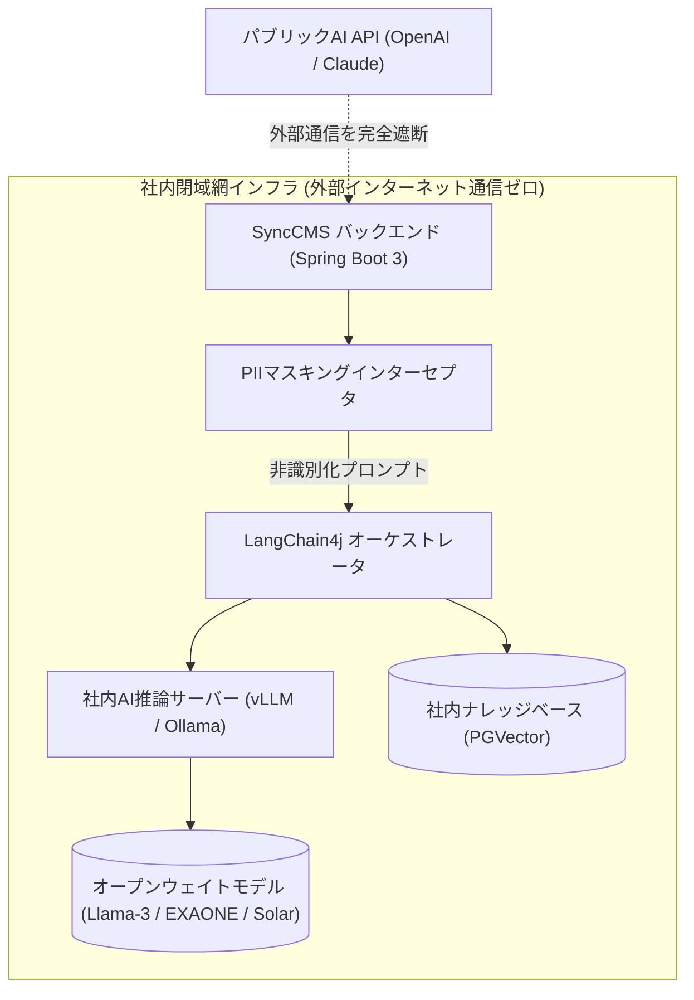

# 社内閉域網AIおよびPIIセキュリティコンプライアンス

SyncCMSは、金融機関、官公庁、大企業の**網分離セキュリティ規定および個人情報保護法**を遵守するため、社内閉域網専用のAIパイプラインとリアルタイムセキュリティフィルターを提供します。

---

## 社内閉域網AIアーキテクチャ



---

## 1. LangChain4j基盤のオンプレミスAI設定

Spring Bootバックエンドにおいて、社内GPUサーバーのvLLMまたはOllamaエンドポイントを標準の`ChatLanguageModel` Beanとして構成します。

### `application.yml` 設定例
```yaml
langchain4j:
  open-ai:
    chat-model:
      base-url: http://internal-vllm-cluster.local:8000/v1
      api-key: none  # 社内通信用トークン(必要に応じて指定)
      model-name: meta-llama/Llama-3-70b-Instruct
      temperature: 0.2
      timeout: PT60S
      max-retries: 2
```

### Java Configuration クラス例
```java
package com.empasy.synccms.config;

import dev.langchain4j.model.chat.ChatLanguageModel;
import dev.langchain4j.model.openai.OpenAiChatModel;
import org.springframework.beans.factory.annotation.Value;
import org.springframework.context.annotation.Bean;
import org.springframework.context.annotation.Configuration;

import java.time.Duration;

@Configuration
public class AiModelConfiguration {

    @Value("${langchain4j.open-ai.chat-model.base-url}")
    private String baseUrl;

    @Value("${langchain4j.open-ai.chat-model.model-name}")
    private String modelName;

    @Bean
    public ChatLanguageModel onPremiseChatModel() {
        return OpenAiChatModel.builder()
                .baseUrl(baseUrl)
                .apiKey("internal-key")
                .modelName(modelName)
                .temperature(0.2)
                .timeout(Duration.ofSeconds(60))
                .maxRetries(2)
                .build();
    }
}
```

---

## 2. 個人情報(PII)リアルタイム非識別化インターセプタ

AIプロンプト送信やコンテンツ保存の前に、機密性の高い個人識別情報(PII)を自動検知してマスキングします:

```java
package com.empasy.synccms.security;

import java.util.regex.Pattern;

public class PiiMaskingInterceptor {

    // マイナンバー / 住民登録番号パターン (例: 1234-5678-9012 -> 1234-****-****)
    private static final Pattern MY_NUMBER_PATTERN = 
        Pattern.compile("\\b(\\d{4})-\\d{4}-\\d{4}\\b");

    // クレジットカード番号パターン (例: 1234-5678-9012-3456 -> 1234-****-****-3456)
    private static final Pattern CARD_PATTERN = 
        Pattern.compile("\\b(\\d{4})-\\d{4}-\\d{4}-(\\d{4})\\b");

    // 携帯電話番号パターン (例: 090-1234-5678 -> 090-****-5678)
    private static final Pattern PHONE_PATTERN = 
        Pattern.compile("\\b(0[789]0)-\\d{4}-(\\d{4})\\b");

    public static String maskSensitiveData(String input) {
        if (input == null || input.isBlank()) {
            return input;
        }

        String masked = MY_NUMBER_PATTERN.matcher(input).replaceAll("$1-****-****");
        masked = CARD_PATTERN.matcher(masked).replaceAll("$1-****-****-$2");
        masked = PHONE_PATTERN.matcher(masked).replaceAll("$1-****-$2");

        return masked;
    }
}
```

---

## 3. 表示広告法および社内用語の事前検証

- **法的リスク表現の検知**: `日本初`, `業界最高`, `100%保証`, `完全無料`など、根拠の提示が必要な単語の入力時に確認フラグを生成します。
- **社内用語集(Glossary)の自動注入**: 企業の公式ブランド表記規定や禁止用語ルールセットをAIのSystem Promptに自動注入し、統一されたトーン＆マナーを維持します。

---

## 4. コンプライアンス遵守チェックリスト

| 監査項目 | 基準および法的根拠 | SyncCMSでの対応策 |
| :--- | :--- | :--- |
| **網分離セキュリティ** | 金融情報システムセンター(FISC)安全対策基準 | 外部通信を行わない社内インフラ内でのvLLM/Ollama稼働 |
| **個人情報保護** | 個人情報の保護に関する法律(第20条安全管理措置) | PIIインターセプタによるリアルタイム非識別化とログマスク |
| **変更履歴の保全** | 電子帳簿保存法・各種内部統制監査基準 | 全コンテンツの登録・承認・配信履歴を不変テーブルに永続保存 |
