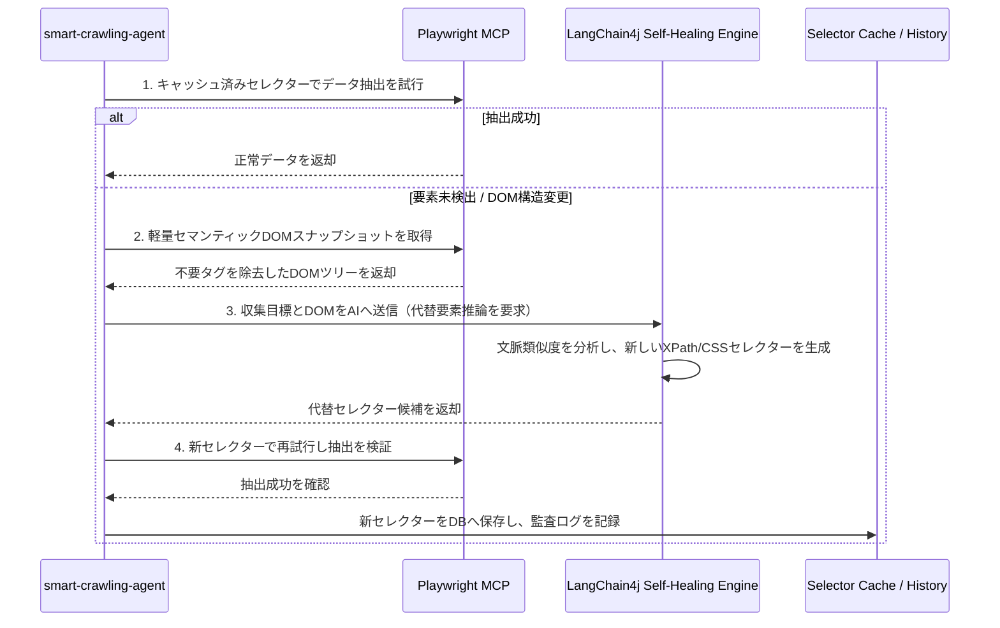

# 適応型クローリング＆AI自己修復エンジン

Webクローリングシステムの運用保守における課題の多くは、**対象サイトのデザイン改編やDOM/CSSセレクターの変更**によって発生します。SyncCrawlは、**Playwright MCP**と**Self-Healingセレクター修復アルゴリズム**によって構造変化へ柔軟に適応します。

---

## 従来のクローラーとSyncCrawl適応型エンジンの比較

| 比較項目 | 従来のクローラー (Scrapy, Puppeteer等) | SyncCrawl 適応型エンジン |
| :--- | :--- | :--- |
| **セレクター指定** | 固定CSS / XPathセレクターへの依存 | **意味論（Semantics）および多重重み付け分析** |
| **サイト改編時** | クローリング停止および手動改修が必要 | **代替要素を探索してセレクターを再構成** |
| **動的SPA対応** | 固定待機時間（Sleep）による失敗リスク | **DOM変更監視＆Network Idle基準の同期** |
| **複雑な操作** | スクリプト個別記述が必要 | **自然言語シナリオビルダーによるアクション生成** |

---

## Self-Healing セレクター修復プロセス

SyncCrawlは要素の抽出に失敗した場合、以下の段階で復旧処理を進めます。



---

## 自己修復技術詳細

### 1. セマンティックDOM最適化 (Semantic DOM Pruning)
`<script>`、`<style>`、`<svg>`などを整理し、表示テキスト、入力フォーム、テーブル、意味論的タグ（`article`, `section`, `nav`）で構成された軽量DOMツリーを生成して処理します。

### 2. 多重重み付けヒューリスティック
以下の指標を総合して代替要素を判定します：
- **テキストラベルの類似度**: 周辺ラベル（例：「お知らせ日」、「作成者」、「価格」）の意味的一致度
- **相対的階層構造**: 過去の成功時における親子ノードパターンとの構造的類似性
- **アクセシビリティ情報**: `aria-label`、`role`、`name`属性を用いたセマンティック検証

### 3. 成功履歴に基づくルールの更新
代替セレクターによる抽出が確認されると、データベースに対象サイトのセレクターバージョンが更新され、次回以降の実行時は直接抽出が行われます。

---

## 動的操作と複合シナリオ

SyncCrawlは単純なWebページ取得にとどまらず、多様なブラウジングアクションをサポートします。

```typescript
// Scenario Agent 実行例 (Playwright MCP ブリッジ)
await scenarioRunner.execute([
  { action: 'NAVIGATE', url: 'https://partner.portal.com/login' },
  { action: 'FILL_CREDENTIALS', userField: '#loginId', passField: '#passwd' },
  { action: 'WAIT_FOR_NAVIGATION', waitUntil: 'networkidle' },
  { action: 'HANDLE_MODAL', selector: '.popup-close-btn', optional: true },
  { action: 'INFINITE_SCROLL', maxRounds: 5, scrollDelayMs: 800 },
  { action: 'EXTRACT_LIST', targetSelector: '.data-row', schema: ContentSchema }
]);
```

- **ポップアップ・Cookieバナーの処理**: ポップアップや同意ダイアログを検知して閉じ、処理を継続します。
- **無限スクロール・仮想スクロール**: スクロール時に動的ロードされるAPIレスポンスを検知して蓄積します。
