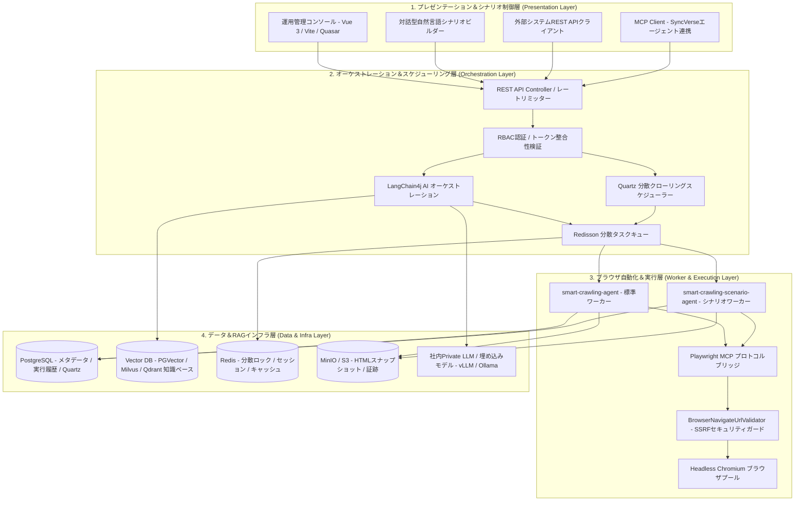

# SyncCrawl システムアーキテクチャ

SyncCrawlは、大規模なクローリング負荷の並行処理、安定運用、そしてエンタープライズAI連携のために**分散エージェントClean Architecture 4層構造**を採用しています。

---

## 4層アーキテクチャ図

---

## 4つのコア分散コンテナイメージ

SyncCrawlは、無停止リリースと独立したスケールアウトのために4つの独立したコンテナイメージで構成されます。

| コンテナイメージ | 技術スタック | 主な役割と機能 |
| :--- | :--- | :--- |
| **`smart-crawling-server`** | Java 21, Spring Boot 3.5, LangChain4j, Flyway | APIエンドポイント提供、Quartzスケジューリング、AIタスク計画、RAG同期 |
| **`smart-crawling-agent`** | Java 21, Playwright Java, MCP SDK | 定型Web収集、DOM解析、データ抽出、HTMLスナップショット保存 |
| **`smart-crawling-scenario-agent`** | Java 21, Node.js/Playwright MCP, Chromium | ログイン、複数フォーム入力、無限スクロール、SPA操作などの複合シナリオ実行 |
| **`smart-crawling-console`** | Vue 3, TypeScript, Vite, Quasar | 運用ダッシュボード、自然言語シナリオ作成、RAG検索検証コンソール |

---

## 各層の詳細設計

### 1. プレゼンテーション＆シナリオ制御層 (Presentation Layer)
- **自然言語シナリオビルダー**: 自然言語で目標を入力すると、LangChain4jエージェントと対話形式でブラウザ操作シナリオを生成します。
- **リアルタイム実行モニタリング**: WebSocketおよびSSEを通じてブラウザ実行画面のスナップショットと実行ログを中継します。

### 2. オーケストレーション＆スケジューリング層 (Orchestration Layer)
- **LangChain4j AIエンジン**: ページ構造と意図を分析し、最適なPlaywrightツールを動的にバインドします。
- **Quartz分散スケジューラー**: 多数の定期クローリングジョブをDBクラスタリングに基づき分散実行します。
- **Redisson分散キュー**: ワーカーノード間の負荷分散とフェイルオーバーを制御します。

### 3. ブラウザ自動化＆実行層 (Worker & Execution Layer)
- **Playwright MCP連携**: Model Context Protocol標準に準拠してブラウザインスタンスを制御します。
- **SSRFセキュリティガード**: `localhost`、`127.0.0.1`および社内プライベートIPへの不正アクセスを事前に検証して遮断します。
- **セレクター自動復旧エンジン**: DOM構造変更時に周辺文脈とアクセシビリティ情報を照合し、代替セレクターを検出します。

### 4. データ＆RAGインフラ層 (Data & Infra Layer)
- **PostgreSQL＆Flyway**: メタデータと実行ログを管理し、スキーマの自動マイグレーションをサポートします。
- **Vector DB＆埋め込み**: 抽出テキストをチャンキングしてベクトル化し、セマンティック検索を提供します。
- **MinIO / S3ストレージ**: 収集時の原本HTMLとスクリーンショット証跡を保管します。
