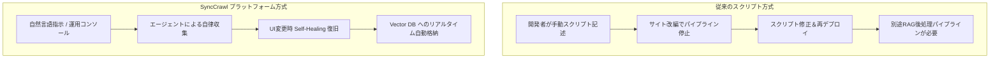

# エンタープライズFAQ＆導入ガイド

SyncCrawlの導入を検討中のIT意思決定者、アーキテクト、データエンジニアのための主要なFAQです。

---

## Q1. オープンソース（Scrapy, Selenium, Puppeteer）と比較したSyncCrawlの強みは何ですか？

一般的なオープンソースはスクリプトライブラリであるため、実運用には分散スケジューラ、DB連携、監視UI、RAG化、そして**サイト改編に伴うスクリプト修正の人員**を継続的に確保する必要があります。

SyncCrawlは、**Self-Healingセレクター自動復旧**、**リアルタイムRAGパイプライン**、**分散アーキテクチャ**を統合提供するため、クローリング保守にかかる工数を削減します。

---

## Q2. クローリング遮断（Bot検知・レートリミット）にはどのように対応しますか？

SyncCrawlは安定した収集のために以下の制御機能を備えています：

1. **実ブラウザ環境エミュレーション**: Playwrightエンジンにより、Canvas署名、WebGL描画、User-Agent、画面解像度を設定します。
2. **動的リクエスト間隔調整**: 一定周期ではなく、ランダムな遅延（Jittering）とマウス軌跡をシミュレーション可能です。
3. **エンタープライズプロキシ連携**: 社内ゲートウェイや商用ローテーションプロキシと連携可能です。

---

## Q3. 大規模収集における拡張性はどのように保証されますか？

SyncCrawlは**KubernetesのHPA（Horizontal Pod Autoscaler）**に対応しています。

- **マイクロサービス分離**: `smart-crawling-server`（管理）と`smart-crawling-agent`（実行ワーカー）が分離されているため、収集ピーク時にワーカーPodを柔軟に拡張できます。
- **Redisson分散キュー**: ドメインごとの並行数制限、負荷分散、ワーカー障害時の自動フェイルオーバーをサポートします。

---

## Q4. 個人情報保護や法令遵守（コンプライアンス）への対応は？

企業のコンプライアンス管理を支援する機能を搭載しています。

- **Robots.txt遵守ポリシー**: 対象ドメインの`robots.txt`を解析し、規約を優先遵守する設定が可能です。
- **個人情報（PII）マスキング**: 収集テキストから電話番号、メールアドレス、識別番号などを検出し、匿名化処理が可能です。
- **監査証跡の保存**: 全ての収集ジョブについて、実行パラメータ、担当者、ハッシュ値を保存します。

---

## Q5. オンプレミス（閉域網）への導入サポートはありますか？

SyncCrawlは**閉域網（Air-Gapped）オンプレミス環境**をサポートします。

- **隔離環境での展開**: 外部インターネット接続なしで社内KubernetesやLinuxサーバーにコンテナ展開可能です。
- **社内LLMとの直結**: 外部クラウドを利用せず社内の`vLLM`、`Ollama`、Vector DBと直接連携し、外部データ流出リスクを低減します。
- **技術サポート**: 企業固有のシングルサインオン（SSO）連携や個別シナリオ設定の技術ガイドを提供します。
